---
layout: "post"
title: "The International 2019: Another Practical Guide to All 18 Teams"
date: "2019-07-18 11:45"
summary:    The bare minimum information you need to know before talking to a Dota player this August.
feature-img: "img/ti8teams/ti8header.png"
flags: true
---

### It's that magical time of year again.

Players are going into stream hibernation as bootcamps begin, Arcana propaganda campaigns are getting increasingly heated, and gaming blogs are prepping their annual piece of Dota 2 coverage to report on whichever way the prize pool goes. Ah, International season.

But not everyone has been following the professional Dota 2 scene like their livelihood depended on it. Perhaps you're the viewer who was saturated by all the tournaments and are just now tuning back in for TI. Maybe your weird friend's yearly pilgrimage to Seattle has been rerouted to Vancouver and you're shocked to learn they allow this kind of degeneracy in Canada too. Or maybe you just want to enjoy the week of festivities Valve has organized around the upcoming Artifact information session.

Whatever your story, here's a preview of the teams and memes you should know come August.

# The Invites

Eight teams were directly invited to TI8 this year through a new system Valve implemented called the *Dota Pro Circuit* or *DPC*. Instead of the old, ambiguous, invitation process of 'do pretty good in the five months before TI,' players were given a new, clearer, directive of 'do pretty good in the five months before TI and don't you dare mess with your roster.'

Twenty-two DPC tournaments later, these are the teams that either stayed after class, captained the Mechanics team, and played Varsity Dota, or the ones that showed up, got a B-, copied drafts at lunch, but still got automatic admission because the rest of the graduating class spent too much time casting Pipe of Insight under the bleachers. That’s not to say any team ended up invited due to a technicality, but make no mistake, there exists a significant gap in Dota proficiency between the upper and lower tiers of this list.

The beauty of The International is when most of these skill differences go out the window.

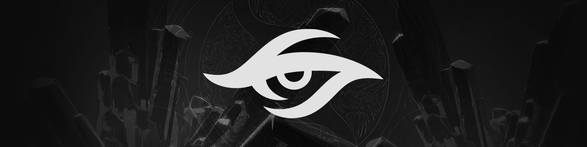

<h2 style="margin: 0.25em 0;">Team Secret</h2>
<table>
  <tbody><tr>
    <td>Nisha</td>
    <td>MidOne</td> 
    <td>zai</td>
    <td>YapzOr</td>
    <td>Puppey</td></tr>
   </tbody>
</table>

**Notable tournament placings** Dreamleague S8 and S9 champions. Also won the meme Captain's Draft tournament.

**How did they qualify?** Attended the most DPC events of any team (tied with Newbee). Did reasonably well in a few of them.

**What can we expect?** Heroes you usually don't see being played in roles you usually wouldn't expect losing to teams Secret usually should beat.

**How to sound smart talking about Secret** During the second pick phase of any draft just casually mumble, "This *could* be an Ace Meepo game," to no one in particular.

On panels, this is known as the <abbr title="jk ilu Will <3"><i>Blitz-Storm Corollary</i></abbr>.

**What would success look like?** Despite always being pretty good, Team Secret's highest placing at any International since the organization's inception was 7/8th at TI5. So ideally better than that.

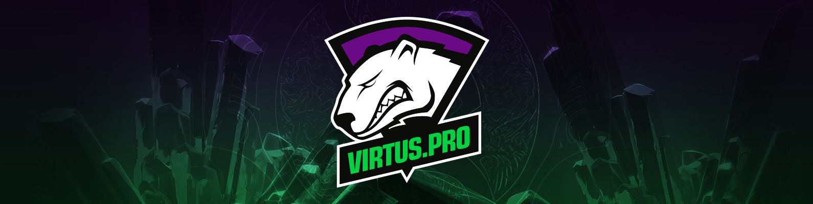

<h2 style="margin: 0.25em 0;">Virtus.pro</h2>

<table>
  <tbody><tr>
    <td>RAMZES666</td>
    <td>No[o]ne</td> 
    <td>9pasha</td>
    <td>RodjER</td>
    <td>Solo</td></tr>
   </tbody>
</table>

**Notable tournament placings** Just say ESL and some random city that sounds famous, but isn't really known for tourism. Chances are VP won something there. *"Yeah, they looked really good at ESL... Düsseldorf. I didn't watch it, though. Fuck Facebook."*

**How did they qualify?** Got top 4 in seven out of the eight majors they attended and then proceeded to win half of them.

**What can we expect?** With their top DPC ranking finish, they're arguably the favorites coming into TI8. They won so many points you could theoretically buy one of their players and automatically get a spot at TI. Oh wait.

**How to sound smart talking about VP** "Maybe Sansheng should've written a guide on how to deal with the chat wheel."

**What would success look like?** Anything besides a grand finals appearance would undoubtedly be a disappointment to the team, their fans, and people hoping to get the 50 correct predictions Battle Pass achievement off VP matches.

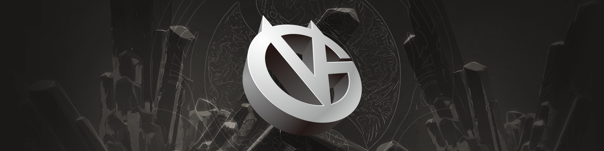

<h2 style="margin: 0.25em 0;">Vici Gaming</h2>
<table>
  <tbody><tr>
    <td>Paparazi灬</td>
    <td>Ori</td> 
    <td>Yang</td>
    <td>Fade</td>
    <td>Dy</td></tr>
   </tbody>
</table>

**Notable tournament placings** A whole bunch of 2nd place finishes

**How did they qualify?** Middle of the pack tournament results translating into a middle of the pack DPC result.

**What can we expect?** Just some real solid Dotes. You know, a real focus on the fundamentals. The guys are gonna give it their all. Show some real hustle out there.

And not win.

**How to sound smart talking about VG** How does one even talk about Vici to begin with? To investigate, I sifted through roughly ten different VG match discussion threads on reddit in the past few months and found only *one* person with Vici Gaming flair in any of them. You are a lost soul, /u/OPQOP, but I hope you find happiness as a VG fan.

**What would success look like?** Fenrir and LaNm doing well enough that they don't 'retire' after TI8.

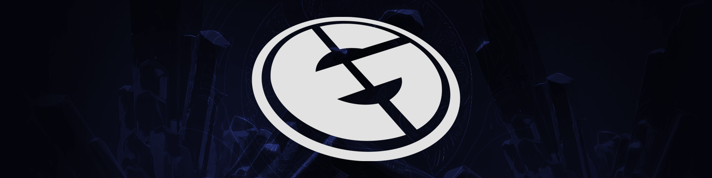

<h2 style="margin: 0.25em 0;">Evil Geniuses</i></h2>
<table>
  <tbody><tr>
    <td>Arteezy</td>
    <td>Suma1L</td> 
    <td>s4</td>
    <td>Cr1t-</td>
    <td>Fly</td></tr>
   </tbody>
</table>

**Notable tournament placings** Three out of their five players won the GESC: Indonesia Minor and the other two won the MDL Macau Minor. By these powers combined, this full roster had zero usable DPC points.

**How did they qualify?** EG has basically been playing Dota Mad Libs for the past year.

>Former EG member <select><option hidden>Player</option><option>Fear</option><option>ppd</option><option>Demon</option></select> will be joining our <select><option hidden>Organization</option><option>Dota 2 roster</option><option>stream team</option><option>Rainbow 6 squad</option></select> to <select><option hidden>Role</option><option>play support</option><option>coach</option><option>feed Sumail bananas</option></select> !

><select><option hidden>Player</option><option>Sumail</option><option>Arteezy</option><option>Bulba</option></select> will be taking over as <select><option hidden>Position</option><option>offlaner</option><option>quadcore</option><option>jungler</option></select> as we say goodbye to <select><option hidden>Literally Anyone But Sumail</option><option>Universe</option><option>Misery</option><option>Bulba</option></select> .

After these maneuvers failed to produce results, the boys decided to consult the forbidden texts and made one of the most drastic roster changes possible just six days before the Supermajor.

>We appreciate your <select><option hidden>Platitude</option><option>continued patience</option><option>passionate support</option><option>angry tweets</option></select> and are excited to announce the additions of <select><option hidden>Player #1 You'd Least Expect</option><option>Fly</option><option>Dendi</option><option>Poopkid</option></select> and <select><option hidden>Player #2 You'd Least Expect</option><option>s4</option><option>Doublelift</option><option>HookGangGod</option></select> to our Dota 2 team.

**What can we expect?** Several hundred threads on */r/dota2/new/* justifying, decrying, and celebrating every minute-to-minute moment during EG matches.

**How to sound smart talking about EG** "The current EG roster is the largest waste of potential in the history of dota."

**What would satisfaction look like?** It's not even about the Aegis, it's about the storylines. EG vs OpTic would be the highest stakes Sumail-ppd showdown to date. EG vs OG could either be 7Mad's Austerlitz or Waterloo. And of course, EG vs VGJ.Storm=Hassanbowl.

Anything short of a scorched earth loser's bracket run in which EG personally eliminates every last punk would just be a missed opportunity for *The DPC* season 1 finale.

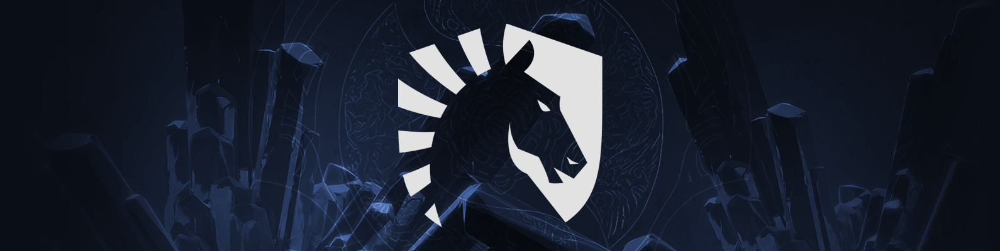

<h2 style="margin: 0.25em 0;">Team Liquid</h2>
<table>
  <tbody><tr>
    <td>Miracle-</td>
    <td>w33</td>
    <td>MinD_ContRoL</td>
    <td>GH</td>
    <td>KuroKy</td></tr>
   </tbody>
</table>

**Notable tournament placings** TI7 champions, China Dota 2 Supermajor champions. Never won a real Major, though.

**How did they qualify?**  

<iframe width="840" height="472" src="https://www.youtube.com/embed/oWBDZo3axYg?start=1710&rel=0&cc_load_policy=1" frameborder="0" allowfullscreen></iframe>

**What can we expect?** Of all the past TI championship squads, Team Liquid has by far maintained the most consistent success in their post-Aegis season. With the team once again winning the penultimate tournament before The International, this could potentially be another year of the horse.

**How to sound smart talking about Liquid** <!-- "Calling Liquid a 'filler pick' is blatantlly ridiculous.  They're the best early game team in pro Dota; so far 7.06 seems VERY good for them" -->

<blockquote class="twitter-tweet tw-align-center" data-conversation="none" data-lang="en">
Calling Liquid a &quot;filler pick&quot; is blatantlly ridiculous.  They&#39;re the best early game team in pro Dota; so far 7.06 seems VERY good for them
&mdash; Nahaz (@NahazDota) <a href="https://twitter.com/NahazDota/status/867702326508781568?ref_src=twsrc%5Etfw">May 25, 2017</a></blockquote>

**What would success look like?** First defense of the Aegis, first repeat champion(s), first two-time organization victory, world's highest earning esports prize winners for at least a few years to come.

No pressure.

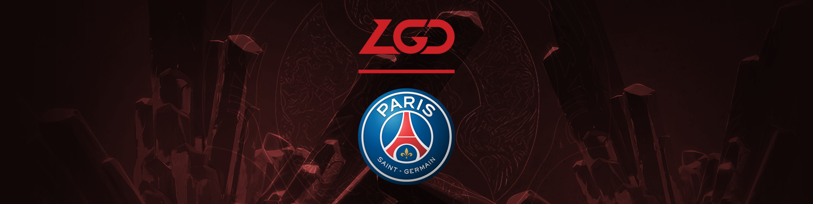

<h2 style="margin: 0.25em 0;">PSG.LGD</h2>
<table>
  <tbody><tr>
    <td>Ame</td>
    <td>Somnus丶M (Maybe)</td> 
    <td>Chalice</td>
    <td>fy</td>
    <td>xNova</td></tr>
   </tbody>
</table>

**Notable tournament placings** Epicenter XL Major champions, MDL Changsha Major champions

**How did they qualify?** LGD went from mostly irrelevant Chinese bottom feeder to French sponsored TI contender in a whirlwind two months starting with a 2nd place finish at DAC in April to winning MDL in May.

**What can we expect?** The lore behind TI champions is every alternate year is a "China year." TI1 - Na'Vi (Western), TI2 - iG (Chinese), TI3 - Alliance (Western), TI4 - Newbee (Chinese), TI5 - EG (Western), TI6 - Wings (Chinese), TI7 - Liquid (Western).

In other words, these guys are the world's best chance at saving Dota from becoming a ded gaem.

**How to sound smart talking about LGD** Most people are aware that Ame and Burning have a somewhat antagonistic relationship stemming from Ame destroying his items on iG's high ground after beating Burning with Anti-Mage during TI7. A few weeks ago, Burning sent Ame on a huge losing streak in pubs eventually culminating in them playing a 1v1 as AM with Burning ending up victorious. In the Chinese zodiac story of The Great Race, the ox agrees to carry the rat across the river to make it to the heavenly gates, but loses to the rat after it jumps off. Meanwhile, the dragon could've won the race whenever he wanted to, but stopped to bring rain to a village in need. Ame was born in the year of the ox (牛) and Burning was born in the year of the dragon (龙). Ame lost the 1v1 by overextending past the river and dying on Burning's high ground. But instead of destroying his items, Burning planted a single Iron Branch on Ame's high ground, making it rain on Ame's village. The character for 'ox' is used in '吹牛' which means 'to talk big' and the character for 'dragon' is used in '成龙' which is Jackie Chan's Chinese name. So after the match, Sgamer netizens began posting '吹牛得到成龙' effectively translating to 'Talk shit, get (Jackie Chan'd) hit.'

The previous paragraph is complete bullshit, but you bought it. That's because if there's anything that makes you sound smart talking about LGD, it's explaining convoluted Chinese wordplay to redditors who don't really understand and just want to post, 'Wow, Chinese memes are so high level! xD'

**What would success look like?** Having said that, "\_\_\_\_\_\_\_，\_\_\_\_\_\_\_\_\_\_\_\_\_\_\_\!"

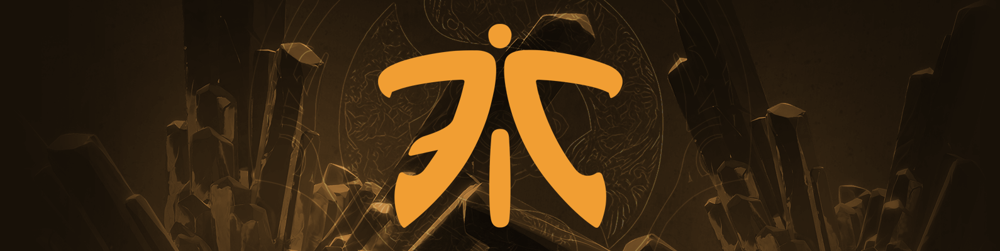

<h2 style="margin: 0.25em 0;">Fnatic</h2>
<table>
  <tbody><tr>
    <td>Jabz</td>
    <td>Abed</td> 
    <td>iceiceice</td>
    <td>DJ</td>
    <td>DuBu</td></tr>
   </tbody>
</table>

**Notable tournament placings** 4th place at both the ESL Katowice and Birmingham Majors

**How did they qualify?** Simply put, they didn't choke. After losing their way to both TNCs in the group stage, Fnatic went plus ultra in playoffs to then 2-0 the pair of them and claim the first qualifier spot.

**What can we expect?** Let it All Out of You

**How to sound smart talking about Fnatic** "Dude, of course he counts. TI1's rules were different, he could've competed at any point!"

**What would success look like?** Abed shakes all remaining 10k MMR doubt, DJ expands his LAN cafe empire, Universe solidifies his spot on Dota 2's Mount Rushmore, KyoAni begins storyboarding an OVA of EE's life, and pieliedie finally closes his eyes.

For he is at peace.

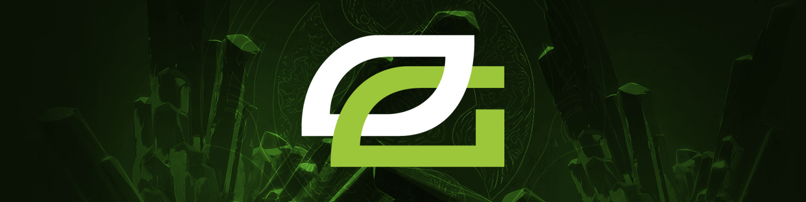

<h2 style="margin: 0.25em 0;">Ninjas in Pyjamas</h2>
<table>
  <tbody><tr>
    <td>Ace</td>
    <td>Fata</td> 
    <td>33</td>
    <td>Saksa</td>
    <td>ppd</td></tr>
   </tbody>
</table>

**Notable tournament placings** StarLadder S5 Minor champions, 2nd place at ESL Birmingham Major

**How did they qualify?** After getting DPCockblocked by VP in three separate events, Zai, 33, and their ragtag band of former TI panelists managed to snag the final spot in NA over compLexity and Immortals.

**What can we expect?** Being the only NA team to collect any relevant points this season should've meant that OpTic was the most vetted roster in the region, but coming out as the runt of the qualifier's litter wasn't a great look.

**How to sound smart talking about NiP** "*True Sight*? Nah fam, I can't wait to see the *Vision* episode on this."

**What would success look like?** Doing so well that Call of Duty players take a break from tweeting 'Who's up?' and decide to voluntarily watch Dota 2.

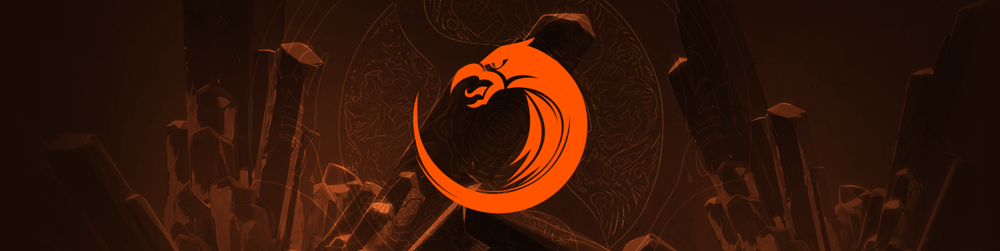

<h2 style="margin: 0.25em 0;">TNC Predator</i></h2>
<table>
  <tbody><tr>
    <td>Gabbi</td>
    <td>Armel</td> 
    <td>Kuku</td>
    <td>Tims</td>
    <td>eyyou</td></tr>
   </tbody>
</table>

**Notable tournament placings** 4th place at DAC 2018 Major, 2nd place at MDL Macau Minor

**How did they qualify?** At any given moment, there are usually three teams consistently vying for king of the hill status in SEA. This year, the rock-paper-scissors was Mineski-Fnatic-TNC. Mineski was invited, Fnatic took the first qualifier spot, and TNC narrowly scraped the second.

**What can we expect?** TNC can easily take a game off any team in the entire tournament without breaking a sweat.

Scientists have yet to determine if a second game is possible.

**How to sound smart talking about TNC** "Just three teams were able to beat both VP and Liquid on LAN this season, but only one also lost to Execration."

**What would success look like?** The longer they stay in the tournament, the longer I can keep blindly picking Raven for easy fantasy points.

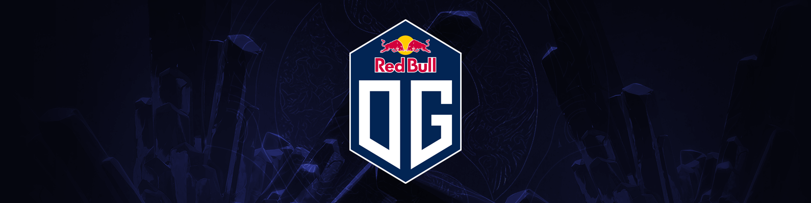

<h2 style="margin: 0.25em 0;">OG</h2>
<table>
  <tbody><tr>
    <td>ana</td>
    <td>Topson</td> 
    <td>7ckngMad (Ceb)</td>
    <td>JerAx</td>
    <td>N0tail</td></tr>
   </tbody>
</table>

**Notable tournament placings** The current roster was assembled around two weeks before TI qualifiers began, so... The International 2018: Europe Open Qualifier #1 champions.

**How did they qualify?** Ritsu would've needed five more bladders worth of post-draft prep time to beat Europe's DPC qualifier gatekeeping kings.

**What can we expect?**

**How to sound smart talking about OG** "I was spamming '*OG.TOPSON*' in chat before Meteor Hammer Invoker was even a twinkle in his eyes."

**What would success look like?** After multiple failed International runs, it would be only fitting that OG do well at the first TI where they're actually considered underdogs

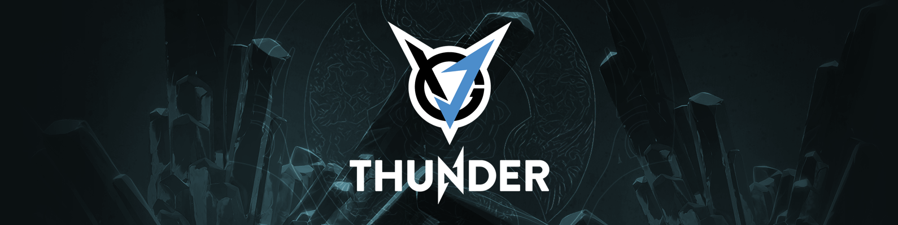

<h2 style="margin: 0.25em 0;">Alliance</h2>
<table>
  <tbody><tr>
    <td>miCKe</td>
    <td>qojqva</td> 
    <td>Boxi</td>
    <td>iNSaNiA</td>
    <td>Taiga</td></tr>
   </tbody>
</table>

**Notable tournament placings** 2nd place at The Bucharest Major. Also won Galaxy Battles II, but I'm the only person who cares about that tournament.

**How did they qualify?**  

<video playsinline autoplay loop muted poster="/blog/img/ti8teams/luigiwins.jpg" width="640">
  <source src="/blog/img/ti8teams/luigiwins.webm" type="video/webm">
  <source src="/blog/img/ti8teams/luigiwins.mp4" type="video/mp4">
  <source src="/blog/img/ti8teams/luigiwins.ogv" type="video/ogg">
</video>

**What can we expect?** Not that.

**How to sound smart talking about Thunder** Without scrolling up, name the other three players who aren't ddc or Sylar.

**What would success look like?** Beyond ddc potentially becoming the last of the <abbr title="Puppey, Universe, Kuroky, ddc">Elite Four all-TI attendees</abbr> to earn an Aegis, a victory for their coach, the ever-lovable rOtK, would be something to celebrate for Eastern and Western Dota fans alike.

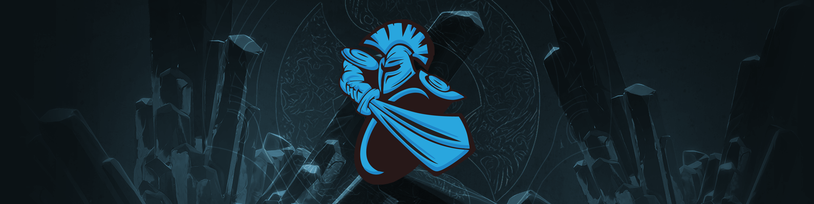

<h2 style="margin: 0.25em 0;">Keen Gaming</h2>
<table>
  <tbody><tr>
    <td>old chicken</td>
    <td>一 (yī)</td> 
    <td>eLeVeN</td>
    <td>Kaka</td>
    <td>dark</td></tr>
   </tbody>
</table>

**Notable tournament placings** A whole bunch of 3rd place finishes

**How did they qualify?** TI7's runners-up gave a less than stellar performance this season, but it was enough to squeeze into the DPC top 8 for a TI invite anyway. Their biggest mistake was getting revenge on Liquid too early in the year, thus preventing the Sccc ultra instinct arc.

**What can we expect?** This squad didn't have *amazing* results before TI7 either. They were good enough to be directly invited, but most people considered LFY or LGD to be the strongest Chinese teams at that TI. Perhaps history will repeat itself.

**How to sound smart talking about Newbee** "Sccc is my free pass."

**What would success look like?** "You expect to win a championship at your first TI? You're just an ordinary person... not a god. Second TI is no excuse though, you better win."

<h2 style="margin: 0.25em 0;">Mineski</h2>
<table>
  <tbody><tr>
    <td>Mushi</td>
    <td>Moon</td> 
    <td>iceiceice</td>
    <td>Jabz</td>
    <td>ninjaboogie</td></tr>
   </tbody>
</table>

**Notable tournament placings** DAC 2018 Major champions

**How did they qualify?** While allegedly on the brink of disbanding, the squad managed to beat LGD on their own home turf to win DAC. Thankfully, with VP and Liquid vacuuming up all the other DPC points, that Major win was all Mineski needed to secure their TI invite.

**What can we expect?** Mineski is one of those teams that people are mostly unsurprised no matter what result they get. Drown in group stage? *Eh, it happens.* Dominant winner's side run? *Knew they had it in them.* Don't even qualify? *Wow, SEA is so competitive!*

**How to sound smart talking about Mineski** Don't say anything, just start doing push-ups.

**What would success look like?** An iceiceice Aegis would be like the DiCaprio Oscar in terms of reddit self-satisfaction.

# The Qualifiers

The other ten teams came through a double elimination bracket of online qualifiers within their respective regions. Half of them had to even go through a Bo1 madhouse open qualifier for committing the cardinal sin of wanting to change rosters after February 5th.

Some trivia: Of the ten different squads to have attended an International grand final since the qualifier system was created in TI3, only three have been non-invited teams, and Wings is the only qualifier team to have ever won.

So that's where the bar is set.

<h2 style="margin: 0.25em 0;">Winstrike Team - <i>CIS Regional Qualifier</i></h2>
<table>
  <tbody><tr>
    <td>Silent</td>
    <td>Iceberg</td> 
    <td>nongrata</td>
    <td>Nofear</td>
    <td>ALWAYSWANNAFLY</td></tr>
   </tbody>
</table>

**Notable tournament placings** 3rd place at Epicenter XL Major

**How did they qualify?** \**read in deep announcer voice while imagining smash cuts of esports poses shrouded by smoke machines*\* Formerly known as ***FlyToMoon,*** this squad of CIS rejects took their ***region by storm*** after being assembled during the ***second half*** of the season. ***Brash, aggressive, and unpredictable.*** This roster has the ***experience to dominate*** and the ***confidence to go with it.*** This is... ***Winstrike.*** \**cut back to panel as Redeye says "Yes, indeed..." and then asks Cap a question about Iceberg probably*\*

**What can we expect?** Entertaining games and maybe a few upsets, but a deep run by Winstrike is among the darkest of horses.

**How to sound smart talking about Winstrike** "This is good for Bitcoin."

**What would success look like?** Earlier in the season, Iceberg mentioned in an interview that they themselves don't expect to do particularly well, just getting to TI was the main goal. So mission accomplished. The real success would be if the roster stays together for more than two months post-TI.

<h2 style="margin: 0.25em 0;">Team Serenity - <i>China Regional Qualifier #1</i></h2>
<table>
  <tbody><tr>
    <td>zhizhizhi</td>
    <td>Zyd</td> 
    <td>XinQ</td>
    <td>Pyw</td>
    <td>XCJ</td></tr>
   </tbody>
</table>

**Notable tournament placings** ???  
**Notable tournament attendances** ???  
**Notable players** ???

**How did they qualify?** In the divine game of mahjong that randomly determines whichever Chinese team is intra-regionally strongest on any given week, the gods willed that Serenity shall be victorious.

**What can we expect?** Honestly, no one knows. Anyone who claims otherwise is just trying to sound smart.

**How to sound smart talking about Serenity** "lmaoooo maybe if you watched *actual* amateur dota and not grant streams of trashcan na pubs youd know my boys have been looking like TI winners since hcup season 8"

**What would success look like?** Not getting banned by ACE next year.

<h2 style="margin: 0.25em 0;">Invictus Gaming - <i>China Regional Qualifier #2</i></h2>
<table>
  <tbody><tr>
    <td>Agressif</td>
    <td>Xxs</td> 
    <td>Srf</td>
    <td>BoBoKa</td>
    <td>Q</td></tr>
   </tbody>
</table>

**Notable tournament placings** World Cyber Arena 2017 champions... I guess

**How did they qualify?** iG was the *only* team to be directly invited to the Chinese qualifiers since literally every other team messed around with their rosters at some point. After narrowly making it through a group stage tiebreaker, and then losing to Serenity in the playoffs, iG 2-0'd LFY to become the 6th Chinese representative at TI8.

**What can we expect?** Probably nothing special, but it's worth noting that Agressif and Q *were* on the TI5 CDEC squad that Cinderella story'd their way from wild cards to grand finals.

**How to sound smart talking about iG**  

<iframe width="840" height="472" src="https://www.youtube.com/embed/KhQio49YG-Q?rel=0" frameborder="0" allowfullscreen></iframe>

**What would success look like?** For the sake of justifying the two Chinese regional qualifier slots, they better hope they at least make it out of group stage.

<h2 style="margin: 0.25em 0;">PaiN Gaming - <i>South America Regional Qualifier</i></h2>
<table>
  <tbody><tr>
    <td>hFn</td>
    <td>w33</td> 
    <td>tavo</td>
    <td>Kingrd</td>
    <td>Duster</td></tr>
   </tbody>
</table>

**Notable tournament placings** 3rd place at ESL Birmingham Major

**How did they qualify?** *Combat Log: Day 86 of SA qualifiers. Skol supplies running low. Game 7 has been delayed until after Sooths gets back from church for Nossa Senhora Aparecida. Rumor is the group stage may be played out again after we discovered Thunder Predator's coach was standing outside a window our entire series.*

**What can we expect?** This is only the second time a South American team has even appeared at an International, so expectations are tempered. Lest we forget, however, this is the same PaiN that beat Liquid in a Bo1 and then a Bo3 during the ESL Birmingham group stage, so a few surprise wins are definitely on the table.

**How to sound smart talking about PaiN** "O SONHO TÁ VIVO. CAPINAR O LOTE! VAMOOOOS!"

**What would success look like?** A result more memorable than the SG e-sports Kiev Major run to become the new default moment people cite when arguing over the strength of SA Dota.

<h2 style="margin: 0.25em 0;">VGJ.Storm - <i>North America Regional Qualifier #1</i></h2>
<table>
  <tbody><tr>
    <td>Resolut1on</td>
    <td>YawaR</td> 
    <td>Sneyking</td>
    <td>MSS</td>
    <td>SVG</td></tr>
   </tbody>
</table>

**Notable tournament placings** GESC: Thailand Minor champions, 2nd place at MDL Changsha Major

**How did they qualify?** Since this team's formation in Sept. 2017, there were a whopping thirteen different players to don the VGJ.Storm tag at some point during the season. The addition of Resolut1on as the one position was the conclusion, but *come on*, it's no coincidence that the team with the most American players made it through NA qualifiers in 1st.

**What can we expect?** Jeremy Lin to make his yearly cameo, but now with some actual skin in the game. At least I hope so. If he and Asa Butterfield move to Fortnite, we're doomed.

**How to sound smart talking about Storm** "BSJ was just ahead of his time."

**What would success look like?** So many USA chants you'll forget this TI is actually in Canada.

----

This article was inspired by a <i>New York Times</i> <a href="https://www.nytimes.com/2018/06/11/sports/world-cup-groups.html">guide to World Cup teams</a> and appropriated for Dota as suggested by <a href="https://twitter.com/SkimGaming/status/1007998992498790401">@SkimGaming.</a> Much appreciation to the people who exhaustively update all tournament and team results on Liquipedia including those responsible for this exceptionally detailed <a href="https://liquipedia.net/dota2/Dota_Pro_Circuit/Stats">Dota Pro Circuit stats page.</a> Player photos in the header were sourced from the <a href="https://www.flickr.com/photos/dota2ti/">dota2ti</a>, <a href="https://www.flickr.com/photos/cybersportcom/">Cybersport</a>, and <a href="https://www.flickr.com/photos/starladder/">StarLadder</a> Flickrs.

<a href="https://www.reddit.com/r/DotA2/comments/8zx25q/the_international_2018_a_practical_guide_to_all/">Discussion for this article on /r/dota2.</a>

