---
layout: "post"
title: "The International 2021: A Practical Guide to All 18 Teams"
date: "2021-09-25 11:45"
summary:    The bare minimum information you need to know before talking to a Dota player this October.
feature-img: "img/ti8teams/ti8header.png"
flags: true
---

### Well it's happening

Barely. Maybe someone you love seems distraught that their annual August esports pilgramage has been thrown into disarray. Whatever the case, this is the guide for you.

First, to calibrate your Dota esports MMR, please answer the following question:

<p style="font-size: 1.3em; font-weight: bold;">Who is the current offlaner for EG?

<select id="dropDown" onchange="test()" style="font-weight: 100;">
 <option value="default" selected="selected">Select offlaner</option>
 <option value="one" id="RAMZES666">RAMZES666</option>
 <option value="two" id="iceiceice">iceiceice</option>
 <option value="three" id="s4">s4</option>
 <option value="four" id="UNiVeRsE">UNiVeRsE</option>
 <option value="five" id="what">What's an offlaner?</option>
</select>
</p>

<p style="font-size: 1.38em; font-weight: bold;">You stopped watching Dota:
<span id="wrapperOne" style="display: none;font-weight: 100;">Riiiight before COVID</span>
<span id="wrapperTwo" style="display: none;font-weight: 100;">Never, you fiend</span>
<span id="wrapperThree" style="display: none;font-weight: 100;">After TI9</span>
<span id="wrapperFour" style="display: none;font-weight: 100;">This is awkward</span>
<span id="wrapperFive" style="display: none;font-weight: 100;">You never started</span>
</p>

<div id="paragraphOne" style="display: none; line-height:1.5em;">
World goes to hell in a handbasket and you just <i>leave Dota?</i> After everything we've been through? You know we still had tournaments going on in 2020! You really missed out. Sort of. Well at least you're here now. Please don't leave again, our player count numbers can't take it.
</div>
<div id="paragraphTwo" style="display: none; line-height:1.5em;">
You're not the demographic for this guide, get outta here.
</div>
<div id="paragraphThree" style="display: none; line-height:1.5em;">
...ever heard of a "neutral item" before? No? How about the term <i>'sunmommy'</i>? Nothing? Well this is gonna be one confusing TI for you.</div>
<div id="paragraphFour" style="display: none; line-height:1.5em; font-size:large;">
Just a second, let me get into character.<br><blockquote style="font-size: 1.1 em;">Whoa, long time no see. What have you been up to? You got married? No way, that's awesome! One on the way too? Wow. Congratulations. Our old stack? Nah, I'm... I'm the only one who still plays these days. Haha, yeah... Remember that one time you got a rampage on Death Prophet? Good times. Anyway, n-nice catching up with you.</blockquote></div>
<div id="paragraphFive" style="display: none; line-height:1.5em; font-size:large;">
Trying to impress somebody? Talk about relationship goals, you're a keeper. Ok so in the current 7.30d meta an offlaner, also known as the '3', is usually a tanky initiat--<br><br>Actually, forget it. All you need to know is if your special someone starts stressing out in the first few minutes of a game just say, "It's ok, babe. Laning phase doesn't matter."</div>

<script>
  var dropDown = document.getElementById("dropDown"),
   myWrappers = [
      document.getElementById("wrapperOne"),
      document.getElementById("wrapperTwo"),
      document.getElementById("wrapperThree"),
      document.getElementById("wrapperFour"),
      document.getElementById("wrapperFive")
   ];
   myParagraphs = [
      document.getElementById("paragraphOne"),
      document.getElementById("paragraphTwo"),
      document.getElementById("paragraphThree"),
      document.getElementById("paragraphFour"),
      document.getElementById("paragraphFive")
   ];
function test() {
for (i=0; i<myWrappers.length; i++){
    if(dropDown.value === "default"){ 
       myWrappers[i].style.display = "none";
       myParagraphs[i].style.display = "none";
     } else if(dropDown.value === "one"){
       myWrappers[i].style.display = "none";
       myParagraphs[i].style.display = "none";
       myWrappers[0].style.display = "inline";
       myParagraphs[0].style.display = "block";
      } else if(dropDown.value === "two"){
       myWrappers[i].style.display = "none";
       myParagraphs[i].style.display = "none";
       myWrappers[1].style.display = "inline";
       myParagraphs[1].style.display = "block";
      } else if(dropDown.value === "three"){
       myWrappers[i].style.display = "none";
       myParagraphs[i].style.display = "none";
       myWrappers[2].style.display = "inline";
       myParagraphs[2].style.display = "block";
      } else if(dropDown.value === "four"){
       myWrappers[i].style.display = "none";
       myParagraphs[i].style.display = "none";
       myWrappers[3].style.display = "inline";
       myParagraphs[3].style.display = "block";
      } else if(dropDown.value === "five"){
       myWrappers[i].style.display = "none";
       myParagraphs[i].style.display = "none";
       myWrappers[4].style.display = "inline";
       myParagraphs[4].style.display = "block";
      }
 }
}
</script>

# The Invites

Remember the *Dota Pro Circuit/DPC*? It's back. In league form.

Now there are plenty of resources explaining the details of the system, so I'm not gonna get into it. All you really need to know is each team had four opportunities to earn DPC points this year: Their regional league season 1 *(Jan-Mar 2021)*, the Singapore Major *(Apr 2021)*, their regional league season 2 *(Apr-May 2021)*, and the Kyiv AniMajor *(May 2021

The top 12 teams with the most DPC points were directly invited to TI10. These are their stories.

<hr style="margin-bottom: 1.2em;">
<p style="margin: 0.5em 0;">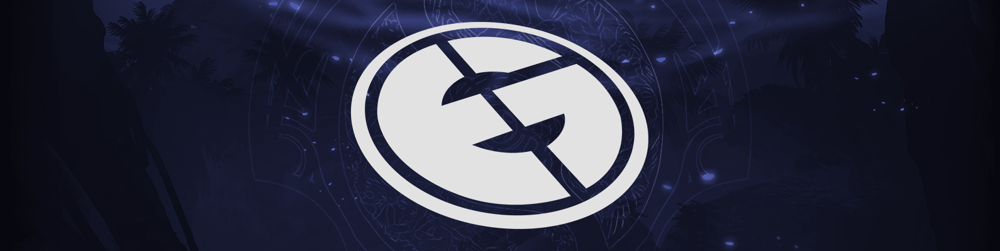</p>
<h2 style="margin: 0.25em 0;">Evil Geniuses</h2>
<table>
  <tbody><tr>
    <td>Arteezy</td>
    <td>Abed</td> 
    <td>iceiceice</td>
    <td>Cr1t-</td>
    <td>Fly</td>
    <td>&nbsp;</td>
    <td><i style="font-size: smaller;">Coach</i>&nbsp;&nbsp;&nbsp;BuLba</td></tr>
   </tbody>
</table>
<hr style="margin: 0.5em 0;">

**How did this roster happen?** Many of you reading the list above are gonna be like: *Arteezy, of course, my boy. Abed? That's cool. Wait, where's Sumail? WHERE'S SUMAIL?!* Sumail's not on EG anymore. Wild, I know. Soon after TI9 ended, Sumail was benched and Abed was brought in. But don't worry, this is a Chekhov's Hassan. He'll be back in the third act.

Iceiceice, meanwhile, finally got tired of floundering around in SEA and came to North America of all regions in Novemeber 2020 to replace Ramzes, who replaced s4 after TI9. Now you see why I chose that position to be your pro Dota familiarity barometer.

Fun fact, for all abuse Arteezy once endured for being a treacherous team hopping bastard, he is currently on the longest continuous tenure of any team+player pairing at TI10 besides Crit, Secret's Puppey, and OG's Notail. Can you believe it? They grow up so fast.

**How was their DPC year?** 1700 points

* ***NA DPC S1** - 1st, **ONE Esports Singapore Major** - 2nd, **NA DPC S2** - 2nd, **WePlay Kyiv AniMajor** - 2nd*

You may recall that EG were once notorious for always getting third place at events. Times have changed, though. That was a completely different roster, different meta, different era.

They've since moved up a digit.

Now for a normal person, 2nd place at two majors is pretty incredible. But Dota players, and fans, are not normal people. And in true Ricky Bobby fashion, if you ain't first, you're last. *What a joke of a year. Abed Storm for five games? 1 position NP in grand finals? smh can we kick LULba please?*

**What would success look like?** How funny would it be if, after eight years of competing in professional Dota, Arteezy's first Valve LAN event win was TI10.

**What to spam in Twitch chat when EG are winning?** `My streamer FeelsStrongMan`

<hr style="margin-bottom: 1.2em;">
<p style="margin: 0.5em 0;">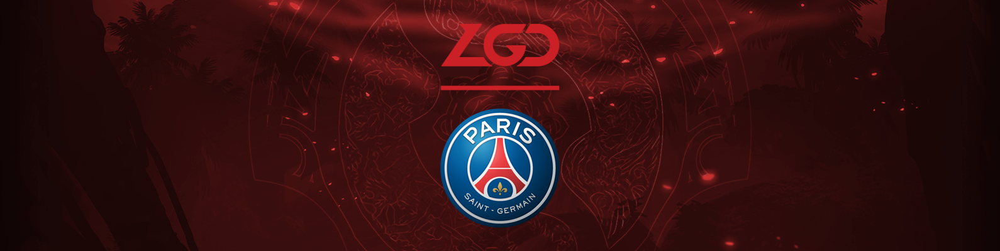</p>
<h2 style="margin: 0.25em 0;">PSG.LGD</h2>
<table>
  <tbody><tr>
    <td>Ame</td>
    <td>NothingToSay</td>
    <td>Faith_bian</td> 
    <td>XinQ</td>
    <td>y` (Innocence)</td>
    <td>&nbsp;</td>
    <td><i style="font-size: smaller;">Coach</i>&nbsp;&nbsp;&nbsp;xiao8</td></tr>
   </tbody>
</table>
<hr style="margin: 0.5em 0;">

**How did this roster happen?**  Just reading these names, how could you not get hype? Two of the Wings Gaming TI6 winning squad? Young hotshot 12k MMR midlaner? And xiao8 coaching? LET'S GOOOOO.

In fact Ame, who may seem like the only connection to the TI9 LGD, actually traded spots with AhJit on CDEC for most of 2020 before this roster formed in September. Was he being given a lesson in humility? Who knows, but there's never been a better time to be an lgdamefan.

**How was their DPC year?** 1300 Points

* ***CN DPC S1** - 4th, **ONE Esports Singapore Major** - 3rd, **CN DPC S2** - 2nd, **WePlay Kyiv AniMajor** - 1st*

As is tradition with LGDs past, they started the year off *cold*. Granted, the CN DPC is arguably the most competitive of all the six regional leagues, but they only narrowly won a 4/5th place tiebreaker against Elephant in the CN DPC S1 to even get the privilege of attending the Singapore Major. Since then it's been hot, hot, hot. They're damn good at Dota and they're fun to watch.

**What would success look like?** Statistically, [LGD has the highest probability of winning TI10.](https://noxville.github.io/ti10-probabilities/) Also statistically, the team with the highest probability of winning TI rarely ever does. RIP LGD.

**What to spam in Twitch chat when LGD are winning?** `Translator winning mid Pog`

<hr style="margin-bottom: 1.2em;">
<p style="margin: 0.5em 0;">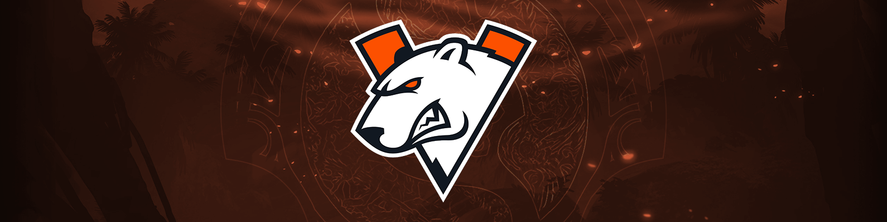</p>
<h2 style="margin: 0.25em 0;">Virtus.pro</h2>
<style type="text/css">table {margin: 0.25em 0; overflow: hidden} tr td {display: inline-block;padding:0 1em 0 0;font-style: italic;border: 0px solid}</style>
<table>
  <tbody><tr>
    <td>Nightfall</td>
    <td>gpk</td> 
    <td>DM</td>
    <td>Save-</td>
    <td>Kingslayer</td>
    <td>&nbsp;</td>
    <td><i style="font-size: smaller;">Coach</i>&nbsp;&nbsp;&nbsp;boolk</td></tr>
   </tbody>
</table>
<hr style="margin: 0.5em 0;">

**How did this roster happen?** This ain't your dad's VP. No, actually, this is your little brother's VP. This is a group of young players who had been wanting to form a team together for quite a while and were eventually assembled under the *VP.Prodigy* tag in April 2020. They had some stellar performances at a few online tournaments and were eventually promoted to the main VP in November 2020.

**How was their DPC year?** 1200 Points

* ***EEU DPC S1** - 1st, **ONE Esports Singapore Major** - 7-8th, **EEU DPC S2** - 1st, **WePlay Kyiv AniMajor** - 9-12th*

By their own admission, their DPC leagues were FREEEEE. They literally only dropped three out of the thirty-one total games they played during both seasons. Put 'em on LAN though? Weelllll, then they don't look so hot. I liken it to how I never had to study at all during high school. Physics? Simple. World History? Cram the night before.

Then I roll up to university and get punched in the mouth by Organic Chemistry. Still have nightmares of S<sub>N</sub>2 reactions.

In VP's defense, this is a young team (literally, their oldest player is DM at 21) with minimal LAN experience to begin with. Additionally, they were also operating with no coach until now for TI.

**What would success look like?** The EEU/CIS region hasn't even had a team place top 4 at TI since TI3 Na`Vi, so anything near there would be impressive. No one is really doubting if this squad is good, but what we don't know is if they can handle pressure. This roster hasn't ever even played in front of a crowd before.

<p style="font-size: 0.85em;">Which means that TI10 should feel natural.</p>

**What to spam in Twitch chat when VP are winning?** `I ALWAYS BELIEVED IN GPK STORM`

<hr style="margin-bottom: 1.2em;">
<p style="margin: 0.5em 0;">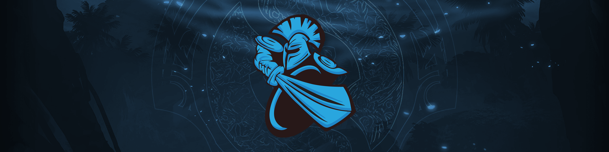</p>
<h2 style="margin: 0.25em 0;">Quincy Crew</h2>
<table>
  <tbody><tr>
    <td>YawaR</td>
    <td>Quinn (CCnC)</td>
    <td>Lelis</td>
    <td>MSS</td>
    <td>LoA (SVG)</td>
    <td>&nbsp;</td>
    <td><i style="font-size: smaller;">Coach</i>&nbsp;&nbsp;&nbsp;KheZu</td></tr>
   </tbody>
</table>
<hr style="margin: 0.5em 0;">

**How did this roster happen?** Yawar, Quinn, and MSS have actually been together since 2019. It was as Forward Gaming, who got turned into TI9 Newbee, who got turned into Quincy Crew, who got turned into Chaos EC, who again turned into Quincy Crew and have remained so since early 2020. Along the way, they imported the Brazilian Lelis and brought LoA/SVG out of semi-retirement.

**How was their DPC year?** 1100 Points

* ***NA DPC S1** - 2nd, **ONE Esports Singapore Major\*** - 9-12th, **NA DPC S2** - 1st, **WePlay Kyiv AniMajor** - 5-6th*

For most of 2020, practically everyone had written off North America as a region beyond saving and it was basically just EG's sandbox to stomp on kids.

In 2021, we learned that North America *is* indeed mostly beyond saving, but there are actually two bullies at the playground with Quincy Crew too.

**What would success look like?** Getting a sponsor.

Actually, wait, scratch that. *Quincy Crew* becoming an esports powerhouse would be the real success story.

**What to spam in Twitch chat when QC is winning?** `EZ 4 [insert player name here]AO`

<hr style="margin-bottom: 1.2em;">
<p style="margin: 0.5em 0;">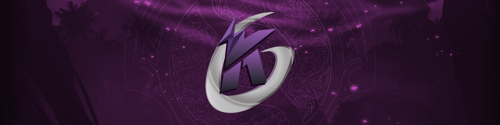</p>
<h2 style="margin: 0.25em 0;">Invictus Gaming</h2>
<table>
  <tbody><tr>
    <td>flyfly</td>
    <td>Emo</td> 
    <td>JT-</td>
    <td>Kaka</td>
    <td>Oli</td>
    <td>&nbsp;</td>
    <td><i style="font-size: smaller;">Coach</i>&nbsp;&nbsp;&nbsp;super</td></tr>
   </tbody>
</table>
<hr style="margin: 0.5em 0;">

**How did this roster happen?** Unlike most of the other Chinese teams at TI10, this roster was *not* frantically cobbled together in late 2020. Instead, it was a slow, methodical process that has had these five players together since September 2019.

**How was their DPC year?** 1100 Points

* ***CN DPC S1** - 1st, **ONE Esports Singapore Major** - 1st, **CN DPC S2** - 4th, **WePlay Kyiv AniMajor\*** - 15th*

This team's story is probably best told through greentext.

```
>walks into the dpc
>decides to reverse sweep singapore grand finals halfway through game 3
>gets enough points for TI
>refuses to elaborate further
>leaves
```

It's like pottery.

Their coach did have to stand-in for Oli at the AniMajor, sure, but I prefer my interpretation.

**What would success look like?** Kaka avenges Newbee's TI7 silver medal and somewhere in the distance Sccc smiles.

**What to spam in Twitch chat when iG is winning?** `?` That's all. Just `?`

<hr style="margin-bottom: 1.2em;">
<p style="margin: 0.5em 0;">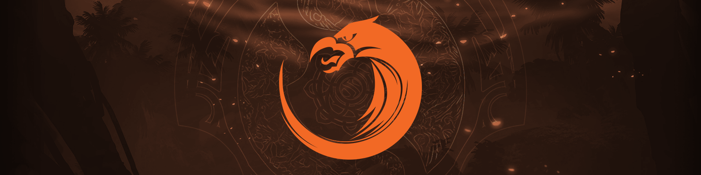</p>
<h2 style="margin: 0.25em 0;">T1</h2>
<table>
  <tbody><tr>
    <td>23savage</td>
    <td>Karl</td> 
    <td>Kuku</td>
    <td>Xepher</td>
    <td>Whitemon</td>
    <td>&nbsp;</td>
    <td><i style="font-size: smaller;">Coach</i>&nbsp;&nbsp;&nbsp;March</td></tr>
   </tbody>
</table>
<hr style="margin: 0.5em 0;">

**How did this roster happen?** Yes, this is *that* T1. The Faker T1. The... tyler1 T1. The T1 brand that's a juggernaut in Korea. Originally announced in late 2019 with Forev at the center, T1 went through multiple iterations before finally putting together this surprisingly multinational SEA team right before the DPC started. The last addition was 23savage who replaced JaCkky after the Singapore Major.

**How was their DPC year?** 1070 Points

* ***SEA DPC S1** - 3rd, **ONE Esports Singapore Major\*** - 15th, **SEA DPC S2** - 1st, **WePlay Kyiv AniMajor** - 3rd*

SEA had an interesting conundrum this year. Since their seasons were so intra-regionally competitive, no single team was able to farm the leagues for DPC points. As a result, there was a very real possibility that only one SEA team would attend TI10.

But then halfway through the SEA DPC S2 it seems T1 decided, "You know it'd be pretty cool to go to TI directly," and then proceeded to smash their way through the rest of the season and the AniMajor.

**What would success look like?** I talked about EEU/CIS not having any team in top 4 at TI for a while. SEA, meanwhile, hasn't had a top *8* placement at TI since TI6.

**What to spam in Twitch chat when T1 is winning?** `MikeHogu MASTER KUKU TURUAN MO PA NG IBANG KANTA SI WHITEMON`

<hr style="margin-bottom: 1.2em;">
<p style="margin: 0.5em 0;">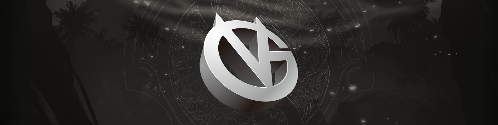</p>
<h2 style="margin: 0.25em 0;">Vici Gaming</h2>
<table>
  <tbody><tr>
    <td>poyoyo (Erica)</td>
    <td>Ori</td> 
    <td>old eLeVeN</td>
    <td>Pyw</td>
    <td>Dy</td>
    <td>&nbsp;</td>
    <td><i style="font-size: smaller;">Coach</i>&nbsp;&nbsp;&nbsp;Fenrir</td></tr>
   </tbody>
</table>
<hr style="margin: 0.5em 0;">

**How did this roster happen?** Ori has been on Vici since the dawn of time, but what about the rest of these names? You may remember Eurus (Paparazi灬) and Yang as being Vici boys for a while, but they were dropped in 2020 for poyoyo and old eLeVeN.

You may also remember Fade. Fade """"retired"""" after TI9, enjoyed a day at the beach, and then un-retired two weeks later to join Team Aster. Even by Chinese retirement standards, that's pretty quick. I'm not gonna make a Fade pun here, but he's not at TI10.

**How was their DPC year?** 950 Points

* ***CN DPC S1** - 3rd, **ONE Esports Singapore Major** - 7-8th, **CN DPC S2** - 3rd, **WePlay Kyiv AniMajor** - 4th*

I could literally copy paste what I wrote about Vici's TI8 squad three years ago and you would not be able to tell the difference.

<blockquote style="font-size: large;">Just some real solid Dotes. You know, a real focus on the fundamentals. The guys are gonna give it their all. Show some real hustle out there. <br><br>And not win.</blockquote>

What is with Vici and signing teams that are always *good* but never TI champion material.

**What would success look like?** ...being TI championship material. Alley-oop.

**What to spam in Twitch chat when T1 is winning?** `poyoyoyoyoyoyo`

<hr style="margin-bottom: 1.2em;">
<p style="margin: 0.5em 0;">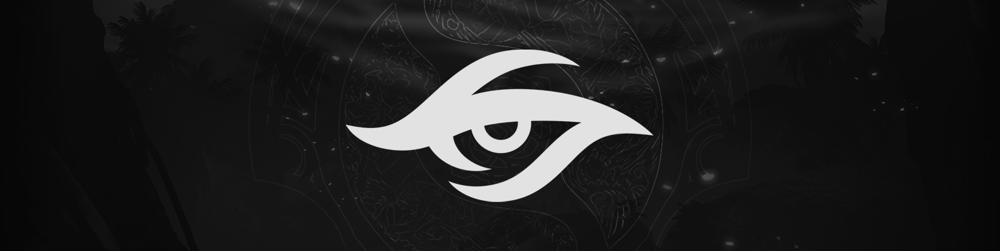</p>
<h2 style="margin: 0.25em 0;">Team Secret</h2>
<table>
  <tbody><tr>
    <td>MATUMBAMAN</td> 
    <td>Nisha</td>
    <td>zai</td>
    <td>YapzOr</td>
    <td>Puppey</td>
    <td>&nbsp;</td>
    <td><i style="font-size: smaller;">Coach</i>&nbsp;&nbsp;&nbsp;Heen</td></tr>
   </tbody>
</table>
<hr style="margin: 0.5em 0;">

**How did this roster happen?** PLACEHOLDER

**How was their DPC year?** 950 Points

* ***WEU DPC S1** - 1st, **ONE Esports Singapore Major** - 4th, **WEU DPC S2** - 4th, **WePlay Kyiv AniMajor** - 16th*

PLACEHOLDER

**What would success look like?** PLACEHOLDER

**What to spam in Twitch chat when Secret is winning?** `PLACEHOLDER`

<hr style="margin-bottom: 1.2em;">
<p style="margin: 0.5em 0;">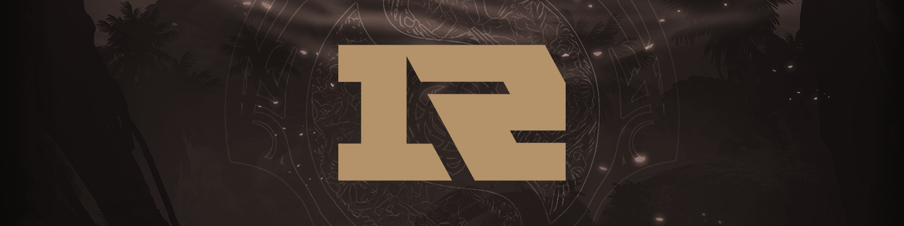</p>
<h2 style="margin: 0.25em 0;">Team Aster</h2>
<table>
  <tbody><tr>
    <td>Monet</td>
    <td>White丶Album_白学家</td> 
    <td>Xxs</td>
    <td>Borax (BoBoKa)</td>
    <td>LaNm</td>
    <td>&nbsp;</td>
    <td><i style="font-size: smaller;">Coach</i>&nbsp;&nbsp;&nbsp;Mad</td></tr>
   </tbody>
</table>
<hr style="margin: 0.5em 0;">

**How did this roster happen?** PLACEHOLDER 

**How was their DPC year?** 800 Points

* ***CN DPC S1** - 2nd, **ONE Esports Singapore Major\*** - 9-12th, **CN DPC S2** - 1st, **WePlay Kyiv AniMajor** - 9-12th*

Aster are known as civil war specialists. Playing against Chinese teams? Beasts. International opponents? Lost cause.

**What would success look like?** PLACEHOLDER 

**What to spam in Twitch chat when Aster is winning?** `PLACEHOLDER`

<hr style="margin-bottom: 1.2em;">
<p style="margin: 0.5em 0;">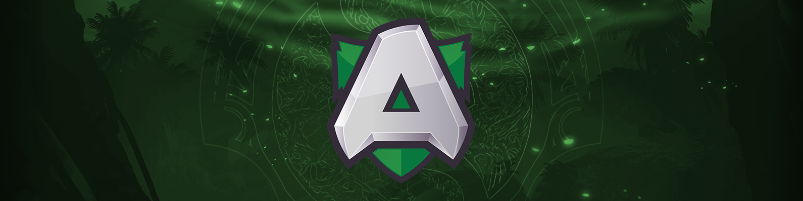</p>
<h2 style="margin: 0.25em 0;">Alliance</h2>
<table>
  <tbody><tr>
    <td>Nikobaby</td>
    <td>LIMMP</td> 
    <td>s4</td>
    <td>Handsken</td>
    <td>fng</td></tr>
   </tbody>
</table>
<hr style="margin: 0.5em 0;">

**How did this roster happen?** PLACEHOLDER

**How was their DPC year?** 800 Points

* ***WEU DPC S1** - 2nd, **ONE Esports Singapore Major** - 13th, **WEU DPC S2** - 1st, **WePlay Kyiv AniMajor** - 9-12th*

It was a spicy season

**What would success look like?** Beating a non-European team for the first time this year would be a good start.

**What to spam in Twitch chat when Alliance is winning?** `WINNING WITH ONLY 5 PLAYERS 🦈`

<hr style="margin-bottom: 1.2em;">
<p style="margin: 0.5em 0;">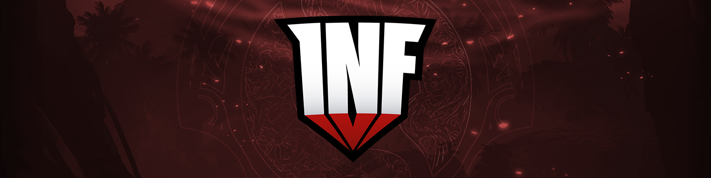</p>
<h2 style="margin: 0.25em 0;">beastcoast</h2>
<table>
  <tbody><tr>
    <td>K1 (Hector)</td>
    <td>Chris Luck</td> 
    <td>Wisper</td>
    <td>Scofield</td>
    <td>StingeR</td>
    <td>&nbsp;</td>
    <td><i style="font-size: smaller;">Coach</i>&nbsp;&nbsp;&nbsp;Papita</td></tr>
   </tbody>
</table>
<hr style="margin: 0.5em 0;">

**How did this roster happen?** Remember TI9 Infamous? It's the same guys.

**How was their DPC year?** 800 Points

* ***SA DPC S1** - 1st, **ONE Esports Singapore Major\*** - Did not attend, **SA DPC S2** - 2nd, **WePlay Kyiv AniMajor** - 14th*

PLACEHOLDER

**What would success look like?** PLACEHOLDER

**What to spam in Twitch chat when beastcoast is winning?** `PLACEHOLDER`

<hr style="margin-bottom: 1.2em;">
<p style="margin: 0.5em 0;"></p>
<h2 style="margin: 0.25em 0;">Thunder Predator</h2>
<table>
  <tbody><tr>
    <td>Mnz</td>
    <td>Leostyle-</td> 
    <td>Frank</td>
    <td>MoOz</td>
    <td>Mjz</td>
    <td>&nbsp;</td>
    <td><i style="font-size: smaller;">Coach</i>&nbsp;&nbsp;&nbsp;Fear</td></tr>
   </tbody>
</table>
<hr style="margin: 0.5em 0;">

**How did this roster happen?** PLACEHOLDER

**How was their DPC year?** 800 Points

* ***SA DPC S1** - 2nd, **ONE Esports Singapore Major** - 5-6th, **SA DPC S2** - 3rd, **WePlay Kyiv AniMajor** - Did not qualify*

PLACEHOLDER

**What would success look like?** PLACEHOLDER

**What to spam in Twitch chat when TP is winning?** `TE QUIERO MUCHO ARTURITO FrankerZ`

# The Regional Qualifiers

<p style="margin: 0.5em 0;">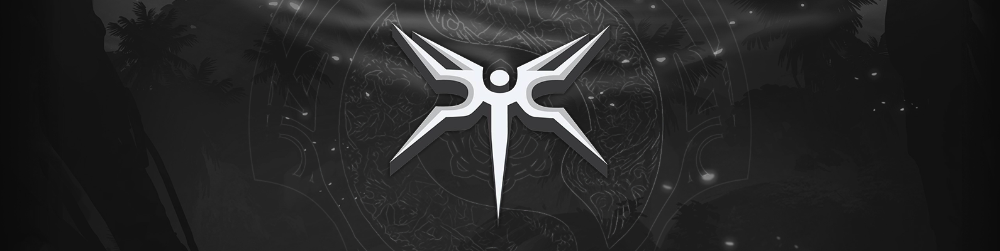</p>
<h2 style="margin: 0.25em 0;">Team Undying - <i>North America</i></h2>
<table>
  <tbody><tr>
    <td>Timado</td>
    <td>Bryle</td> 
    <td>SabeRLight-</td>
    <td>MoonMeander</td>
    <td>Dubu</td>
    <td>&nbsp;</td>
    <td><i style="font-size: smaller;">Coach</i>&nbsp;&nbsp;&nbsp;Febby</td></tr>
   </tbody>
</table>
<hr style="margin: 0.5em 0;">

**How did this roster happen?** PLACEHOLDER

**How was their DPC year?** 400 Points

* ***NA DPC S1** - 3rd, **ONE Esports Singapore Major** - Did not qualify, **NA DPC S2** - 3rd, **WePlay Kyiv AniMajor** - Did not qualify*

North America is Schrödinger's region. If you don't observe it, the cat could very well be alive. But then you tune in to a few matches and think, "No wonder everyone's moving to Valorant." Wait wrong Valve esport.

 While coming just barely short of qualifying to both majors, Undying plowed through the NA regional qualifier without dropping a single game. Does that actually mean anything? Your guess is as good as mine.

**What would success look like?** Acquiring enough practice and experience to maybe, just *maybe*...
<br><br><br><br>
Take a game off Arkosh next year.

**What to spam in Twitch chat when Undying is winning?** `NEVA EVA NEVA EVA CruW`

<hr style="margin-bottom: 1.2em;">
<p style="margin: 0.5em 0;">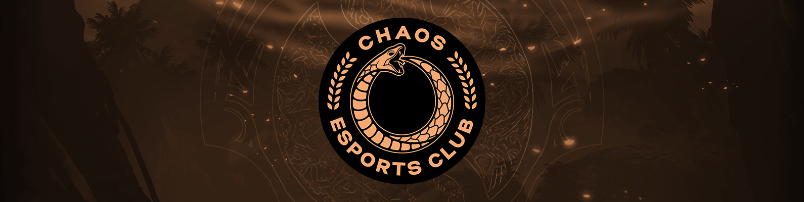</p>
<h2 style="margin: 0.25em 0;">SG esports - <i>South America</i></h2>
<table>
  <tbody><tr>
    <td>Costabile</td>
    <td>4dr</td> 
    <td>Tavo</td>
    <td>Thiolicor</td>
    <td>KJ</td>
    <td>&nbsp;</td>
    <td><i style="font-size: smaller;">Coach</i>&nbsp;&nbsp;&nbsp;Mangusu</td></tr>
   </tbody>
</table>
<hr style="margin: 0.5em 0;">

**How did this roster happen?** Hold the phone, *three* SA teams at TI? Peruvian *and* Brazilian? It's a brave new world, amigos.

**How was their DPC year?** 170 Points

* ***SA DPC S1** - 3rd, **ONE Esports Singapore Major** - Did not qualify, **SA DPC S2** - 6th, **WePlay Kyiv AniMajor** - Did not qualify*

PLACEHOLDER

**What would success look like?** PLACEHOLDER

**What to spam in Twitch chat when SG is winning?** `PLACEHOLDER`

<hr style="margin-bottom: 1.2em;">
<p style="margin: 0.5em 0;">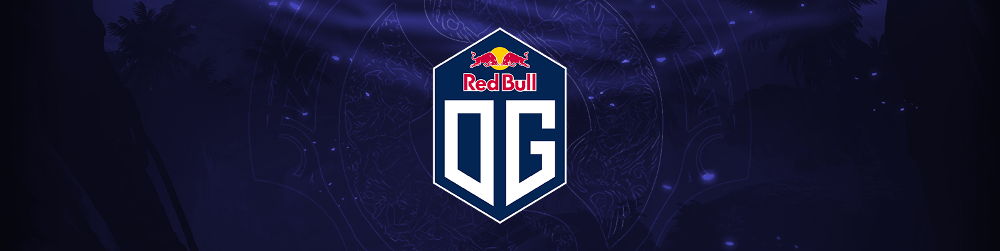</p>
<h2 style="margin: 0.25em 0;">OG - <i>Western Europe</i></h2>
<table>
  <tbody><tr>
    <td>SumaiL</td>
    <td>Topson</td> 
    <td>Ceb</td>
    <td>Saksa</td>
    <td>N0tail</td>
    <td>&nbsp;</td>
    <td><i style="font-size: smaller;">Coach</i>&nbsp;&nbsp;&nbsp;Misha</td></tr>
   </tbody>
</table>
<hr style="margin: 0.5em 0;">

**How did this roster happen?** I told you Sumail would be back.

**How was their DPC year?** 36.13 Points

* ***WEU DPC S1** - 5th, **ONE Esports Singapore Major** - Did not qualify, **WEU DPC S2** - 6th, **WePlay Kyiv AniMajor** - Did not qualify*

Oh my god, it was so exciting. Notail called Alliance a bunch of cheaters during the coach scandal and never formally apologized. Ceb DM'd Secret's social media manager and cursed him out in French. The brand appears to be slowly pivoting from esports teams to NFT manufacturers.

Oh the actual Dota? The Dota wasn't that great. After a sluggish season 1, Ana came back under the tag *humblegod* and got so humbled he didn't even finish the season.

**What would success look like?** C'mon, this one's obvious.

**What to spam in Twitch chat when OG is winning?** `THREE FUCKING FLUKES IN A ROW MAN SwiftRage`

<hr style="margin-bottom: 1.2em;">
<p style="margin: 0.5em 0;"></p>
<h2 style="margin: 0.25em 0;">Team Spirit - <i>Eastern Europe (CIS)</i></h2>
<table>
  <tbody><tr>
    <td>Yatoro</td>
    <td>TORONTOTOKYO (mio)</td> 
    <td>Collapse</td>
    <td>Miroslaw</td>
    <td>Miposhka</td>
    <td>&nbsp;</td>
    <td><i style="font-size: smaller;">Coach</i>&nbsp;&nbsp;&nbsp;Silent</td></tr>
   </tbody>
</table>
<hr style="margin: 0.5em 0;">

**How did this roster happen?** Yellow submarine

**How was their DPC year?** 585 Points

* ***EEU DPC S1** - 4th, **ONE Esports Singapore Major** - Did not qualify, **EEU DPC S2** - 2nd, **WePlay Kyiv AniMajor** - 7-8th*

PLACEHOLDER

**What would success look like?** Naruto running their way to pick up the Aegis.

**What to spam in Twitch chat when Spirit is winning?** `COLLAPSE GIGACHAD`

<hr style="margin-bottom: 1.2em;">
<p style="margin: 0.5em 0;"></p>
<h2 style="margin: 0.25em 0;">Elephant - <i>China</i></h2>
<table>
  <tbody><tr>
    <td>Eurus (Paparazi灬)</td>
    <td>Somnus丶M (Maybe)</td> 
    <td>Yang</td>
    <td>fy</td>
    <td>Super</td>
    <td>&nbsp;</td>
    <td><i style="font-size: smaller;">Coach</i>&nbsp;&nbsp;&nbsp;rOtK</td></tr>
   </tbody>
</table>
<hr style="margin: 0.5em 0;">

**How did this roster happen?** It's a tale as old as time. *What if. We took. A couple of **SUPERSTAR** players. And made a team with them? It has to work.*

It never works.

**How was their DPC year?** 85 Points

* ***CN DPC S1** - 5th, **ONE Esports Singapore Major** - Did not qualify, **CN DPC S2** - 5th, **WePlay Kyiv AniMajor** - Did not qualify*

*Okay, but what if we also brought in a **SUPERSTAR** coach for season 2?*

Still didn't work. Lucky for Elephant, four Chinese teams directly qualified for TI through points. And would you look at that, guess who was always 5th.

**What would success look like?** TI10 being a Rubick meta.

**What to spam in Twitch chat when Elephant is winning?** `pregnant me fy Kreygasm`

<hr style="margin-bottom: 1.2em;">
<p style="margin: 0.5em 0;">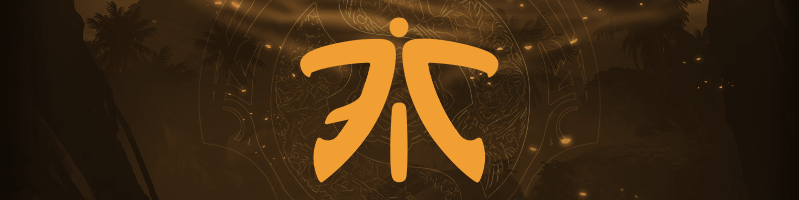</p>
<h2 style="margin: 0.25em 0;">Fnatic - <i>SEA</i></h2>
<table>
  <tbody><tr>
    <td>Raven</td>
    <td>ChYuan</td> 
    <td>Deth</td>
    <td>Jabz</td>
    <td>DJ</td>
    <td>&nbsp;</td>
    <td><i style="font-size: smaller;">Coach</i>&nbsp;&nbsp;&nbsp;SunBhie</td></tr>
   </tbody>
</table>
<hr style="margin: 0.5em 0;">

**How did this roster happen?** Painfully.

**How was their DPC year?** 446.25 Points

***SEA DPC S1** - 1st, **ONE Esports Singapore Major** - 9-12th, **SEA DPC S2** - 4th, **WePlay Kyiv AniMajor** - Did not qualify*

PLACEHOLDER

**What would success look like?** iceiceice bumps Deth up a tier or two, or six, in his [SEA offlaner power rankings.](https://afkgaming.com/dota2/news/7038-iceiceice-ranks-sea-dota-2-players-by-role)

**What to spam in Twitch chat when Fnatic is winning?** `CEO MOON MADE A GREAT BUSINESS DECISION`

----

# What about...?

Only 18 teams made it, which leaves a lot of

## North America

#### The rest of TI5 EG (ppd, Universe, Aui_2000)
* After TI9, ppd and Universe reunited on NiP. They actually qualified for the March 2020 ESL Los Angeles major right before COVID hit. The tournament got canceled and they both promptly retired. Peter then un-retired, competed in the NA DPC S1, stopped doing that, became Alliance's coach for the EU DPC S2, stopped doing that, was invited to cast TI10, but also stopped doing that.<br><br>Universe *actually* retired and recently [got married!](https://twitter.com/UniverseDota/status/1426214388508233731)<br><br>Aui seems content with his current coach/caster status and will also be joining the TI10 English broadcast.

#### EternaLEnVy
* I think they caught up with manga so we got some weird filler arc where Envy doesn't read the DPC rules and then acts surprised at the end of the season.<br><br>After floating around in the NA lower and upper divisions, Jacky Mao slapped together a team for the TI10 qualifier with Ryoya, Kingrd/Mr. Kingão, Zfreek, and Moo and got 3rd. Idk feels like the writers just ran out of ideas, not sure if I'll watch next season...

#### Mason

* Now a professional speech writer on twitch dot tv.

## South America

#### hFn
* If you didn't catch it, Fear is

#### Duster
* They're great! 

## Western Europe

#### Miracle-, w33, MinD_ContRoL, GH, KuroKy, iLTW
* Ah, you mean *Team Nigma*? Yes, that's their name. Well, actually, it's *Nigma Galaxy* now. After TI9, Kuro took the path of Secret/OG and decided to create his own organization. There were a few exciting victories for Nigma in 2020, but 2021 was mostly rocky. They attended the Singapore Major with a stand-in, bombed out, benched w33 for iLTW in season 2, attended the AniMajor, and landed 13th place in the DPC rankings. *One slot away* from being directly invited to TI through points. In the WEU regional qualifier, they got 3rd after narrowly losing to longtime rivals OG and bowed out of TI contention. <br><br>Their fans have not been coping with the loss particularly well. Rather than graciously accept defeat, some vocal Nigma diehards have been channeling their frustrations by: belittling the competitive integrity of other regions, condemning the DPC structure, trying to convince everyone this TI will suck because their team isn't there, and eagerly licking their chops to sub-in when news broke that some Chinese teams in Bucharest have COVID. Some real *BERNIE CAN STILL WIN* vibes out in the Nigma camp.

#### Team Liquid in general
* After Kuro splintered off to form Nigma, Liquid signed TI9's Alliance of miCKe, qojqva, Boxi, Taiga, and iNSaNiA. The team did well enough to show up to both majors, but they only "showed up" and not much more than that. Ultimately, they got 4th in the EU regional qualifiers after losing to Nigma.

#### Hmmm... if Nigma got 3rd and Liquid got 4th, who got 2nd?
* A team by the name of *Tundra Esports* with Skiter, Nine, 33, Sneyking, and Fata. Tundra never got to attend any majors, but they got nail-bitingly close to beating OG in the WEU TI10 qualifiers. Incidentally, this is the first International that Fata has missed since he started competing at *TI3.*

## Eastern Europe (CIS)

#### Old VP (RAMZES666, no[o]ne, 9pasha, Rodjer, Solo)
* Amusingly, Na\`Vi is apparently the most recent team on every one of those players' history, but that's reductive. After TI9, the team imploded and everyone went their separate ways.

#### Dendi
* They're great!

## China

#### Burning
* If you didn't catch it, Fear is

#### Sccc
* They're great! 

## Southeast Asia

#### smg (mushi, ninjaboogie)
* If you didn't catch it, Fear is

#### Duster
* They're great! 

<p style="text-align: justify;margin-bottom: 0.5em;font-size: smaller;">This article was inspired by a <i>New York Times</i> <a href="https://www.nytimes.com/2018/06/11/sports/world-cup-groups.html">guide to World Cup teams</a> and appropriated for Dota as suggested by <a href="https://twitter.com/SkimGaming/status/1007998992498790401">@SkimGaming.</a> Much appreciation to the people who exhaustively update all tournament and team results on Liquipedia including those responsible for this exceptionally detailed <a href="https://liquipedia.net/dota2/Dota_Pro_Circuit/Stats">Dota Pro Circuit stats page.</a> Player photos in the header were sourced from the <a href="https://www.flickr.com/photos/dota2ti/">dota2ti</a>, <a href="https://www.flickr.com/photos/cybersportcom/">Cybersport</a>, and <a href="https://www.flickr.com/photos/starladder/">StarLadder</a> Flickrs.</p>

<p style="text-align: justify;margin-bottom: 0.5em;font-size: smaller;"><a href="https://www.reddit.com/r/DotA2/comments/8zx25q/the_international_2018_a_practical_guide_to_all/">Discussion for this article on /r/dota2.</a></p>
