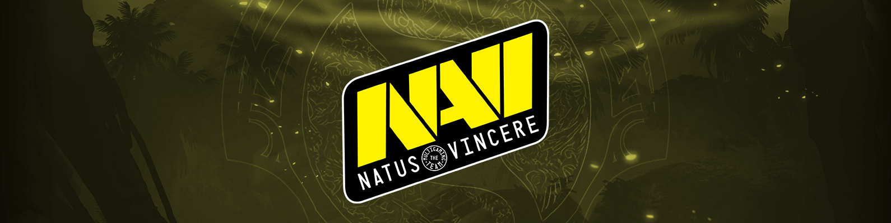

### It's that magical time of year again.

Players are going into stream hibernation as bootcamps begin, Arcana propaganda campaigns are getting increasingly heated, and gaming blogs are prepping their annual piece of Dota 2 coverage to report on whichever way the prize pool goes. Ah, International season.

But not everyone has been following the professional Dota 2 scene like their livelihood depended on it. Perhaps you're the viewer who was saturated by all the tournaments and are just now tuning back in for TI. Maybe your weird friend's yearly pilgrimage to Seattle has been rerouted to Vancouver and you're shocked to learn they allow this kind of degeneracy in Canada too. Or maybe you just want to enjoy the week of festivities Valve has organized around the upcoming Artifact information session.

Whatever your story, here's a preview of the teams and memes you should know come August.

# The Invites

Eight teams were directly invited to TI8 this year through a new system Valve implemented called the *Dota Pro Circuit* or *DPC*. Instead of the old, ambiguous, invitation process of 'do pretty good in the five months before TI,' players were given a new, clearer, directive of 'do pretty good in the five months before TI and don't you dare mess with your roster.'

Twenty-two DPC tournaments later, these are the teams that either stayed after class, captained the Mechanics team, and played Varsity Dota, or the ones that showed up, got a B-, copied drafts at lunch, but still got automatic admission because the rest of the graduating class spent too much time casting Pipe of Insight under the bleachers. That’s not to say any team ended up invited due to a technicality, but make no mistake, there exists a significant gap in Dota proficiency between the upper and lower tiers of this list.

The beauty of The International is when most of these skill differences go out the window.

<h2 style="margin: 0.25em 0;">Evil Geniuses</h2>
<table>
  <tbody><tr>
    <td>Arteezy</td>
    <td>Abed</td> 
    <td>iceiceice</td>
    <td>Cr1t-</td>
    <td>Fly</td>
    <td>&nbsp;</td>
    <td><i style="font-size: smaller;">Coach</i>&nbsp;&nbsp;&nbsp;BuLba</td></tr>
   </tbody>
</table>

**How did this roster happen?** Do you know how painful this season has been for EG fans? Through gritted teeth, they've been tanking abuse from smug Europeans whose teams have been completely dominating the DPC. Whatever, that's fine, but the worst part was EG weren't even *doing bad*. So #BleedBluers didn't even get the satisfaction of demanding roster changes. "B-b-but they were consistently getting top three!" Obviously. By any reasonable metric of achievement, it's been a pretty excellent year. But Dota players operate on the Ricky Bobby scale, so if you ain't first, you're last.

**How did they qualify?** EG has basically been playing Dota Mad Libs for the past year.

>Former EG member <select><option hidden>Player</option><option>Fear</option><option>ppd</option><option>Demon</option></select> will be joining our <select><option hidden>Organization</option><option>Dota 2 roster</option><option>stream team</option><option>Rainbow 6 squad</option></select> to <select><option hidden>Role</option><option>play support</option><option>coach</option><option>feed Sumail bananas</option></select> !

><select><option hidden>Player</option><option>Sumail</option><option>Arteezy</option><option>Bulba</option></select> will be taking over as <select><option hidden>Position</option><option>offlaner</option><option>quadcore</option><option>jungler</option></select> as we say goodbye to <select><option hidden>Literally Anyone But Sumail</option><option>Universe</option><option>Misery</option><option>Bulba</option></select> .

After these maneuvers failed to produce results, the boys decided to consult the forbidden texts and made one of the most drastic roster changes possible just six days before the Supermajor.

>We appreciate your <select><option hidden>Platitude</option><option>continued patience</option><option>passionate support</option><option>angry tweets</option></select> and are excited to announce the additions of <select><option hidden>Player #1 You'd Least Expect</option><option>Fly</option><option>Dendi</option><option>Poopkid</option></select> and <select><option hidden>Player #2 You'd Least Expect</option><option>s4</option><option>Doublelift</option><option>HookGangGod</option></select> to our Dota 2 team.

**What can we exp3ct?** Dank memes

**How to sound smart talking about EG** "The current EG roster is the largest waste of potential in the history of dota."

**What would success look like?** Second.

<h2 style="margin: 0.25em 0;">PSG.LGD</h2>
<table>
  <tbody><tr>
    <td>Ame</td>
    <td>NothingToSay</td>
    <td>Faith_bian</td> 
    <td>XinQ</td>
    <td>y` (Innocence)</td>
    <td>&nbsp;</td>
    <td><i style="font-size: smaller;">Coach</i>&nbsp;&nbsp;&nbsp;xiao8</td></tr>
   </tbody>
</table>

**Notable tournament placings** Epicenter XL Major champions, MDL Changsha Major champions

**How did they qualify?** LGD went from mostly irrelevant Chinese bottom feeder to French sponsored TI contender in a whirlwind two months starting with a 2nd place finish at DAC in April to winning MDL in May.

**What can we expect?** The lore behind TI champions is every alternate year is a "China year." TI1 - Na'Vi (Western), TI2 - iG (Chinese), TI3 - Alliance (Western), TI4 - Newbee (Chinese), TI5 - EG (Western), TI6 - Wings (Chinese), TI7 - Liquid (Western).

In other words, these guys are the world's best chance at saving Dota from becoming a ded gaem.

**How to sound smart talking about LGD** Most people are aware that Ame and Burning have a somewhat antagonistic relationship stemming from Ame destroying his items on iG's high ground after beating Burning with Anti-Mage during TI7. A few weeks ago, Burning sent Ame on a huge losing streak in pubs eventually culminating in them playing a 1v1 as AM with Burning ending up victorious. In the Chinese zodiac story of The Great Race, the ox agrees to carry the rat across the river to make it to the heavenly gates, but loses to the rat after it jumps off. Meanwhile, the dragon could've won the race whenever he wanted to, but stopped to bring rain to a village in need. Ame was born in the year of the ox (牛) and Burning was born in the year of the dragon (龙). Ame lost the 1v1 by overextending past the river and dying on Burning's high ground. But instead of destroying his items, Burning planted a single Iron Branch on Ame's high ground, making it rain on Ame's village. The character for 'ox' is used in '吹牛' which means 'to talk big' and the character for 'dragon' is used in '成龙' which is Jackie Chan's Chinese name. So after the match, Sgamer netizens began posting '吹牛得到成龙' effectively translating to 'Talk shit, get (Jackie Chan'd) hit.'

The previous paragraph is complete bullshit, but you bought it. That's because if there's anything that makes you sound smart talking about LGD, it's explaining convoluted Chinese wordplay to redditors who don't really understand and just want to post, 'Wow, Chinese memes are so high level! xD'

**What would success look like?** Having said that, "\_\_\_\_\_\_\_，\_\_\_\_\_\_\_\_\_\_\_\_\_\_\_\!"

<h2 style="margin: 0.25em 0;">Virtus.pro</h2>

<table>
  <tbody><tr>
    <td>Nightfall</td>
    <td>gpk</td> 
    <td>DM</td>
    <td>Save-</td>
    <td>Kingslayer</td>
    <td>&nbsp;</td>
    <td><i style="font-size: smaller;">Coach</i>&nbsp;&nbsp;&nbsp;boolk</td></tr>
   </tbody>
</table>

**Notable tournament placings** Normally I would just . Or I could tell you that this VP has never placed lower than Top 8 at any event. Any event. Maybe that's not impressive enough for you? How about this. Since August 2016, which is when this VP formed with Lil, this team has still <i>never placed lower than Top 8 at any event.</i>

**How did they qualify?** Got top 4 in seven out of the eight majors they attended and then proceeded to win half of them.

**What can we expect?** While VP were not the apex predators they were last season, this legendary squad has maintained the longest running roster

**How to sound smart talking about VP** "Maybe Sansheng should've written a guide on how to deal with the chat wheel."

**What would success look like?** CIS deserves another Aegis.

<h2 style="margin: 0.25em 0;">Quincy Crew</h2>
<table>
  <tbody><tr>
    <td>YawaR</td>
    <td>Quinn (CCnC)</td>
    <td>Lelis</td>
    <td>MSS</td>
    <td>LoA (SVG)</td></tr>
   </tbody>
</table>

**Notable tournament placings** If you ever put ex-Forward Gaming in the cage with anyone else in the region (besides EG), they came out  But ya send 'em to a LAN against international opponents and it's all ♿♿♿NA DOTA COMING THROUGH♿♿♿

**How did they qualify?** After Valve finally confiscated NA's third slot to every major

**What can we expect?** Jeremy Lin to make his yearly cameo, but now with some actual skin in the game. At least I hope so. If he and Asa Butterfield move to Fortnite, we're doomed.

**How to sound smart talking about Newbee** "BSJ was just ahead of his time."

**What would success look like?** So many USA chants you'll forget this TI is actually in Canada.

<h2 style="margin: 0.25em 0;">Invictus Gaming</h2>
<table>
  <tbody><tr>
    <td>flyfly</td>
    <td>Emo</td> 
    <td>JT-</td>
    <td>Kaka</td>
    <td>Oli</td>
    <td>&nbsp;</td>
    <td><i style="font-size: smaller;">Coach</i>&nbsp;&nbsp;&nbsp;super</td></tr>
   </tbody>
</table>

**Notable tournament placings** A whole bunch of 3rd place finishes

**How did they qualify?** TI7's runners-up gave a less than stellar performance this season, but it was enough to squeeze into the DPC top 8 for a TI invite anyway. Their biggest mistake was getting revenge on Liquid too early in the year, thus preventing the Sccc ultra instinct arc.

**What can we expect?** This squad didn't have *amazing* results before TI7 either. They were good enough to be directly invited, but most people considered LFY or LGD to be the strongest Chinese teams at that TI. Perhaps history will repeat itself.

**How to sound smart talking about Keen** "Sccc is my free pass."

**What would success look like?** "You expect to win a championship at your first TI? You're just an ordinary person... not a god. Second TI is no excuse though, you better win."

<h2 style="margin: 0.25em 0;">T1</h2>
<table>
  <tbody><tr>
    <td>23savage</td>
    <td>Karl</td> 
    <td>Kuku</td>
    <td>Xepher</td>
    <td>Whitemon</td>
    <td>&nbsp;</td>
    <td><i style="font-size: smaller;">Coach</i>&nbsp;&nbsp;&nbsp;March</td></tr>
   </tbody>
</table>

**Notable tournament placings** 4th place at both the ESL Katowice and Birmingham Majors

**How did they qualify?** Simply put, they didn't choke. After losing their way to both TNCs in the group stage, Fnatic went plus ultra in playoffs to then 2-0 the pair of them and claim the first qualifier spot.

**What can we expect?** Let it All Out of You

**How to sound smart talking about Fnatic** "Dude, of course he counts. TI1's rules were different, he could've competed at any point!"

**What would success look like?** Abed shakes all remaining 10k MMR doubt, DJ expands his LAN cafe empire, Universe solidifies his spot on Dota 2's Mount Rushmore, KyoAni begins storyboarding an OVA of EE's life, and pieliedie finally closes his eyes.

For he is at peace.

<h2 style="margin: 0.25em 0;">Vici Gaming</h2>
<table>
  <tbody><tr>
    <td>poyoyo</td>
    <td>Ori</td> 
    <td>old eLeVeN</td>
    <td>Pyw</td>
    <td>Dy</td>
    <td>&nbsp;</td>
    <td><i style="font-size: smaller;">Coach</i>&nbsp;&nbsp;&nbsp;Fenrir</td></tr>
   </tbody>
</table>

**Notable tournament placings** A whole bunch of 2nd place finishes

**How did they qualify?** Middle of the pack tournament results translating into a middle of the pack DPC result.

**What can we expect?** Just some real solid Dotes. You know, a real focus on the fundamentals. The guys are gonna give it their all. Show some real hustle out there.

And not win.

**How to sound smart talking about VG** How does one even talk about Vici to begin with? To investigate, I sifted through roughly ten different VG match discussion threads on reddit in the past few months and found only *one* person with Vici Gaming flair in any of them. You are a lost soul, /u/OPQOP, but I hope you find happiness as a VG fan.

**What would success look like?** Fenrir and LaNm doing well enough that they don't 'retire' after TI8.

<h2 style="margin: 0.25em 0;">Team Secret</h2>
<table>
  <tbody><tr>
    <td>MATUMBAMAN</td> 
    <td>Nisha</td>
    <td>zai</td>
    <td>YapzOr</td>
    <td>Puppey</td>
    <td>&nbsp;</td>
    <td><i style="font-size: smaller;">Coach</i>&nbsp;&nbsp;&nbsp;Heen</td></tr>
   </tbody>
</table>

**Notable tournament placings** It'd be shorter to list their non-notable tournament placings this season. It was Epicenter. They got bodied at Epicenter. But the rest of the season was 👌

**How did they qualify?** Nisha's Dota 2 career began in around 2015 and earned him netted him ~$25,000 USD in prize winnings before joining Team Secret. After Team Secret? Nearly $300,000

**What can we expect?** Only a fool would expect the best performing team of the season to win TI.

**How to sound smart talking about Secret** During the second pick phase of any draft just casually mumble, "This *could* be an Ace Meepo game," to no one in particular.

On panels, this is known as the <abbr title="jk ilu Will <3"><i>Blitz-Storm Corollary</i></abbr>.

**What would success look like?** How convenient, I can just repeat what I said last year: Despite always being pretty good, Team Secret's highest placing at any International since the organization's inception was <i><strike>7/8th at TI5</strike></i> 5/6th at TI8. So ideally better than that.

<h2 style="margin: 0.25em 0;">Team Aster</h2>
<table>
  <tbody><tr>
    <td>Monet</td>
    <td>White丶Album_白学家</td> 
    <td>Xxs</td>
    <td>Borax (BoBoKa)</td>
    <td>LaNm</td>
    <td>&nbsp;</td>
    <td><i style="font-size: smaller;">Coach</i>&nbsp;&nbsp;&nbsp;Mad</td></tr>
   </tbody>
</table>

**Notable tournament placings** Top 10 most 

**How did they qualify?** In the divine game of mahjong that randomly determines whichever Chinese team is intra-regionally strongest on any given week, the gods willed that Serenity shall be victorious.

**What can we expect?** Honestly, no one knows. Anyone who claims otherwise is just trying to sound smart.

**How to sound smart talking about RNG** "lmaoooo maybe if you watched *actual* amateur dota and not grant streams of trashcan na pubs youd know my boys have been looking like TI winners since hcup season 8"

**What would success look like?** Not getting banned by ACE next year.

<h2 style="margin: 0.25em 0;">Alliance</h2>
<table>
  <tbody><tr>
    <td>Nikobaby</td>
    <td>LIMMP</td> 
    <td>s4</td>
    <td>Handsken</td>
    <td>fng</td></tr>
   </tbody>
</table>

**Notable tournament placings** 2nd place at The Bucharest Major. Also won Galaxy Battles II, but I'm the only person who cares about that tournament.

**How did they qualify?** In a cutthroat they beat gambit

**What can we expect?** Not that.

**How to sound smart talking about Alliance** Without scrolling up, name the other three players who aren't ddc or Sylar.

**What would success look like?** Beyond ddc potentially becoming the last of the <abbr title="Puppey, Universe, Kuroky, ddc">Elite Four all-TI attendees</abbr> to earn an Aegis, a victory for their coach, the ever-lovable rOtK, would be something to celebrate for Eastern and Western Dota fans alike.

<h2 style="margin: 0.25em 0;">beastcoast</h2>
<table>
  <tbody><tr>
    <td>K1 (Hector)</td>
    <td>Chris Luck</td> 
    <td>Wisper</td>
    <td>Scofield</td>
    <td>StingeR</td>
    <td>&nbsp;</td>
    <td><i style="font-size: smaller;">Coach</i>&nbsp;&nbsp;&nbsp;Papita</td></tr>
   </tbody>
</table>

**Notable tournament placings** Infamous? Never heard of 'em. You mean the Burger Cats? Oh hell yeah, Anvorgesa did pretty good at that last StarLadder Minor.

**How did they qualify?** The tug-of-war between Brazilian and Peruvian Dota went back to the cabinas this year.

**What can we expect?** This is the longest period of time I've seen a SA squad stick together before qualifying to TI.

**How to sound smart talking about Infamous** "GAAAAAAAAAAAAAAAAAAAAAAAA"

**What would success look like?** None of the players using an offensive name during the event.

<h2 style="margin: 0.25em 0;">Thunder Predator</h2>
<table>
  <tbody><tr>
    <td>Mnz</td>
    <td>Leostyle-</td> 
    <td>Frank</td>
    <td>MoOz</td>
    <td>Mjz</td>
    <td>&nbsp;</td>
    <td><i style="font-size: smaller;">Coach</i>&nbsp;&nbsp;&nbsp;Fear</td></tr>
   </tbody>
</table>

**Notable tournament placings** Infamous? Never heard of 'em. You mean the Burger Cats? Oh hell yeah, Anvorgesa did pretty good at that last StarLadder Minor.

**How did they qualify?** The tug-of-war between Brazilian and Peruvian Dota went back to the cabinas this year.

**What can we expect?** This is the longest period of time I've seen a SA squad stick together before qualifying to TI.

**How to sound smart talking about Infamous** "GAAAAAAAAAAAAAAAAAAAAAAAA"

**What would success look like?** None of the players using an offensive name during the event.

# The Qualifiers

The other ten teams came through a double elimination bracket of online qualifiers within their respective regions. Half of them had to even go through a Bo1 madhouse open qualifier for committing the cardinal sin of wanting to change rosters after February 5th.

Some trivia: Of the ten different squads to have attended an International grand final since the qualifier system was created in TI3, only three have been non-invited teams, and Wings is the only qualifier team to have ever won.

So that's where the bar is set.

<h2 style="margin: 0.25em 0;">Team Undying - <i>North America Regional Qualifier</i></h2>
<table>
  <tbody><tr>
    <td>Timado</td>
    <td>Bryle</td> 
    <td>SabeRLight-</td>
    <td>MoonMeander</td>
    <td>Dubu</td></tr>
   </tbody>
</table>

**Notable tournament placings** DAC 2018 Major champions

**How did they qualify?** While allegedly on the brink of disbanding, the squad managed to beat LGD on their own home turf to win DAC. Thankfully, with VP and Liquid vacuuming up all the other DPC points, that Major win was all Mineski needed to secure their TI invite.

**What can we expect?** Mineski is one of those teams that people are mostly unsurprised no matter what result they get. Drown in group stage? *Eh, it happens.* Dominant winner's side run? *Knew they had it in them.* Don't even qualify? *Wow, SEA is so competitive!*

**How to sound smart talking about Mineski** Don't say anything, just start doing push-ups.

**What would success look like?** An iceiceice Aegis would be like the DiCaprio Oscar in terms of reddit self-satisfaction.

<h2 style="margin: 0.25em 0;">SG esports - <i>South America Regional Qualifier</i></h2>
<table>
  <tbody><tr>
    <td>Costabile</td>
    <td>4dr</td> 
    <td>Tavo</td>
    <td>Thiolicor</td>
    <td>KJ</td>
    <td>&nbsp;</td>
    <td><i style="font-size: smaller;">Coach</i>&nbsp;&nbsp;&nbsp;Mangus</td></tr>
   </tbody>
</table>

**Notable tournament placings** Infamous? Never heard of 'em. You mean the Burger Cats? Oh hell yeah, Anvorgesa did pretty good at that last StarLadder Minor.

**How did they qualify?** The tug-of-war between Brazilian and Peruvian Dota went back to the cabinas this year.

**What can we expect?** This is the longest period of time I've seen a SA squad stick together before qualifying to TI.

**How to sound smart talking about Infamous** "GAAAAAAAAAAAAAAAAAAAAAAAA"

**What would success look like?** None of the players using an offensive name during the event.

<h2 style="margin: 0.25em 0;">OG - <i>Western Europe Regional Qualifier</i></h2>
<table>
  <tbody><tr>
    <td>SumaiL</td>
    <td>Topson</td> 
    <td>Ceb</td>
    <td>Saksa</td>
    <td>N0tail</td>
    <td>&nbsp;</td>
    <td><i style="font-size: smaller;">Coach</i>&nbsp;&nbsp;&nbsp;Sockshka</td></tr>
   </tbody>
</table>

**Notable tournament placings** The current roster was assembled around two weeks before TI qualifiers began, so... The International 2018: Europe Open Qualifier #1 champions.

**How did they qualify?** Ana came back.

**What can we expect?**

**How to sound smart talking about OG** "I was spamming '*OG.TOPSON*' in chat before Meteor Hammer Invoker was even a twinkle in his eyes."

**What would success look like?** After multiple failed International runs, it would be only fitting that OG do well at the first TI where they're actually considered underdogs.

<h2 style="margin: 0.25em 0;">Team Spirit - <i>Eastern Europe (CIS) Regional Qualifier</i></h2>
<table>
  <tbody><tr>
    <td>Yatoro</td>
    <td>TORONTOTOKYO (mio)</td> 
    <td>Collapse</td>
    <td>Miroslaw</td>
    <td>Miposhka</td>
    <td>&nbsp;</td>
    <td><i style="font-size: smaller;">Coach</i>&nbsp;&nbsp;&nbsp;Silent</td></tr>
   </tbody>
</table>

**Notable tournament placings** 3rd place at Epicenter XL Major

**How did they qualify?** \**read in deep announcer voice while imagining smash cuts of esports poses shrouded by smoke machines*\* Formerly known as ***FlyToMoon,*** this squad of CIS rejects took their ***region by storm*** after being assembled during the ***second half*** of the season. ***Brash, aggressive, and unpredictable.*** This roster has the ***experience to dominate*** and the ***confidence to go with it.*** This is... ***Winstrike.*** \**cut back to panel as Redeye says "Yes, indeed..." and then asks Cap a question about Iceberg probably*\*

**What can we expect?** Entertaining games and maybe a few upsets, but a deep run by Winstrike is among the darkest of horses.

**How to sound smart talking about Na`Vi** "This is good for Bitcoin."

**What would success look like?** Earlier in the season, Iceberg mentioned in an interview that they themselves don't expect to do particularly well, just getting to TI was the main goal. So mission accomplished. The real success would be if the roster stays together for more than two months post-TI.

<h2 style="margin: 0.25em 0;">Elephant - <i>China Regional Qualifier</i></h2>
<table>
  <tbody><tr>
    <td>Eurus (Paparazi灬)</td>
    <td>Somnus丶M (Maybe)</td> 
    <td>Yang</td>
    <td>fy</td>
    <td>Super</td>
    <td>&nbsp;</td>
    <td><i style="font-size: smaller;">Coach</i>&nbsp;&nbsp;&nbsp;rOtK</td></tr>
   </tbody>
</table>

**Notable tournament placings** Top 10 most 

**How did they qualify?** In the divine game of mahjong that randomly determines whichever Chinese team is intra-regionally strongest on any given week, the gods willed that Serenity shall be victorious.

**What can we expect?** Honestly, no one knows. Anyone who claims otherwise is just trying to sound smart.

**How to sound smart talking about RNG** "lmaoooo maybe if you watched *actual* amateur dota and not grant streams of trashcan na pubs youd know my boys have been looking like TI winners since hcup season 8"

**What would success look like?** Not getting banned by ACE next year.

<h2 style="margin: 0.25em 0;">Fnatic - <i>SEA Regional Qualifier</i></h2>
<table>
  <tbody><tr>
    <td>Raven</td>
    <td>ChYuan</td> 
    <td>Deth</td>
    <td>Jabz</td>
    <td>DJ</td>
    <td>&nbsp;</td>
    <td><i style="font-size: smaller;">Coach</i>&nbsp;&nbsp;&nbsp;SunBhie</td></tr>
   </tbody>
</table>

**Notable tournament placings** 4th place at DAC 2018 Major, 2nd place at MDL Macau Minor

**How did they qualify?** Little known fact, TNC actually stands for _They Need Coaching._ Under the tutelage of Kips, the team scooped up a pretty cozy 5/6th place finish at the Kuala Lumpur Major. Shortly thereafter, they go coachless, get destroyed at the Chongqing Major, and then proceed to fall off the face off the earth. Three months later, they enter the Heen zone. The former Team Liquid coach whips the pinoy boys into shape for a 4th place finish at EPICENTER and a lock into TI.

**What can we expect?** TNC can easily take a game off any team in the entire tournament without breaking a sweat.

Scientists have yet to determine if a second game is possible.

**How to sound smart talking about TNC** Just regurgitate whatever you read on scantzor's twitter.

**What would success look like?** SA and SEA are the only regions remaining who have yet to take an Aegis.

----

This article was inspired by a <i>New York Times</i> <a href="https://www.nytimes.com/2018/06/11/sports/world-cup-groups.html">guide to World Cup teams</a> and appropriated for Dota as suggested by <a href="https://twitter.com/SkimGaming/status/1007998992498790401">@SkimGaming.</a> Much appreciation to the people who exhaustively update all tournament and team results on Liquipedia including those responsible for this exceptionally detailed <a href="https://liquipedia.net/dota2/Dota_Pro_Circuit/Stats">Dota Pro Circuit stats page.</a> Player photos in the header were sourced from the <a href="https://www.flickr.com/photos/dota2ti/">dota2ti</a>, <a href="https://www.flickr.com/photos/cybersportcom/">Cybersport</a>, and <a href="https://www.flickr.com/photos/starladder/">StarLadder</a> Flickrs.

<a href="https://www.reddit.com/r/DotA2/comments/8zx25q/the_international_2018_a_practical_guide_to_all/">Discussion for this article on /r/dota2.</a>

