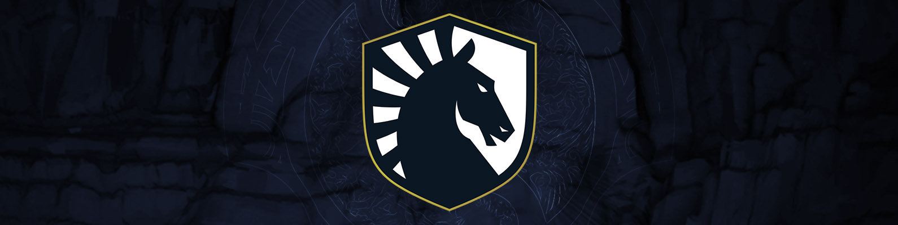
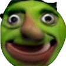

---
layout: "post"
title: "The International 2022: A Practical Guide to All 20 Teams"
date: "2022-10-06 11:45"
summary:    The bare minimum information you need to know before talking to a Dota player this October.
feature-img: "img/ti11teams/ti11header.jpg"
flags: true
---

### Not a moment too soon

After last year, a lot of people were expecting a big patch for how the DPC operates. You know maybe some calendar shifts? Economy reworks? Instead we just got some number buffs.

<style>
  @font-face{font-family:"Radiance";src:url("https://cdn.cloudflare.steamstatic.com/apps/dota2/fonts/radiance.eot");src:url("https://cdn.cloudflare.steamstatic.com/apps/dota2/fonts/radiance.eot?#iefix") format("embedded-opentype"),url("https://cdn.cloudflare.steamstatic.com/apps/dota2/fonts/radiance.woff") format("woff"),url("https://cdn.cloudflare.steamstatic.com/apps/dota2/fonts/radiance.ttf") format("truetype"),url("https://cdn.cloudflare.steamstatic.com/apps/dota2/fonts/radiance.svg#ywftsvg") format("svg");font-weight:normal;font-style:normal}@font-face{font-family:"Radiance";src:url("https://cdn.cloudflare.steamstatic.com/apps/dota2/fonts/radiance-bold.eot");src:url("https://cdn.cloudflare.steamstatic.com/apps/dota2/fonts/radiance-bold.eot?#iefix") format("embedded-opentype"),url("https://cdn.cloudflare.steamstatic.com/apps/dota2/fonts/radiance-bold.woff") format("woff"),url("https://cdn.cloudflare.steamstatic.com/apps/dota2/fonts/radiance-bold.ttf") format("truetype"),url("https://cdn.cloudflare.steamstatic.com/apps/dota2/fonts/radiance-bold.svg#ywftsvg") format("svg");font-weight:900;font-style:normal}@font-face{font-family:"Radiance";src:url("https://cdn.cloudflare.steamstatic.com/apps/dota2/fonts/radiance-semibold.eot");src:url("https://cdn.cloudflare.steamstatic.com/apps/dota2/fonts/radiance-semibold.eot?#iefix") format("embedded-opentype"),url("https://cdn.cloudflare.steamstatic.com/apps/dota2/fonts/radiance-semibold.woff") format("woff"),url("https://cdn.cloudflare.steamstatic.com/apps/dota2/fonts/radiance-semibold.ttf") format("truetype"),url("https://cdn.cloudflare.steamstatic.com/apps/dota2/fonts/radiance-semibold.svg#ywftsvg") format("svg");font-weight:700;font-style:normal}@font-face{font-family:"Reaver";src:url("https://cdn.cloudflare.steamstatic.com/apps/dota2/fonts/Reaver-Regular.woff") format("woff"),url("https://cdn.cloudflare.steamstatic.com/apps/dota2/fonts/Reaver-Regular.ttf") format("truetype");font-weight:400;font-style:normal}@font-face{font-family:"Reaver";src:url("https://cdn.cloudflare.steamstatic.com/apps/dota2/fonts/Reaver-Light.woff") format("woff"),url("https://cdn.cloudflare.steamstatic.com/apps/dota2/fonts/Reaver-Regular-Light.ttf") format("truetype");font-weight:200;font-style:normal}@font-face{font-family:"Reaver";src:url("https://cdn.cloudflare.steamstatic.com/apps/dota2/fonts/Reaver-SemiBold.woff") format("woff"),url("https://cdn.cloudflare.steamstatic.com/apps/dota2/fonts/Reaver-Regular-SemiBold.ttf") format("truetype");font-weight:600;font-style:normal}@font-face{font-family:"Reaver";src:url("https://cdn.cloudflare.steamstatic.com/apps/dota2/fonts/Reaver-Bold.woff") format("woff"),url("https://cdn.cloudflare.steamstatic.com/apps/dota2/fonts/Reaver-Regular-Bold.ttf") format("truetype");font-weight:700;font-style:normal}@font-face{font-family:"Reaver";src:url("https://cdn.cloudflare.steamstatic.com/apps/dota2/fonts/Reaver-Black.woff") format("woff"),url("https://cdn.cloudflare.steamstatic.com/apps/dota2/fonts/Reaver-Regular-Black.ttf") format("truetype");font-weight:800;font-style:normal}
</style>

<div style='box-sizing: border-box; font-family: "Radiance","Noto Sans",sans-serif; width: 100%; background-color: #000; padding: 15px 25px; min-height: 0; margin-bottom: 1em; display: flex; flex-direction: column; position: relative;'>

<span style='box-sizing: border-box; font-family: "Radiance","Noto Sans",sans-serif; max-width: 900px; color: #ed3b1c; font-size: 32px; letter-spacing: 4px;'>
DPC Changelog
</span>
<span style='font-family: "Radiance","Noto Sans",sans-serif; max-width: 900px; color: #ed3b1c; font-size: 72px; font-weight: bold; letter-spacing: 8px;'>
2021-2022
</span>
<span style=' background: linear-gradient(to right, #833312FF, #83331200); border-left: 2px solid #ff5005; font-size: 30px; font-weight: 600; font-family: "Reaver",serif; text-transform: uppercase; letter-spacing: 4px; color: #fff; text-shadow: 0px 0px 5px #000; box-shadow: 0px 0px 30px #000; padding: 12px 20px;'>GENERAL UPDATES</span>
<br>
<span style=' font-family: "Radiance","Noto Sans",sans-serif; font-size: 20px; color: #bbbbbbee; line-height: 30px; font-weight: 200; margin-bottom: 20px'>
• Increased number of Regional Leagues/Tours from 2 to 3
<br>
• Reworked DPC points formula. Leagues and Majors now scale the closer they are to TI. For example, 1st place in a Regional League now earns 300/400/500 points for Tour 1/2/3 instead of a flat 500 points each Tour
</span>
</div>

Alright, fair enough. At least this is closer to Valve's original vision of the DPC when they [initially pitched the regional league format.](https://web.archive.org/web/20210212054111/http://blog.dota2.com/2020/02/introducing-regional-leagues/) 3 regional leagues, 3 majors, 6 opportunities total to earn points. Still six weeks per league, still the same prize pools, and still the same major slot allocations per region, but progress nonetheless.

The first regional tour for this season started near the <abbr title="For every region besides China">end of November 2021</abbr> and things were going along swimmingly. _"I wonder where the first major will be?"_ the Dota scene very openly wondered. Well on January 11th, [we found out.](https://web.archive.org/web/20220112065038/https://www.dota2.com/newsentry/3110298479118085517)

<div style='box-sizing: border-box; font-family: "Radiance","Noto Sans",sans-serif; width: 100%; background-color: #000; padding: 15px 25px; min-height: 0; margin-bottom: 1em; display: flex; flex-direction: column; position: relative;'>

<span style='box-sizing: border-box; font-family: "Radiance","Noto Sans",sans-serif; max-width: 900px; color: #ed3b1c; font-size: 32px; letter-spacing: 4px;'>
DPC Changelog
</span>
<span style='font-family: "Radiance","Noto Sans",sans-serif; max-width: 900px; color: #ed3b1c; font-size: 72px; font-weight: bold; letter-spacing: 8px;'>
2021-2022.b
</span>
<span style=' background: linear-gradient(to right, #833312FF, #83331200); border-left: 2px solid #ff5005; font-size: 30px; font-weight: 600; font-family: "Reaver",serif; text-transform: uppercase; letter-spacing: 4px; color: #fff; text-shadow: 0px 0px 5px #000; box-shadow: 0px 0px 30px #000; padding: 12px 20px;'>PANIC UPDATES</span>
<br>
<span style=' font-family: "Radiance","Noto Sans",sans-serif; font-size: 20px; color: #bbbbbbee; line-height: 30px; font-weight: 200; margin-bottom: 20px'>
• Due to escalating COVID concerns, the first major has been canceled
<br>
• DPC Points that would have been awarded during the first major will now be reallocated to Major 2 and Major 3
<br>
</span>
</div>

And that was... kind of it? As it is, players were not particularly thrilled about burning six weeks of their time competing in a 2-Bo3-a-week league, but they had to grin and bear it to make it to the major. Well, now there's no major. Thanks for playing. Literally.

People were piiiiiiissed.

So Valve went [back to the drawing board.](https://web.archive.org/web/20220122075926/https://www.dota2.com/newsentry/3104670157387376084)

<div style='box-sizing: border-box; font-family: "Radiance","Noto Sans",sans-serif; width: 100%; background-color: #000; padding: 15px 25px; min-height: 0; margin-bottom: 1em; display: flex; flex-direction: column; position: relative;'>

<span style='box-sizing: border-box; font-family: "Radiance","Noto Sans",sans-serif; max-width: 900px; color: #ed3b1c; font-size: 32px; letter-spacing: 4px;'>
DPC Changelog
</span>
<span style='font-family: "Radiance","Noto Sans",sans-serif; max-width: 900px; color: #ed3b1c; font-size: 72px; font-weight: bold; letter-spacing: 8px;'>
2021-2022.c
</span>
<span style=' background: linear-gradient(to right, #833312FF, #83331200); border-left: 2px solid #ff5005; font-size: 30px; font-weight: 600; font-family: "Reaver",serif; text-transform: uppercase; letter-spacing: 4px; color: #fff; text-shadow: 0px 0px 5px #000; box-shadow: 0px 0px 30px #000; padding: 12px 20px;'>APPEASEMENT UPDATES</span>
<br>
<span style=' font-family: "Radiance","Noto Sans",sans-serif; font-size: 20px; color: #bbbbbbee; line-height: 30px; font-weight: 200; margin-bottom: 20px'>
• An online Regional Finals will replace the Major and award DPC points and prize money
<br>
• This year's International will feature a Last Chance Qualifier. During the regional qualifiers, each first place team will be directly invited to TI. Each region's second and third place teams will play a tournament on LAN to determine two more invites to compete at TI
<br>
</span>
</div>

Now we're talking. If you look at the title of this blog, you'll see I mentioned *20* teams. In an effort to make sure that visas/COVID/war complicating travel for teams didn't stop them from reaching TI, a Last Chance Qualifier was implemented this year. 20 TEAM TI, BABY! TWO GROUPS OF 10. 4 TEAMS ELIMINATED AFTER GROUPS.

Anyway, this is a pretty abridged version of all the complications that occurred during the season. China had a whole bunch of difficulties competing internationally this year, as did EEU, but we'll get into that.

Also, looking back at that last blog, I couldn't help but notice.

> We expect the rest of the year to go as planned

Honestly, I appreciate the optimism.

---

# The Invites

---

<p style="margin: 0.5em 0;"></p>
<h2 style="margin: 0.25em 0;">PSG.LGD</h2>
<table>
  <tbody><tr>
    <td>Ame</td>
    <td>NothingToSay</td>
    <td>Faith_bian</td>
    <td>XinQ</td>
    <td>y`</td>
    <td>&nbsp;</td>
    <td><i style="font-size: smaller;">Coach</i>&nbsp;&nbsp;&nbsp;xiao8</td></tr>
   </tbody>
</table>
<hr style="margin: 0.5em 0;">

**How did this roster happen?**  It's *been* happening. As of now, they are currently the [8th most played roster of all time](../img/ti11teams/lgdwinrate.jpg) (credit: [datdota](https://datdota.com/players/squads?tier=1&tier=2&valve-event=does-not-matter&patch=7.32&patch=7.31&patch=7.30&patch=7.29&patch=7.28&patch=7.27&patch=7.26&patch=7.25&patch=7.24&patch=7.23&patch=7.22&patch=7.21&patch=7.20&patch=7.19&patch=7.18&patch=7.17&patch=7.16&patch=7.15&patch=7.14&patch=7.13&patch=7.12&patch=7.11&patch=7.10&patch=7.09&patch=7.08&patch=7.07&patch=7.06&patch=7.05&patch=7.04&patch=7.03&patch=7.02&patch=7.01&patch=7.00&patch=6.88&patch=6.87&patch=6.86&patch=6.85&patch=6.84&patch=6.83&patch=6.82&patch=6.81&patch=6.80&patch=6.79&patch=6.78&patch=6.77&patch=6.76&patch=6.75&patch=6.74&after=01%2F01%2F2011&before=14%2F10%2F2022&duration=0%3B200&duration-value-from=0&duration-value-to=200)) with an insane 70% winrate together to boot.

Better pray TI grand finals isn't the 30%.

**How was their DPC year?** 2240 points

* **CN DPC Tour 1** - 1st 🥇
* **CN DPC Tour 1 Regional Final** - 1st 🥇
* **CN DPC Tour 2** - 2nd 🥈
* **CN DPC Tour 2 Regional Final** - 1st 🥇
* **CN DPC Tour 3** - 4th
* **PGL Arlington Major** - 2nd 🥈

Due to heavy COVID restrictions, Chinese Dota was locked away for most of this season. Even getting back to China after TI10 in Romania was a massive project for a lot of teams, which led to their first tour being delayed. So CN Doto remained in its own little bubble for most of the year.

LGD only narrowly qualified to the Arlington Major after scraping through their Tour 3 tiebreaker, but came in to their second international LAN of the year with an axe to grind. Second LAN, because they had shown up to the non-DPC Riyadh Masters LAN a few weeks prior to Arlington and took the trophy after defeating Team Spirit.

Guess who beat them in Arlington?

**What would success look like?** They have to win. That's it. Literally any placement that doesn't involve them lifting the Aegis at the end of this tournament is a complete failure. I'm not being hyperbolic. This is legitimately where the bar has been set for this team.

**What to spam in Twitch chat when LGD are winning?** `WASH YOUR FACE`

<hr style="margin-bottom: 1.2em;">
<p style="margin: 0.5em 0;"></p>
<h2 style="margin: 0.25em 0;">OG</h2>
<table>
  <tbody><tr>
    <td>Yuragi</td>
    <td>bzm</td>
    <td>ATF (Ammar)</td>
    <td>Taiga</td>
    <td>Misha</td>
    <td>&nbsp;</td>
    <td><i style="font-size: smaller;">Coach</i>&nbsp;&nbsp;&nbsp;Chuvash</td></tr>
   </tbody>
</table>
<hr style="margin: 0.5em 0;">

**How did this roster happen?** After TI10 ended, OG, as we knew it, scattered across the seven seas\*. No former members remained as active players\*, so they had to start from scratch. How did they do it? Allow me to present this section in the form that I myself learned this information.

Through a series of disjointed DMs I received from OG's CEO JMR Luna.

---

<span class="twitter-dm">I saw you on the pannel about how we build the roster</span>
<span class="twitter-dm">This is public. We spoke about it on the [monkey business show](https://www.youtube.com/playlist?list=PLQRJUuILzZKUMNpwSmOUJRm6hgUbW-0Me)</span>
<span class="twitter-dm twitter-dm-first">Misha was first</span>

---

Makes sense. Misha was OG's coach last year, so that's a reasonable foundation.

---

<span class="twitter-dm">When we started doing the recruiting many people turned Misha down</span>
<span class="twitter-dm">Always asking... "well who are the rest of the team"</span>
<span class="twitter-dm twitter-dm-first">And taiga was the only one ready to take a chance on us</span>

---

Pretty surprising, actually. Taiga was a part of the Insania crew for the longest time. However, the Liquid boys knew a change had to be made after they failed to qualify to TI last year and Taiga voluntarily fell on the sword. Guess he and OG saw mutual potential in one another.

---

<span class="twitter-dm">Once we have taiga then Ammar decided to join us</span>
<span class="twitter-dm twitter-dm-first">Ammar brought bzm</span>

---

So ATF, also known as <abbr title="I'm not making this up, that's what the acronym stands for">AMMAR_THE_FUCKER</abbr>, was on a WEU Div 2 team last year called Creepwave along with bzm, so that adds up.

---

<span class="twitter-dm">And then we tried out a few carries and ended up with yuragi</span>
<span class="twitter-dm twitter-dm-first">And then we brought in the coach chuvash</span>

---

You wouldn't be faulted for not knowing Yuragi. He's been playing semi-professionally since 2019, but no notable results. And Chuvash has actually been around for a while, but was also a player on Creepwave with ATF and bzm.

**How was their DPC year?** 1930 points

* **WEU DPC Tour 1** - 4th
* **WEU DPC Tour 1 Regional Final** - 3rd 🥉
* **WEU DPC Tour 2** - 1st 🥇
* **ESL Stockholm Major** - 1st 🥇*
* **WEU DPC Tour 3** - 3rd 🥉
* **PGL Arlington Major** - 4th*

On paper, this is the kind of roster that grows into its own after a year or two. In execution? OG is **BUILT DIFFERENT.**

They didn't pop off immediately, but they definitely hit their stride way quicker than anyone expected. And while these DPC results may not be as decorated as LGD's, this team* had strong showings at third party tournaments, including a recent 1st 🥇* place at ESL Malaysia near the end of August.

*ALRIGHT TSUNAMI, WHAT'S WITH ALL THE ASTERISKS?* Well, our good friend Misha had quite a bit of difficulty getting visas this year. As a result, OG spent a lot of time this year playing musical chairs with substitutes when they traveled internationally for LANs. Ceb came back for one last ride and stood in for Misha at Stockholm. Won. Came back for another one last ride in Arlington. Got fourth. And then coach Chuvash stood in for Misha at ESL Malaysia. Which they won.

**What would success look like?** A top 6 finish would be perfectly respectable for such a fresh roster. For Misha? Oh boy. I don't even know if _he_ necessarily feels the pressure. But the public at large putting the pressure on him has gotta be something else.

**What to spam in Twitch chat when OG are winning?** `ATF=ALWAYS TAKES FIRST`

<hr style="margin-bottom: 1.2em;">
<p style="margin: 0.5em 0;"></p>
<h2 style="margin: 0.25em 0;">Team Spirit</h2>
<table>
  <tbody><tr>
    <td>Yatoro</td>
    <td>TORONTOTOKYO</td>
    <td>Collapse</td>
    <td>Mira</td>
    <td>Miposhka</td>
    <td>&nbsp;</td>
    <td><i style="font-size: smaller;">Coach</i>&nbsp;&nbsp;&nbsp;Silent</td></tr>
   </tbody>
</table>
<hr style="margin: 0.5em 0;">

**How did this roster happen?** No.

**How was their DPC year?** 1810 points

* **EEU DPC Tour 1** - 1st 🥇
* **EEU DPC Tour 1 Regional Final** - 1st 🥇
* **EEU DPC Tour 2 Playoff Tournament** - 2nd 🥈
* **ESL Stockholm Major** - 9-12th
* **WEU DPC Tour 3** - 3rd 🥉
* **PGL Arlington Major** - 1st 🥇

If you take a peek at the flags next to each of these player names, you may be able to deduce that last year's TI champions haven't had the smoothest year, geopolitically speaking. Team Spirit as an organization is also Russian, but moved to Serbia after the war began. Given the situation, Valve put the entire EEU DPC Tour 2 on hold and replaced it with a compressed playoff bracket that would award DPC points, determine relegation slots, and figure out who goes to the Stockholm Major.

Stockholm was a wash for Spirit, understandably so, but they got their bearings come Arlington. And what a time to do it, because their last match was against eternal foe PSG.LGD. If you didn't catch this grand final series, [I highly recommend watching game 2.](https://www.twitch.tv/videos/1561728844?t=6h45m16s) Instant hall of fame contender.

**What would success look like?** Two-timing à la OG would be pretty sweet. The problem: they're still pretty good. Lest we forget, OG coming into TI9 were... well let's just say there's a reason why detractors branded both their wins as 'flukes.' Spirit, on the other hand, won the last major and [True Sight was just released](https://www.youtube.com/watch?v=NFEwN1N3vvA) so everyone just got a refresher on how sick they were/are/will be. Safe to say there will be a lot more eyeballs on Spirit's drafts and gameplay this TI.

A lot more eyeballs in the crowd, too. Because there's actually going to be one.

**What to spam in Twitch chat when Spirit are winning?** Has the Twitch meta really not evolved in the 12 months [since I last wrote this?](https://howdoiplay.com/blog/2021/10/06/ti10-team-guide.html#:~:text=What%20to%20spam%20in%20Twitch%20chat%20when%20Spirit%20is%20winning%3F%20COLLAPSE%20GIGACHAD) Well if it ain't broke, don't fix it: `COLLAPSE GIGACHAD`

<hr style="margin-bottom: 1.2em;">
<p style="margin: 0.5em 0;"></p>
<h2 style="margin: 0.25em 0;">beastcoast</h2>
<table>
  <tbody><tr>
    <td>K1 (Hector)</td>
    <td>Chris Luck</td>
    <td>Wisper</td>
    <td>Gōjira (Scofield)</td>
    <td>Stinger</td>
    <td>&nbsp;</td>
    <td><i style="font-size: smaller;">Coach</i>&nbsp;&nbsp;&nbsp;Valqui</td></tr>
   </tbody>
</table>
<hr style="margin: 0.5em 0;">

**How did this roster happen?** Would you believe that the Anvorgesa stack from 2019 is *still* together? They've actually been with each other for so long, they've also broken into the [top 10 most played rosters of all time](../img/ti11teams/beastcoastwinrate.jpg) (credit: [datdota](https://datdota.com/players/squads?tier=1&tier=2&valve-event=does-not-matter&patch=7.32&patch=7.31&patch=7.30&patch=7.29&patch=7.28&patch=7.27&patch=7.26&patch=7.25&patch=7.24&patch=7.23&patch=7.22&patch=7.21&patch=7.20&patch=7.19&patch=7.18&patch=7.17&patch=7.16&patch=7.15&patch=7.14&patch=7.13&patch=7.12&patch=7.11&patch=7.10&patch=7.09&patch=7.08&patch=7.07&patch=7.06&patch=7.05&patch=7.04&patch=7.03&patch=7.02&patch=7.01&patch=7.00&patch=6.88&patch=6.87&patch=6.86&patch=6.85&patch=6.84&patch=6.83&patch=6.82&patch=6.81&patch=6.80&patch=6.79&patch=6.78&patch=6.77&patch=6.76&patch=6.75&patch=6.74&after=01%2F01%2F2011&before=14%2F10%2F2022&duration=0%3B200&duration-value-from=0&duration-value-to=200)) right after PSG.LGD. The next highest SA roster on that list is 2020's Thunder Predator squad with a mere 208 games together.

**How was their DPC year?** 1810 points

* **SA DPC Tour 1** - 3rd 🥉
* **SA DPC Tour 1 Regional Final** - 1st 🥇
* **SA DPC Tour 2** - 2nd 🥈
* **ESL Stockholm Major** - 5-6th
* **SA DPC Tour 3** - 2nd 🥈
* **PGL Arlington Major** - 5-6th

Here's the thing. Longevity should beget success, right? In Dota, that's not always the case. There's usually a bell curve of . It's tough to say where beastcoast currently falls on that curve. On the one hand, their DPC major placements were better this year than any year prior. On the other hand, 

**What would success look like?** ~~This roster's top 8 finish at TI9 was the highest placement a South American team has ever gotten in the history of TI. Given the consistent upwards trajectory of the region overperforming at TI, it's not outside the realm of possibility that they could break top 6 this year.~~

Me getting a beastcoast hoodie. Give me a beastcoast hoodie.

**What to spam in Twitch chat when bc are winning?** `No vales ni un sol, estudia loco`

<hr style="margin-bottom: 1.2em;">
<p style="margin: 0.5em 0;"></p>
<h2 style="margin: 0.25em 0;">Team Aster</h2>
<table>
  <tbody><tr>
    <td>Monet</td>
    <td>Ori</td>
    <td>Xxs</td>
    <td>BoBoKa</td>
    <td>皮球 (píqiú or Siamese.Cat)</td>
    <td>&nbsp;</td>
    <td><i style="font-size: smaller;">Coach</i>&nbsp;&nbsp;&nbsp;LaNm</td></tr>
   </tbody>
</table>
<hr style="margin: 0.5em 0;">

**How did this roster happen?** Monet, Xxs, and BoBoKa are the same as TI10 Aster, but this season they added longtime Vici Gaming midlaner Ori to the mix as well as Aster.Aries academy player 皮球. The direct translation is 'rubber ball,' but you're more likely to hear him be referred to as *píqiú* (kinda sounds like the Pokémon *Pichu*) or *Siamese Cat.*

**How was their DPC year?** 1610 points

* **CN DPC Tour 1** - 2nd 🥈
* **CN DPC Tour 1 Regional Final** - 3rd 🥉
* **CN DPC Tour 2** - 3rd 🥉
* **CN DPC Tour 2 Regional Final** - 2nd 🥈
* **CN DPC Tour 3** - 2nd 🥈
* **PGL Arlington Major** - 3rd 🥉

The moment I saw these placements I thought, "Wow, those are some pretty great performances. But does Aster ever win?" The answer is no, they don't. But they always get *really close.* Heavily reminscent of an [old Vici Gaming squad.](https://howdoiplay.com/blog/2018/07/18/ti8-team-guide.html#:~:text=Notable%20tournament%20placings%20A,And%20not%20win.) Is Ori just allergic to gold? 

**What would success look like?** Aster's reputation within China has been slowly getting repaired compared to last year's 'civil war specialist' stereotype, but unfortunately they fumbled the bag at ESL Malaysia and lost to OG in grand finals. Cue the ridicule all over again.

As long as they eliminate non-Chinese teams, they should be fine. But it'll be a dark day if they face LGD in bracket, eliminate them, and then _don't_ get the Aegis.

**What to spam in Twitch chat when Aster are winning?** `ATF=ATM?`

<hr style="margin-bottom: 1.2em;">
<p style="margin: 0.5em 0;"></p>
<h2 style="margin: 0.25em 0;">Thunder Awaken</h2>
<table>
  <tbody><tr>
    <td>Pakazs</td>
    <td>DarkMago-</td>
    <td>Sacred</td>
    <td>Matthew</td>
    <td>Pandaboo</td>
    <td>&nbsp;</td>
    <td><i style="font-size: smaller;">Coach</i>&nbsp;&nbsp;&nbsp;Vintage</td></tr>
   </tbody>
</table>
<hr style="margin: 0.5em 0;">

**How did this roster happen?** Whoa, now. *Two* South American teams at TI? Hay talento, hay apoyo. This full Peruvian squad was put together pretty much right before the DPC started. Previously, MoOz had been beastcoast's coach/stand-in for most of 2020, but returned to full time play on TP. Also, yes, that is the Fear you're thinking of who's coaching.

**How was their DPC year?** 1540 points

* **SA DPC Tour 1** - 1st 🥇
* **SA DPC Tour 1 Regional Final** - 3rd 🥉
* **SA DPC Tour 2** - 1st 🥇
* **ESL Stockholm Major** - 5-6th
* **SA DPC Tour 3** - 1st 🥇
* **PGL Arlington Major** - 15-16th*

Move over beastcoast, there's a new regional king in South America. In fact, out of the 21 series they played throughout 3 tours, Thunder only dropped *5* games. Stockholm is where the majority of English speaking Dota fans were exposed to the sicknasty gameplay of Pakazs and energetic charisma of Pandaboo. Unfortunately, DarkMago had visa issues getting to Arlington and the team subsequently bombed out in Texas.

**What would success look like?** Last TI had two South American teams, Thunder Predator and SG esports, being eliminated in group stage. This year, *four* teams will be eliminated for groups. Making it to Suntec for playoffs would be a feat, but making it to the Singapore Indoor Stadium for top 4 would be new ground for SA.

**What to spam in Twitch chat when Thunder are winning?** `DOCTOR GOTITO`

<hr style="margin-bottom: 1.2em;">
<p style="margin: 0.5em 0;"></p>
<h2 style="margin: 0.25em 0;">BOOM Esports</h2>
<table>
  <tbody><tr>
    <td>JaCkky</td>
    <td>Yopaj</td>
    <td>Fbz</td>
    <td>TIMS</td>
    <td>skem</td>
    <td>&nbsp;</td>
    <td><i style="font-size: smaller;">Coach</i>&nbsp;&nbsp;&nbsp;Mushi</td>
    <td><i style="font-size: smaller;">Analyst</i>&nbsp;&nbsp;&nbsp;Ohaiyo</td></tr>
   </tbody>
</table>
<hr style="margin: 0.5em 0;">

**How did this roster happen?** After failing to qualify for TI10, BOOM dropped their full-Indo squad, aside from Fbz, and brought in Pinoys Yopaj, Tims, skem, and Tino. Tino played Tour 1, but was replaced by JaCkky for the Regional Final onwards.

Test your geographical knowledge. What flag is next to Jackky's name? <span class="spoiler">It's Laos! First ever Lao at TI.</span>

**How was their DPC year?** 1482 points

* **SEA DPC Tour 1** - 1st 🥇
* **SEA DPC Tour 1 Regional Final** - 1st 🥇
* **SEA DPC Tour 2** - 2nd 🥈
* **ESL Stockholm Major** - 9-12th
* **SEA DPC Tour 3** - 1st 🥇
* **PGL Arlington Major** - 7-8th

BOOM showed up on everyone's radar pretty early in the season when they won the non-DPC GAMERS GALAXY: Dubai tournament in March. They quietly eliminated Secret, Spirit, Nigma in playoffs and beat Tundra in grand finals. Perhaps they peaked a bit too soon, however, as their major performances were decidedly less impressive.

**What would success look like?** Southeast Asian teams have been *struggling* when it comes to TI. No team from the region has broken top 6 since TI6's Fnatic. That being said, this is the first ever International in SEA. We're about to learn just how strong a crowd buff can truly get.

**What to spam in Twitch chat when BOOM are winning?** `JAPOY IS MY IDOL`

<hr style="margin-bottom: 1.2em;">
<p style="margin: 0.5em 0;"></p>
<h2 style="margin: 0.25em 0;">TSM</h2>
<table>
  <tbody><tr>
    <td>Timado</td>
    <td>Bryle</td>
    <td>SabeRLight-</td>
    <td>MoonMeander</td>
    <td>DuBu</td>
    <td>&nbsp;</td>
    <td><i style="font-size: smaller;">Coach</i>&nbsp;&nbsp;&nbsp;MISERY</td></tr>
   </tbody>
</table>
<hr style="margin: 0.5em 0;">

**How did this roster happen?** TSM? In *my* Dota 2? It's more likely than you think. This is the exact same roster as Undying from TI10. After their 13-16th place finish in Romania, Moonmeander contemplated moving to a coach role this season, but decided to play for a little longer.

**How was their DPC year?** 1380 points

* **NA DPC Tour 1** - 1st 🥇
* **NA DPC Tour 1 Regional Final** - 2nd 🥈
* **NA DPC Tour 2** - 2nd 🥈
* **ESL Stockholm Major** - 2nd 🥈
* **NA DPC Tour 3** - 4th
* **PGL Arlington Major** - Did not qualify

A pretty consistent trend this year in North America has been getting a sponsor and then immediately popping off. Wildcard signed D2 Hustlers and then beat EG in Tour 1. Nouns signed 4Zoomers and they won a BTS Pro Series. And TSM signed Undying and they suddenly became the best team in North America.

For... half the year. Let's ignore the second half.

**What would success look like?** [DuBu's YouTube channel hitting 100k subscribers.](https://www.youtube.com/channel/UCK1C6nGjd-gLX4K898wgNVw/videos) Show me another player that would vlog themselves during TI grand finals. You can't.

**What to spam in Twitch chat when TSM are winning?** `SHINZO SASAGEYO CruW`

<hr style="margin-bottom: 1.2em;">
<p style="margin: 0.5em 0;"></p>
<h2 style="margin: 0.25em 0;">Tundra Esports</h2>
<table>
  <tbody><tr>
    <td>skiter</td>
    <td>Nine</td>
    <td>33</td>
    <td>Saksa</td>
    <td>Sneyking</td>
    <td>&nbsp;</td>
    <td><i style="font-size: smaller;">Coach</i>&nbsp;&nbsp;&nbsp;Aui_2000</td></tr>
   </tbody>
</table>
<hr style="margin: 0.5em 0;">

**How did this roster happen?** In a parallel universe, you _know_ how this roster happened. You'd know, because they showed up to TI10 and made HISTORY. Instead, they lost in a 5 game series against OG in the TI10 WEU quals and was nearly forgotten to time. Thankfully, they persevered. Well most of them. Fata was formerly a member of this team but was un-amicably removed after Tour 1 Regional Finals and replaced with Saksa.

**How was their DPC year?** 1212 points

* **WEU DPC Tour 1** - 3rd 🥉
* **WEU DPC Tour 1 Regional Final** - 4th
* **WEU DPC Tour 2** - 4th
* **ESL Stockholm Major** - 3rd 🥉
* **WEU DPC Tour 3** - 1st 🥇
* **PGL Arlington Major** - 15-16th

Pretty good!

**What would success look like?** Should be obvious.

**What to spam in Twitch chat when Tundra are winning?** `THREE FUCKING FLUKES IN A ROW MAN SwiftRage`

<hr style="margin-bottom: 1.2em;">
<p style="margin: 0.5em 0;"></p>
<h2 style="margin: 0.25em 0;">Gaimin Gladiators</h2>
<table>
  <tbody><tr>
    <td>dyrachYO</td>
    <td>BOOM</td>
    <td>Ace</td>
    <td>tOfu</td>
    <td>Seleri</td>
    <td>&nbsp;</td>
    <td><i style="font-size: smaller;">Coach</i>&nbsp;&nbsp;&nbsp;ImmortalFaith</td></tr>
   </tbody>
</table>
<hr style="margin: 0.5em 0;">

**How did this roster happen?** BOOM and Seleri were veterans of tier 1.5-ish WEU team Vikin.gg for quite a while. Ace and tOfu were on another tier 1.5-ish WEU team Hellbear Smashers and faced off against Vikin.gg pretty regularly in officials. dyrachYO came out of nowhere. Dude was an EEU player, but was eager to leave the region and joined these guys to form "Team Tickles" starting this season.

**How was their DPC year?** 1130 points

* **WEU DPC Tour 1** - 2nd 🥈
* **WEU DPC Tour 1 Regional Final** - 1st 🥇
* **WEU DPC Tour 2** - 2nd 🥈
* **ESL Stockholm Major** - 4th
* **WEU DPC Tour 3** - 6th
* **PGL Arlington Major** - Did not qualify

Keen eyed viewers may take a look at this list and say, "HEY! How does a new stack immediately join Division 1? Shouldn't they have to play through open qualifiers to join Division 2 and then place 1st or 2nd in Division 2 before being promoted to Division 1 in the subsequent tour?" To which I say: **pppbbbbbbtttttt**.

It's not my job to know RULES, man. That's Liquipedia's job. Except when Valve says that it's _not_ Liquipedia's job. This'll make more sense once you scroll down to Fnatic.

**What would success look like?** They've been off the grid in official matches for so long, we have no idea where they currently stand. Based off the trajectory of the their last DPC? Probably not good. But then again, WEU is the most represented region at this TI, so how bad is 6th place really?

**What to spam in Twitch chat when GG are winning?** `VEGAN POWER`

<hr style="margin-bottom: 1.2em;">
<p style="margin: 0.5em 0;"></p>
<h2 style="margin: 0.25em 0;">Evil Geniuses</h2>
<table>
  <tbody><tr>
    <td>Arteezy</td>
    <td>Abed</td> 
    <td>Nightfall</td>
    <td>Cr1t-</td>
    <td>Fly</td>
    <td>&nbsp;</td>
    <td><i style="font-size: smaller;">Coach</i>&nbsp;&nbsp;&nbsp;BuLba</td></tr>
   </tbody>
</table>
<hr style="margin: 0.5em 0;">

**How did this roster happen?** If you haven't watched Dota since TI10, you may look at this roster and think, "Oh they kicked iceiceice and got VP's carry to play offlane? That's weird." It is weird. But you know what's even weirder? Jerax being on this team at one point. You know what's even weirder than that? Jerax being on this team at one point and not playing his most famous role. That's right, ole' two time TI winning 4 position Jer-Bear came out of retirement at the beginning of this season, came to North America, and took... Fly's hard support spot.

**How was their DPC year?** 1052 points

* **NA DPC Tour 1** - 3rd 🥉
* **NA DPC Tour 1 Regional Final** - 2nd 🥈
* **NA DPC Tour 2** - 1st 🥇
* **ESL Stockholm Major** - 13th
* **NA DPC Tour 3** - 1st 🥇
* **PGL Arlington Major** - 9-12th

I'm not gonna sugarcoat it, the Jerax 5 experiment was not pleasant. It was like watching a roster [generated through Dall-E mini.](../img/ti11teams/jeraxdalle.jpg) At first glance, "Whoa, this is so cool!" But the longer you stare at it and look at the details, the more horrifying it gets. EG got away with it for a while because Jerax is still incredibly gifted and... well because it was the NA DPC, but it wasn't pretty.

After the Stockholm Major, Jerax left and Fly was brought back in. The team gelled pretty much immediately and yet somehow got destroyed all over again in Arlington. Amusingly, one of the few teams they *did* beat in Texas was Team Spirit in groups.

EG's TI invitation fate wasn't even in their hands near the end, but beastcoast repaid their TI10 debt and eliminated the next closest point teams, Fnatic and Outsiders/VP, in Arlington. Te quiero mucho Arturito goes both ways.

**What would success look like?** I don't even know anymore. As brutal as it sounds, I almost think Arteezy fans would almost prefer him to become a full time streamer at this point. Given these LAN performances, they'd probably see more of him.

**What to spam in Twitch chat when EG are winning?** Whatever you want, but under no circumstances are you allowed to praise Bulba. Doesn't matter if it's the world's greatest Storm Spirit game or if he masterminded a strategy that somehow forced the enemy team into only picking 4 heroes. The first rule and only rule of EG twitch discourse is: everything is Bulba's fault.

Ugh, this whole section feel unnecessarily hostile. I'm sorry. I'm a product of my environment and North American Dota... we... we've had a rough couple of years.

<hr style="margin-bottom: 1.2em;">
<p style="margin: 0.5em 0;"></p>
<h2 style="margin: 0.25em 0;">Fnatic</h2>
<table>
  <tbody><tr>
    <td>Raven</td>
    <td>Armel</td>
    <td>Jabz</td>
    <td>DJ</td>
    <td>Jaunuel</td>
    <td>&nbsp;</td>
    <td><i style="font-size: smaller;">Coach</i>&nbsp;&nbsp;&nbsp;SunBhie</td></tr>
   </tbody>
</table>
<hr style="margin: 0.5em 0;">

**How did this roster happen?** Raven, Jabz, and DJ were on the TI10 Fnatic, but the team had been struggling to fulfill their offlane and mid roles for quite a while. Armel left TNC after they failed to qualify to TI last year and Jaunuel was made available from Neon. Perfect fit.

**How was their DPC year?** 1020 points

* **SEA DPC Tour 1** - 2nd 🥈
* **SEA DPC Tour 1 Regional Final** - 4th
* **SEA DPC Tour 2** - 1st 🥇
* **ESL Stockholm Major** - 7-8th
* **SEA DPC Tour 3** - 3rd 🥉
* **PGL Arlington Major** - 9-12th

They played some Dota and got some placements. Doesn't matter. The only part that does matter is that last 9-12th you see on the list. The Arlington Major was the last opportunity for teams to earn DPC points this season. So direct TI invitation dominos start falling left and right with each elimination.

This year, Fnatic were **0.05** DPC points behind Outsiders/VP to qualify for the last spot at TI. Exciting! Okay, so Arlington Major time. Fnatic lose to Team Aster in upper bracket. Oh no! But Outsiders also lose to Team Spirit! Then Outsiders beat RNG in lower bracket! Oh man! Fnatic then lose to beastcoast, thus eliminating them from TI contention. Wow, that's crazy. Congrats to Outsiders, though, they're going to TI.

<p style="font-family: Georgia; font-size: 2em;">[EXTREMELY LOUD INCORRECT BUZZER]</p>

<blockquote class="twitter-tweet" data-dnt="true"><p lang="en" dir="ltr">We are aware of a discrepancy regarding how the DPC standings are calculated when compared to unofficial sources. The DPC website <a href="https://t.co/lqfXMpOBmD">https://t.co/lqfXMpOBmD</a> reflects the official standings for the 2021-2022 season.</p>&mdash; DOTA 2 (@DOTA2) <a href="https://twitter.com/DOTA2/status/1559303263572283392?ref_src=twsrc%5Etfw">August 15, 2022</a></blockquote> <script async src="https://platform.twitter.com/widgets.js" charset="utf-8"></script>

Or as the community saw it.


[It turns out Valve has always used a *different* metric for calculating partial points that Liquipedia was not privy to.](https://www.reddit.com/r/DotA2/comments/wpd5z2/fnatic_qualify_to_ti_over_outsiders_ruling_from/ikgad8h/) Obviously the official source should be the most trusted one, but Dota fans haven't exactly been able to count on Valve for regularly maintained documentation. In fact, even at the time of this ruling, there were errors on some other teams' point values on the official Valve ranking site.

Anyway, long story short, Fnatic qualified to TI and Outsiders/VP didn't. Crazy stuff.

**What would success look like?** Jaunuel's mullet is added to the list of "greatest TI winning haircuts."

**What to spam in Twitch chat when Fnatic are winning?** `CEO MOON MADE A GREAT BUSINESS DECISION`

----

# The Regional Qualifiers

----

<p style="margin: 0.5em 0;"></p>
<h2 style="margin: 0.25em 0;">Soniqs - <i>North America</i></h2>
<table>
  <tbody><tr>
    <td>YawaR</td>
    <td>Quinn</td>
    <td>LESLÃO</td>
    <td>MSS</td>
    <td>Fata</td>
    </tr>
   </tbody>
</table>
<hr style="margin: 0.5em 0;">

**How did this roster happen?** Yawar, Quinn, and MSS have been together since 2019. It was as Forward Gaming, who got turned into TI9 Newbee, who got turned into Quincy Crew, who got turned into Chaos EC, who again turned into Quincy Crew and have remained so since early 2020. Along the way, they imported the Brazilian Lelis and brought LoA/SVG out of semi-retirement.

**How was their DPC year?** 582 points

* **NA DPC Tour 1** - 1st 🥇
* **NA DPC Tour 1 Regional Final** - 3rd 🥉
* **NA DPC Tour 2** - 3rd 🥉
* **ESL Stockholm Major** - Did not qualify
* **NA DPC Tour 3** - 2nd 🥈
* **PGL Arlington Major** - 17th

For most of 2020, practically everyone had written off North America as a region beyond saving and it was basically just EG's sandbox to stomp on kids.

In 2021, we learned that North America *is* indeed mostly beyond saving, but there are in fact two bullies at the playground with Quincy Crew too.

Quincy Crew not only gave EG a run for their money in both NA DPC seasons, but was also looking to be worthy competition at international LANs. Their Singapore Major result has an asterisk because QC had to use a stand-in of Poloson due to MSS contracting COVID.

**What would success look like?** Getting a sponsor.

Actually, wait, scratch that. *Quincy Crew* becoming an esports powerhouse brand would be the real success story. *QC FTX* when?

**What to spam in Twitch chat when Soniqs are winning?** `EZ 4 [insert player name here]AO`

<hr style="margin-bottom: 1.2em;">
<p style="margin: 0.5em 0;"></p>
<h2 style="margin: 0.25em 0;">Hokori - <i>South America</i></h2>
<table>
  <tbody><tr>
    <td>Lumière</td>
    <td>4nalog</td>
    <td>Vitaly</td>
    <td>Thiolicor</td>
    <td>Gardick</td>
    </tr>
   </tbody>
</table>
<hr style="margin: 0.5em 0;">

**How did this roster happen?** Whoa, now. *Two* South American teams at TI? Hay talento, hay apoyo. This full Peruvian squad was put together pretty much right before the DPC started. Previously, MoOz had been beastcoast's coach/stand-in for most of 2020, but returned to full time play on TP. Also, yes, that is the Fear you're thinking of who's coaching.

**How was their DPC year?** 97 points

* **SA DPC Tour 1** - 6th
* **SA DPC Tour 1 Regional Final** - Did not qualify
* **SA DPC Tour 2** - 3rd 🥉
* **ESL Stockholm Major** - Did not qualify
* **SA DPC Tour 3** - 8th
* **PGL Arlington Major** - Did not qualify

After May 16, 2021, Thunder Predator's TI invite fate was no longer in their own hands. They had quite a few points with their surprise top 6 finish at the Singapore Major, but it wasn't enough to guarantee no other team could leapfrog them in Kyiv. Enter the Evil Genuises who punched TP's ticket by assassinating NoPing, TNC, and Nigma uno a uno at the AniMajor.

**What would success look like?** The Peruvian teams not having to commit country-on-country elimination in the bracket.

**What to spam in Twitch chat when Hokori are winning?** `TE QUIERO MUCHO ARTURITO FrankerZ`

<hr style="margin-bottom: 1.2em;">
<p style="margin: 0.5em 0;"></p>
<h2 style="margin: 0.25em 0;">Entity - <i>Western Europe</i></h2>
<table>
  <tbody><tr>
    <td>Pure</td>
    <td>Stormstormer</td>
    <td>Tobi</td>
    <td>Kataomi`</td>
    <td>Fishman</td>
    <td>&nbsp;</td>
    <td><i style="font-size: smaller;">Coach</i>&nbsp;&nbsp;&nbsp;MeTTpuM</td></tr>
   </tbody>
</table>
<hr style="margin: 0.5em 0;">

**How did this roster happen?** As intimidating as this roster looks, it hasn't been all sunflowers and rainbows for the two time reigning TI champs. After TI9, ana peaced out for another season and Jerax just straight up retired. Even Ceb intended to step down from active play and OG signed MidOne, Saksa, and Sumail to fill the empty shoes.

Then COVID happened and Sumail vanished from competitive Dota for nearly an entire year. But see, I told you he'd be back in the third act. 

**How was their DPC year?** 615 points

* **WEU DPC Tour 1 - _Division 2_** - 1st 🥇
* **WEU DPC Tour 1 Regional Final** - Did not qualify
* **WEU DPC Tour 2** - 6th
* **ESL Stockholm Major** - Did not qualify
* **WEU DPC Tour 3** - 4th
* **PGL Arlington Major** - 5-6th*

Dude, it was so exciting. Notail called Alliance a bunch of cheaters during the coaching scandal and never formally apologized. Ceb DM'd Secret's social media manager and cursed him out in French for being mean. The brand appears to be slowly pivoting from esports teams to NFT manufacturers. It's been a ride.

Oh the Dota? The Dota wasn't that great. After a sluggish season 1, MidOne got the boot and ana came back for season 2 under the tag *humblegod.* He proceeded to get so humbled he didn't even finish the season, probably said, "Yeah, I don't need this shit," and retired for realsies this time. OG then had to call up Madara to temporarily be their fifth in the three-way-hell-in-a-cell tiebreaker just to not get bumped down to lower division.

We in the business simply refer to this as OG getting into "TI form."

**What would success look like?** Fun fact: Every player in this team is popping their TI cherry this year. Wild!

**What to spam in Twitch chat when Entity are winning?** `THREE FUCKING FLUKES IN A ROW MAN SwiftRage`

<hr style="margin-bottom: 1.2em;">
<p style="margin: 0.5em 0;"></p>
<h2 style="margin: 0.25em 0;">BetBoom Team - <i>Eastern Europe</i></h2>
<style type="text/css">table {margin: 0.25em 0; overflow: hidden} tr td {display: inline-block;padding:0 1em 0 0;font-style: italic;border: 0px solid}</style>
<table>
  <tbody><tr>
    <td>Daxak</td>
    <td>Larl</td> 
    <td>Noticed</td>
    <td>RodjER</td>
    <td>SoNNeikO</td>
    <td>&nbsp;</td>
    <td><i style="font-size: smaller;">Coach</i>&nbsp;&nbsp;&nbsp;Mag</td></tr>
   </tbody>
</table>
<hr style="margin: 0.5em 0;">

**How did this roster happen?** This ain't your dad's VP. No, actually, this is your little brother's VP. This is a group of young players who had been wanting to form a team together for quite a while and were eventually assembled under the *VP.Prodigy* tag in April 2020. They had some stellar performances at a few online tournaments and were soon promoted to the main VP in November 2020.

**How was their DPC year?** 629 points

* **EEU DPC Tour 1 - _Division 2_** - 2nd 🥈
* **EEU DPC Tour 1 Regional Final** - Did not qualify
* **EEU DPC Tour 2 Playoff Tournament** - 1st 🥇
* **ESL Stockholm Major** - 7-8th
* **EEU DPC Tour 3** - 4th
* **PGL Arlington Major** - Did not qualify

By their own admission, their DPC leagues were FREEEEE. They literally only dropped three out of the thirty-one total games they played during both seasons. Put 'em on LAN though? Weelllll, then they don't look so hot. I liken it to how I never had to study at all during high school. Physics? Simple. World History? Cram the night before.

Then I roll up to university and get punched in the mouth by Organic Chemistry. Still have nightmares of S<sub>N</sub>2 reaction mechanisms.

In VP's defense, this is a young team (literally, their oldest player is DM at 21) with minimal LAN experience to begin with. Additionally, they were also operating with no coach until now for TI.

**What would success look like?** The EEU/CIS region hasn't even had a team place top 4 at TI since TI3 Na`Vi, so anything near there would be impressive. No one is really doubting if this squad is good, but what we don't know is if they can handle pressure. This roster hasn't ever even played in front of a crowd before.

<p style="font-size: 0.85em;">Which means that TI10 should feel natural.</p>

**What to spam in Twitch chat when BB are winning?** `I ALWAYS BELIEVED IN GPK STORM COPIUM`

<hr style="margin-bottom: 1.2em;">
<p style="margin: 0.5em 0;"></p>
<h2 style="margin: 0.25em 0;">Royal Never Give Up - <i>China</i></h2>
<table>
  <tbody><tr>
    <td>Ghost</td>
    <td>Somnus</td> 
    <td>Chalice</td>
    <td>kaka</td>
    <td>xNova</td>
    <td>&nbsp;</td>
    <td><i style="font-size: smaller;">Coach</i>&nbsp;&nbsp;&nbsp;Super</td></tr>
   </tbody>
</table>
<hr style="margin: 0.5em 0;">

**How did this roster happen?** Unlike most of the other Chinese teams at TI10, this roster was *not* frantically cobbled together in late 2020. Instead, it was a slow, methodical process that has had these five players together since September 2019.

**How was their DPC year?** 738 points

* **CN DPC Tour 1** - 3rd 🥉
* **CN DPC Tour 1 Regional Final** - 2nd 🥈
* **CN DPC Tour 2** - 4th
* **CN DPC Tour 2 Regional Final** - 4th
* **CN DPC Tour 3** - 1st 🥇
* **PGL Arlington Major** - 9-12th*

This team's story is probably best told through greentext.

```
>walks into the dpc
>decides to reverse sweep singapore grand finals
>gets enough points for TI
>refuses to elaborate further
>leaves
```

It's like pottery.

Their coach did have to stand-in for Oli at the AniMajor, but I prefer my interpretation.

**What would success look like?** Kaka avenges Newbee's TI7 silver medal and somewhere miles away Brother Sccc smiles.

**What to spam in Twitch chat when RNG are winning?** `?` That's all. Just `?`

You had to be there.

<hr style="margin-bottom: 1.2em;">
<p style="margin: 0.5em 0;"></p>
<h2 style="margin: 0.25em 0;">Talon Esports - <i>Southeast Asia</i></h2>
<table>
  <tbody><tr>
    <td>23savage</td>
    <td>Mikoto</td> 
    <td>kpii</td>
    <td>Q</td>
    <td>Hyde</td> 
    <td>&nbsp;</td>
    <td><i style="font-size: smaller;">Coach</i>&nbsp;&nbsp;&nbsp;ALWAYSWANNAFLY</td></tr>
   </tbody>
</table>
<hr style="margin: 0.5em 0;">

**How did this roster happen?** Yes, this is *that* T1. The Faker T1. The... tyler1 T1. The T1 brand that's a juggernaut in Korea. Originally announced in late 2019 with Forev at the center, T1 went through multiple iterations before finally putting together this impressively multinational SEA team right before the DPC started. Their last addition was 23savage who replaced JaCkky right before the Singapore Major.

**How was their DPC year?** 300 points

* **SEA DPC Tour 1 - _Division 2_** - 5th
* **SEA DPC Tour 1 Regional Final** - Did not qualify
* **SEA DPC Tour 2 - _Division 2_** - 2nd 🥈
* **ESL Stockholm Major** - Did not qualify
* **SEA DPC Tour 3** - 2nd 🥈
* **PGL Arlington Major** - 13-14th*

SEA had an interesting conundrum this year. Since their leagues were so intra-regionally competitive, no single team was able to farm both seasons for enough DPC points to break the top 12 rank threshold. There was a very real possibility that only one SEA team would attend TI10.

But then halfway through the SEA DPC S2 it seems T1 decided, "You know it'd be pretty cool to go to TI directly," and then proceeded to smash their way through the rest of the league and the AniMajor.

**What would success look like?** Placing higher than the T1 in Worlds 2021.

**What to spam in Twitch chat when Talon are winning?** `MikeHogu MASTER KUKU TURUAN MO PA NG IBANG KANTA SI WHITEMON`

<hr style="margin-bottom: 1.2em;">
<p style="margin: 0.5em 0;"></p>
<h2 style="margin: 0.25em 0;">Team Secret - <i>Last Chance Qualifier #1</i></h2>
<table>
  <tbody><tr>
    <td>Crystallis</td> 
    <td>Nisha</td>
    <td>Resolut1on</td>
    <td>Zayac</td>
    <td>Puppey</td>
    <td>&nbsp;</td>
    <td><i style="font-size: smaller;">Coach</i>&nbsp;&nbsp;&nbsp;Heen</td></tr>
   </tbody>
</table>
<hr style="margin: 0.5em 0;">

**How did this roster happen?** Most of this team should look familiar to you aside from Matumbaman instead of MidOne. Funny enough, Matu was actually planning on taking a break from Dota after a disappointing TI9 on Chaos. But when the Estonian president calls, you answer.

**How was their DPC year?** 78 points

* **WEU DPC Tour 1** - 5th
* **WEU DPC Tour 1 Regional Final** - Did not qualify
* **WEU DPC Tour 2** - 5th
* **ESL Stockholm Major** - Did not qualify
* **WEU DPC Tour 3** - 5th
* **PGL Arlington Major** - Did not qualify

In the world of 2020 online COVID Dota, Secret were kings. If there was a tournament, they e-attended it, obliterated everyone in it, and gave some surprisingly personable winners' interviews afterwards. They were so insanely dominant, in fact, many English/Western-biased viewers extrapolated that European Dota as a whole had simply eclipsed all other regions in terms of game knowledge and mechanics. There wasn't just going to be a skill gap, but rather a skill canyon once international competition with the DPC majors returned.

That ended up not happening and despite being given four slots at each major (many viewers argued there should be *five*), only two European teams qualified for TI through points. Lucky for Secret, they scooped up enough of those points in the first half of the season so they could finally be kinda bad before TI for once.

**What would success look like?**

<blockquote class="twitter-tweet tw-align-center" data-dnt="true"><p lang="en" dir="ltr">My only purpose in 2020 is to make sure the Finnish president knows who Lasse Urpalainen is.</p>&mdash; Heen (@Heen1337) <a href="https://twitter.com/Heen1337/status/1191536445485277184?ref_src=twsrc%5Etfw">November 5, 2019</a></blockquote> <script async src="https://platform.twitter.com/widgets.js" charset="utf-8"></script>

Since Kuroky isn't here to knock Secret out of TI for the fourth goddamn year in a row, it could very well happen.

**What to spam in Twitch chat when Secret are winning?** `test123`

<hr style="margin-bottom: 1.2em;">
<p style="margin: 0.5em 0;"></p>
<h2 style="margin: 0.25em 0;">Team Liquid - <i>Last Chance Qualifier #2</i></h2>
<table>
  <tbody><tr>
    <td>MATUMBAMAN</td> 
    <td>miCKe</td>
    <td>zai</td>
    <td>Boxi</td>
    <td>iNSaNiA</td>
    <td>&nbsp;</td>
    <td><i style="font-size: smaller;">Coach</i>&nbsp;&nbsp;&nbsp;Blitz</td>
    <td><i style="font-size: smaller;">Other Coach</i>&nbsp;&nbsp;&nbsp;JerAx</td>
    <td><i style="font-size: smaller;">Third Coach</i>&nbsp;&nbsp;&nbsp;Jabbz</td></tr>
   </tbody>
</table>
<hr style="margin: 0.5em 0;">

**How did this roster happen?** Most of this team should look familiar to you aside from Matumbaman instead of MidOne. Funny enough, Matu was actually planning on taking a break from Dota after a disappointing TI9 on Chaos. But when the Estonian president calls, you answer.

**How was their DPC year?** 890 points

* **WEU DPC Tour 1** - 1st 🥇
* **WEU DPC Tour 1 Regional Final** - 2nd 🥈
* **WEU DPC Tour 2** - 3rd 🥉
* **ESL Stockholm Major** - 9-12th
* **WEU DPC Tour 3** - 2nd 🥈
* **PGL Arlington Major** - 9-12th

In the world of 2020 online COVID Dota, Secret were kings. If there was a tournament, they e-attended it, obliterated everyone in it, and gave some surprisingly personable winners' interviews afterwards. They were so insanely dominant, in fact, many English/Western-biased viewers extrapolated that European Dota as a whole had simply eclipsed all other regions in terms of game knowledge and mechanics. There wasn't just going to be a skill gap, but rather a skill canyon once international competition with the DPC majors returned.

That ended up not happening and despite being given four slots at each major (many viewers argued there should be *five*), only two European teams qualified for TI through points. Lucky for Secret, they scooped up enough of those points in the first half of the season so they could finally be kinda bad before TI for once.

**What would success look like?**

<blockquote class="twitter-tweet tw-align-center" data-dnt="true"><p lang="en" dir="ltr">My only purpose in 2020 is to make sure the Finnish president knows who Lasse Urpalainen is.</p>&mdash; Heen (@Heen1337) <a href="https://twitter.com/Heen1337/status/1191536445485277184?ref_src=twsrc%5Etfw">November 5, 2019</a></blockquote> <script async src="https://platform.twitter.com/widgets.js" charset="utf-8"></script>

Since Kuroky isn't here to knock Secret out of TI for the fourth goddamn year in a row, it could very well happen.

**What to spam in Twitch chat when Liquid are winning?** 

----

# Who else

Most of your faves were probably in the last chance qualifiers

## North America

#### SVG

* Imagine going from player to caster in one year

#### Fear

* Was actually at TI10 as a coach for Thunder Predator, but now a caster

#### EternaLEnVy
<blockquote class="twitter-tweet" data-dnt="true"><p lang="en" dir="ltr">After watching Yatoro play/pick I’ve concluded I’m no longer good enough to compete at the level I want to. I’ve decided to chill for now and not play for the sake of playing and work on myself as being on a team comes with other obligations. GL to <a href="https://twitter.com/MooDota2?ref_src=twsrc%5Etfw">@MooDota2</a></p>&mdash; EternaLEnVy (@EternaLEnVy1991) <a href="https://twitter.com/EternaLEnVy1991/status/1453577086594166786?ref_src=twsrc%5Etfw">October 28, 2021</a></blockquote> <script async src="https://platform.twitter.com/widgets.js" charset="utf-8"></script>

No one knows what it means, but it's provocative. It gets the people going.

## South America

#### hFn, 4dr, tavo, Kingrd, Duster
* This star studded Brazilian lineup had middling results in SA Div 1 DPC Tour 3 and got eliminated early on in TI regional quals.

## Western Europe

#### Miracle-, SumaiL, MinD_ContRoL, GH, KuroKy
* Ah, you mean *Team Nigma*? Yes, that's their name. Well, actually, it's *Nigma Galaxy* now. After TI9, Kuro took the path of Secret/OG and decided to create his own organization. There were a few exciting victories for Nigma in 2020, but 2021 was mostly rocky. They attended the Singapore Major with a stand-in, bombed out, benched w33 for iLTW in season 2, got 5-6th at the AniMajor after being eliminated by EG, and landed 13th place in the DPC rankings. *One slot away* from being directly invited to TI through points. In the WEU regional qualifier, they got 3rd after narrowly losing to longtime rivals OG and bowed out of TI contention. <br><br>Their fans have not been coping with the loss particularly well. Rather than graciously accept defeat, some vocal Nigma diehards have been channeling their frustrations by: belittling the competitive integrity of other regions, condemning the DPC structure, trying to convince everyone this TI will suck because their favorite players aren't there, and eagerly licking their chops to sub-in when news broke that some Chinese teams in Bucharest have COVID. Some real *BERNIE CAN STILL WIN* vibes out in the Nigma camp.

#### Team Liquid in general
* After Kuro splintered off to form Nigma, Liquid signed TI9's Alliance of miCKe, qojqva, Boxi, Taiga, and iNSaNiA. The team did well enough to show up to both majors, but they only "showed up" and not much more than that. Ultimately, they got 4th in the WEU regional qualifier after losing to Nigma.

#### Hmmm... if Nigma got 3rd and Liquid got 4th, who got 2nd?
* A team by the name of *Tundra Esports* with Skiter, Nine, 33, Sneyking, and Fata. Tundra never got to attend any majors, but they got nail-bitingly close to beating OG in the WEU TI10 qualifiers. Incidentally, this is the first International that Fata has missed since he started competing at *TI3.*

#### Team Bald

* Literally the only reason I'm including this is to preempt the sea of reddit comments that would inevitably say, *"YOU FORGOT TEAM BALD OMEGALUL gorgcBald gorgcBald gorgcBald"*

#### AdmiralBulldog

* This one too. I'm one step ahead of you scrubs.

## Eastern Europe (CIS)

#### Old VP (RAMZES666, No[o]ne, 9pasha, RodjER, Solo)
* After TI9, the team imploded and everyone went their separate ways. I could get into the aftermath, but this stupid guide has gotten way too goddamn long  already so go do the research yourself. Amusingly, Na\`Vi is currently the most recent team on every one of those players' Liquipedia team history.

#### Dendi
* God bless this man. He absolutely refuses to give up on playing the game that he loves and I respect him for it. After formally leaving the Na\`Vi organization in 2019, Dondo formed his own team, *B8,* in early 2020. They had two underwhelming runs in the EEU/CIS S1/S2 lower division with a mishmash of players. But don't worry, he's still ever the ball of light blazing out across a dark sea of toxicity. Tune into the Russian TI10 broadcast if you wanna see his antics with 4 out of 5 players from TI1 Na`Vi.

## China

#### Sccc
* Highly successful streamer in China. Completely MIA from the competitive scene this year.

#### EHOME
* [Has one of the funniest Liquipedia pages I've ever seen.](https://howdoiplay.com../img/ti11teams/ehomeinactive.jpg) Lookin' more like a Retirement EHOME, amirite?

#### BurNIng
* Owns Team Aster. Kinda disliked in China now for some [dickish behavior.](https://www.reddit.com/r/DotA2/comments/nwmjoz/only_38_chinese_audience_support_aster/h1cxazo/?context=10000)

## Southeast Asia

#### iceiceice
* Lol

#### Team SMG (MidOne, Moon, kpii, ah fu, Roddgeee)
* Dropped out of TI10 SEA quals pretty early in the mix. Poor kpii even flew out to their bootcamp and they got eliminated while he was mandatory quarantining.

<hr style="margin-bottom: 1.0em;">

# That's it.

There's no way you read this entire thing, but hopefully whatever bits you glanced over helped you gain a deeper appreciation for the art form that is professional Dota 2 esports and the exhibition that is The International. Say hi if you see me in the Arena Naţională! Oh... 

Shucks. I mean I guess you could always [buy my voice line with your ticket refund money.](https://www.dota2.com/store/itemdetails/22128)

----

My sincerest thanks to the many volunteers who <a href="https://liquipedia.net/dota2/Dota_Pro_Circuit/2021/Rankings">keep Liquipedia up to date.</a> Without resources like this, the lore behind all these players and teams would be lost to time.

If you enjoyed this article and want to keep up with me, check my [Twitter](https://twitter.com/tsunami643), or [Twitch](https://twitch.tv/tsunami643), or [Instagram](https://instagram.com/tsunami643), or my [dead YouTube.](https://youtube.com/tsunami643)

[**Discussion for this article on /r/dota2.**](https://www.reddit.com/r/DotA2/comments/q2l6hv/the_international_2021_a_practical_guide_to_all/?)