---
layout: "post"
title: "The International 2022: A Practical Guide to All 16 Playoff Teams"
date: "2022-10-06 11:45"
summary:    The bare minimum information you need to know before talking to a Dota player this October.
feature-img: "img/ti11teams/ti10header.jpg"
flags: true
---

### TEST ONE TWO THREE

Against all odds, The International 2021 is finally upon us. But you're looking a little lost. Have you not been keeping up with the DPC? The teams, the patches, the meta, the drama? Has everything between March 2020 to October 2021 simply been a blur? Relax, you're in the right place. I just need one quick favor from you to calibrate your Dota esports MMR.

Please answer the following question:

<p style="font-size: 1.3em; font-weight: bold;">Who is the current offlaner for EG?

<select id="dropDown" onchange="test()" style="font-weight: 100;">
 <option value="default" selected="selected">Select offlaner</option>
 <option value="one" id="RAMZES666">RAMZES666</option>
 <option value="two" id="iceiceice">iceiceice</option>
 <option value="three" id="s4">s4</option>
 <option value="four" id="UNiVeRsE">UNiVeRsE</option>
 <option value="five" id="what">What's an offlaner?</option>
</select>
</p>

<p style="font-size: 1.38em; font-weight: bold;">You stopped watching Dota:
<span id="wrapperOne" style="display: none;font-weight: 100;">Riiiight before COVID</span>
<span id="wrapperTwo" style="display: none;font-weight: 100;">Never, you fiend</span>
<span id="wrapperThree" style="display: none;font-weight: 100;">After TI9</span>
<span id="wrapperFour" style="display: none;font-weight: 100;">This is awkward</span>
<span id="wrapperFive" style="display: none;font-weight: 100;">You never started</span>
</p>

<div id="paragraphOne" style="display: none; line-height:1.5em;">
World goes to hell in a handbasket and you just <i>leave Dota?</i> After everything we've been through? You know we still had tournaments going on in 2020! You really missed out. Sort of. Well at least you're here now. Please don't leave again, our player count numbers can't take it.
</div>
<div id="paragraphTwo" style="display: none; line-height:1.5em;">
You're not the demographic for this guide, get outta here. Go watch a Jenkins video and post your first rampage on <i>/r/dota2</i> for 27 upvotes.
</div>
<div id="paragraphThree" style="display: none; line-height:1.5em;">
...ever heard of a "neutral item" before? No? How about the term <i>'sunmommy'</i>? Nothing? Well this is gonna be one confusing TI for you.</div>
<div id="paragraphFour" style="display: none; line-height:1.5em; font-size:large;">
Just a second, let me get into character.<br><blockquote style="font-size: 1.1 em;">Whoa, long time no see. What have you been up to? You got married? No way, that's awesome! One on the way too? Wow. Congratulations. Our old stack? Nah, I'm... I'm the only one who still plays these days. Haha, yeah... Remember that one game we won with your Storm Spirit after you snatched the Aegis? Good times. Anyway, n-nice catching up with you.</blockquote></div>
<div id="paragraphFive" style="display: none; line-height:1.5em; font-size:large;">
Trying to impress somebody? Talk about relationship goals, you're a keeper. Ok so in the current 7.30d meta an offlaner, also known as the '3', is usually a tanky initiat--<br><br>Actually, forget it. All you need to know is if your special someone starts stressing out in the first few minutes of a game just say, "It's ok, babe. Laning phase doesn't matter."</div>

<script>
  var dropDown = document.getElementById("dropDown"),
   myWrappers = [
      document.getElementById("wrapperOne"),
      document.getElementById("wrapperTwo"),
      document.getElementById("wrapperThree"),
      document.getElementById("wrapperFour"),
      document.getElementById("wrapperFive")
   ];
   myParagraphs = [
      document.getElementById("paragraphOne"),
      document.getElementById("paragraphTwo"),
      document.getElementById("paragraphThree"),
      document.getElementById("paragraphFour"),
      document.getElementById("paragraphFive")
   ];
function test() {
for (i=0; i<myWrappers.length; i++){
    if(dropDown.value === "default"){ 
       myWrappers[i].style.display = "none";
       myParagraphs[i].style.display = "none";
     } else if(dropDown.value === "one"){
       myWrappers[i].style.display = "none";
       myParagraphs[i].style.display = "none";
       myWrappers[0].style.display = "inline";
       myParagraphs[0].style.display = "block";
      } else if(dropDown.value === "two"){
       myWrappers[i].style.display = "none";
       myParagraphs[i].style.display = "none";
       myWrappers[1].style.display = "inline";
       myParagraphs[1].style.display = "block";
      } else if(dropDown.value === "three"){
       myWrappers[i].style.display = "none";
       myParagraphs[i].style.display = "none";
       myWrappers[2].style.display = "inline";
       myParagraphs[2].style.display = "block";
      } else if(dropDown.value === "four"){
       myWrappers[i].style.display = "none";
       myParagraphs[i].style.display = "none";
       myWrappers[3].style.display = "inline";
       myParagraphs[3].style.display = "block";
      } else if(dropDown.value === "five"){
       myWrappers[i].style.display = "none";
       myParagraphs[i].style.display = "none";
       myWrappers[4].style.display = "inline";
       myParagraphs[4].style.display = "block";
      }
 }
}
</script>

# The Invites

Remember the *Dota Pro Circuit/DPC*? It's back. In league form.

There are plenty of resources out there that'll [explain the system](https://liquipedia.net/dota2/Dota_Pro_Circuit/2021) in all its gory details, so I'm not gonna bother. All you really need to know is each team had four opportunities to earn DPC points this year: Their regional league season 1 *(Jan-Mar 2021)*, the Singapore Major *(Apr 2021)*, their regional league season 2 *(Apr-May 2021)*, and the Kyiv AniMajor *(May 2021)*. The top 12 teams with the most DPC points at the end of the year got directly invited to TI10.

These are their stories.

<hr style="margin-bottom: 1.2em;">
<p style="margin: 0.5em 0;">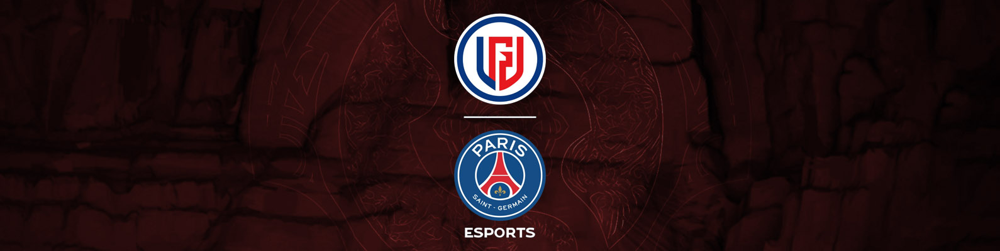</p>
<h2 style="margin: 0.25em 0;">PSG.LGD</h2>
<table>
  <tbody><tr>
    <td>Ame</td>
    <td>NothingToSay</td>
    <td>Faith_bian</td>
    <td>XinQ</td>
    <td>y`</td>
    <td>&nbsp;</td>
    <td><i style="font-size: smaller;">Coach</i>&nbsp;&nbsp;&nbsp;xiao8</td></tr>
   </tbody>
</table>
<hr style="margin: 0.5em 0;">

**How did this roster happen?**  Oh it's been happening. Hap

**How was their DPC year?** 2240 points

* **CN DPC Tour 1** - 1st 🥇
* **CN DPC Tour 1 Regional Final** - 1st 🥇
* **CN DPC Tour 2** - 2nd 🥈
* **CN DPC Tour 2 Regional Final** - 1st 🥇
* **CN DPC Tour 3** - 4th
* **PGL Arlington Major** - 2nd 🥈

Due to escalating COVID concerns, Chinese Dota was locked away for most of this season. Even getting back to China after TI10 in Romania was a massive project for a lot of teams, so unsurprisingly . LGD only narrowly qualified to the Arlington Major after scraping through 

**What would success look like?** They have to win. Literally anything other than lifting the Aegis is a complete failure. I'm not being hyperbolic, this is legitimately where the bar has been set for these guys.

**What to spam in Twitch chat when LGD are winning?** `WASH YOUR FACE`

<hr style="margin-bottom: 1.2em;">
<p style="margin: 0.5em 0;">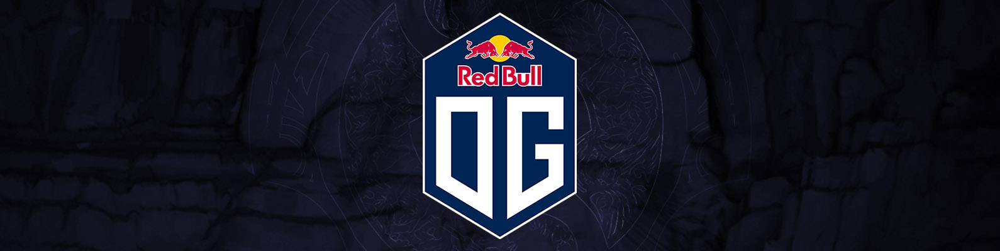</p>
<h2 style="margin: 0.25em 0;">OG</h2>
<table>
  <tbody><tr>
    <td>Yuragi</td>
    <td>bzm</td>
    <td>ATF (Ammar)</td>
    <td>Taiga</td>
    <td>Misha</td>
    <td>&nbsp;</td>
    <td><i style="font-size: smaller;">Coach</i>&nbsp;&nbsp;&nbsp;Chuvash</td></tr>
   </tbody>
</table>
<hr style="margin: 0.5em 0;">

**How did this roster happen?** Allow me to present this section in the form that I myself learned this information. Through a series of disjointed DMs I received from JMRLuna when I asked this question openly during an ESL Malaysia broadcast.

<span class="twitter-dm">I saw you on the pannel about how we build the roster</span>
<span class="twitter-dm twitter-dm-first">Misha was first</span>

Makes sense. Misha was OG's coach last year, so that's a reasonable foundation.

<span class="twitter-dm">When we started doing the recruiting many people turned Misha down</span>
<span class="twitter-dm">Always asking... "well who are the rest of the team"</span>
<span class="twitter-dm twitter-dm-first">And taiga was the only one ready to take a chance on us</span>

Pretty surprising, actually. Taiga was a part of the Insania crew for the longest time. However, Insania and the boys knew a change had to be made after Liquid failed to qualify to TI last year and Taiga voluntarily fell on the sword. Guess Taiga and OG saw mutual potential in one another.

<span class="twitter-dm">Once we have taiga then Ammar decided to join us</span>
<span class="twitter-dm twitter-dm-first">Ammar brought bzm</span>

So ATF, also known as <abbr title="I'm not making this up, that's what the acronym stands for">AMMAR_THE_FUCKER</abbr>, was on a WEU Div 2 team last year called Creepwave along with bzm, so that adds up.

<span class="twitter-dm">And then we tried out a few carries and ended up with yuragi</span>
<span class="twitter-dm twitter-dm-first">And then we brought in the coach chu</span>

You wouldn't be faulted for not knowing Yuragi. He's been playing semi-professionally since 2019, but no notable results. And chu/chuvash has actually been around for a while, but was also a player on Creepwave with ATF and bzm.

<span class="twitter-dm twitter-dm-first">This is public. We spoke about it on the monkey business show</span>

I don't listen to podcasts. By the way, check out this episode of OG's Monkey Business podcast that I guest starred on!

**How was their DPC year?** 1930 points

* **WEU DPC Tour 1** - 4th
* **WEU DPC Tour 1 Regional Final** - 3rd 🥉
* **WEU DPC Tour 2** - 1st 🥇
* **ESL Stockholm Major** - 1st 🥇*
* **WEU DPC Tour 3** - 3rd 🥉
* **PGL Arlington Major** - 4th*

Dude, it was so exciting. Notail called Alliance a bunch of cheaters during the coaching scandal and never formally apologized. Ceb DM'd Secret's social media manager and cursed him out in French for being mean. The brand appears to be slowly pivoting from esports teams to NFT manufacturers. It's been a ride.

Oh the Dota? The Dota wasn't that great. After a sluggish season 1, MidOne got the boot and ana came back for season 2 under the tag *humblegod.* He proceeded to get so humbled he didn't even finish the season, probably said, "Yeah, I don't need this shit," and retired for realsies this time. OG then had to call up Madara to temporarily be their fifth in the three-way-hell-in-a-cell tiebreaker just to not get bumped down to lower division.

We in the business simply refer to this as OG getting into "TI form."

**What would success look like?** For the rest of the team? Eh, . For Misha? Oh boy. Misha, Misha, Misha. I don't even know if _he_ necessarily feels the pressure. But everyone putting the pressure on him has gotta be something

**What to spam in Twitch chat when OG are winning?** `THREE FUCKING FLUKES IN A ROW MAN SwiftRage`

<hr style="margin-bottom: 1.2em;">
<p style="margin: 0.5em 0;">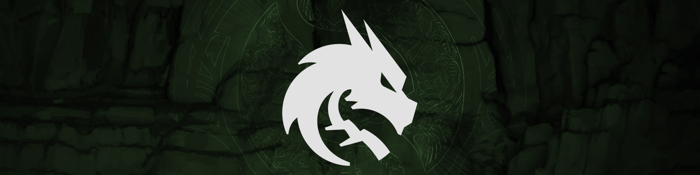</p>
<h2 style="margin: 0.25em 0;">Team Spirit</h2>
<table>
  <tbody><tr>
    <td>Yatoro</td>
    <td>TORONTOTOKYO</td>
    <td>Collapse</td>
    <td>Mira</td>
    <td>Miposhka</td>
    <td>&nbsp;</td>
    <td><i style="font-size: smaller;">Coach</i>&nbsp;&nbsp;&nbsp;Silent</td></tr>
   </tbody>
</table>
<hr style="margin: 0.5em 0;">

**How did this roster happen?** You know how EEU/CIS always has those Empire-ass, Gambit-ass, Winstrike-ass, HellRaisers-ass, Yellow Submarine-ass teams that are always *around*? *Around,* like, playing some random ass tournament at some random ass time on some random ass channel? I love those teams. You just know that each one of them are a ticking timebomb of contempt with five different fingers on the disband trigger. But every once in a while, an EEU roster manages to not hate each other for *juuuust* long enough to make it to TI. Shine on you crazy Yellow Submarine boys.

**How was their DPC year?** 1810 points

* **EEU DPC Tour 1** - 1st 🥇
* **EEU DPC Tour 1 Regional Final** - 1st 🥇
* **EEU DPC Tour 2 Playoff Tournament** - 2nd 🥈
* **ESL Stockholm Major** - 9-12th
* **WEU DPC Tour 3** - 3rd 🥉
* **PGL Arlington Major** - 1st 🥇

If you take a peek at the flags next to each of these player names, you may be able to deduce that last year's TI champions haven't had the smoothest year geopolitically speaking. Team Spirit as an organization is also Russian, but moved to Serbia after the war began. Given the circumstances, Valve put the entire EEU DPC Tour 2 on hold and replaced it with a compressed playoff bracket that would award DPC points, determine relegation slots, and figure out who goes to the Stockholm Major.

**What would success look like?** Two-timing à la OG would be pretty sweet. The problem: they're still pretty good. Lest we forget, OG coming into TI9 were... well let's just say there's a reason why detractors branded both their wins as 'flukes.' Spirit, on the other hand, won the last major and [True Sight was just released](https://www.youtube.com/watch?v=NFEwN1N3vvA) so everyone just got a refresher on how sick they were/are. Safe to say there will be a lot more eyeballs on Spirit's drafts and gameplay this TI.

A lot more eyeballs in the crowd, too. Because there's actually going to be one.

**What to spam in Twitch chat when Spirit are winning?** Damn, has the Twitch meta not changed in 12 months? Well if it ain't broke, don't fix it. `COLLAPSE GIGACHAD`

<hr style="margin-bottom: 1.2em;">
<p style="margin: 0.5em 0;">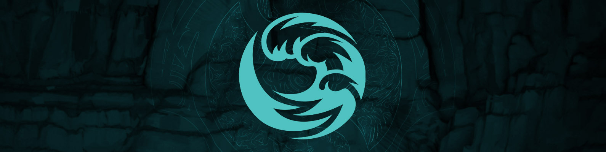</p>
<h2 style="margin: 0.25em 0;">beastcoast</h2>
<table>
  <tbody><tr>
    <td>K1 (Hector)</td>
    <td>Chris Luck</td>
    <td>Wisper</td>
    <td>Gōjira (Scofield)</td>
    <td>Stinger</td>
    <td>&nbsp;</td>
    <td><i style="font-size: smaller;">Coach</i>&nbsp;&nbsp;&nbsp;Valqui</td></tr>
   </tbody>
</table>
<hr style="margin: 0.5em 0;">

**How did this roster happen?** Lemme just pop on over to [last year's article real quick.](https://howdoiplay.com/blog/2021/10/06/ti10-team-guide.html)

> Remember TI9 Infamous? It's the same guys. Yes, a South American team stayed together as five for over <s>two</s> three years.*

**How was their DPC year?** 1810 points

* **SA DPC Tour 1** - 3rd 🥉
* **SA DPC Tour 1 Regional Final** - 1st 🥇
* **SA DPC Tour 2** - 2nd 🥈
* **ESL Stockholm Major** - 5-6th
* **SA DPC Tour 3** - 2nd 🥈
* **PGL Arlington Major** - 5-6th

Here's the thing. Longevity has a weird bell curve of success in Dota.

**What would success look like?** ~~This roster's top 8 finish at TI9 was the highest placement a South American team has ever gotten in the history of TI. Given the consistent upwards trajectory of the region overperforming at TI, it's not outside the realm of possibility that they could break top 6 this year.~~

Me getting a beastcoast hoodie. Give me a beastcoast hoodie.

**What to spam in Twitch chat when bc are winning?** `No vales ni un sol, estudia loco`

<hr style="margin-bottom: 1.2em;">
<p style="margin: 0.5em 0;">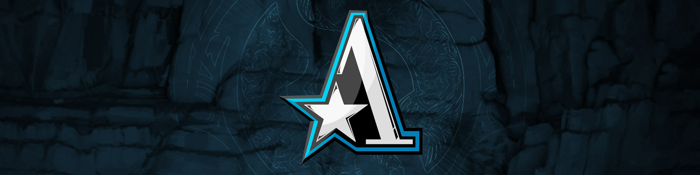</p>
<h2 style="margin: 0.25em 0;">Team Aster</h2>
<table>
  <tbody><tr>
    <td>Monet</td>
    <td>Ori</td>
    <td>Xxs</td>
    <td>BoBoKa</td>
    <td>皮球 (píqiú or Siamese.Cat)</td>
    <td>&nbsp;</td>
    <td><i style="font-size: smaller;">Coach</i>&nbsp;&nbsp;&nbsp;LaNm</td></tr>
   </tbody>
</table>
<hr style="margin: 0.5em 0;">

**How did this roster happen?** Monet, Xxs, and BoBoKa are the same as TI10 Aster, but this season they added longtime Vici Gaming midlaner Ori to the mix as well as Aster.Aries academy player 皮球. The direct translation is 'rubber ball,'

**How was their DPC year?** 1610 points

* **CN DPC Tour 1** - 2nd 🥈
* **CN DPC Tour 1 Regional Final** - 3rd 🥉
* **CN DPC Tour 2** - 3rd 🥉
* **CN DPC Tour 2 Regional Final** - 2nd 🥈
* **CN DPC Tour 3** - 2nd 🥈
* **PGL Arlington Major** - 3rd 🥉

Aster is notorious in China for being civil war specialists. Playing against Chinese teams? Fantastic. International opponents? *[Sit tight and watch their performance!](https://www.reddit.com/r/DotA2/comments/nx9dpk/cn_thoughts_memes_on_aster/)* This has garnered them a pretty negative reputation in China since they effectively just keep wasting their slots at majors. It's not even a recent development. Aster have been getting roasted like this since The Chongqing Major in 2019.

You may also notice that their Singapore Major result has an *aster*isk beside it. Did you ever hear the tragedy of Borax The Thirsty? I thought not. It’s not a story Liquipedia would tell you. How do I explain this? Basically one day our boy boboka was roaming the map looking for... that good Spirit Siphon... but didn't realize he was in the cops' ward vision. He got caught out of position and couldn't buyback in time for the major, so their coach Mad had to stand-in.

Ironic. The jungle king could save others from ganks, but not himself.

**What would success look like?** I have been scouring the internet for a single positive Chinese meme about Aster and it's literally just people shitting relentlessly on this team. If they can manage to change their public perception in the slightest, that'd be a massive dub for the Tea Masters.

**What to spam in Twitch chat when Aster are winning?** `ATF=ATM?`

<hr style="margin-bottom: 1.2em;">
<p style="margin: 0.5em 0;">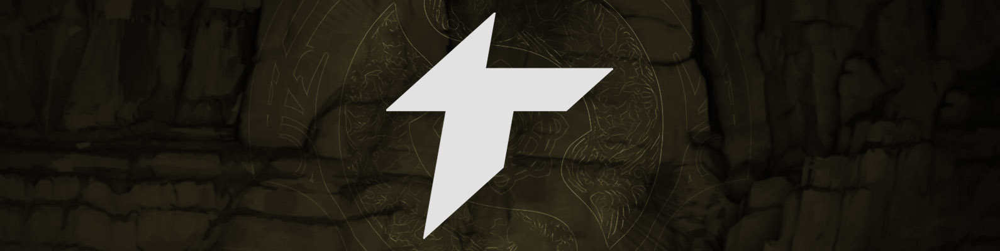</p>
<h2 style="margin: 0.25em 0;">Thunder Awaken</h2>
<table>
  <tbody><tr>
    <td>Pakazs</td>
    <td>DarkMago-</td>
    <td>Sacred</td>
    <td>Matthew</td>
    <td>Pandaboo</td>
    <td>&nbsp;</td>
    <td><i style="font-size: smaller;">Coach</i>&nbsp;&nbsp;&nbsp;Vintage</td></tr>
   </tbody>
</table>
<hr style="margin: 0.5em 0;">

**How did this roster happen?** Whoa, now. *Two* South American teams at TI? Hay talento, hay apoyo. This full Peruvian squad was put together pretty much right before the DPC started. Previously, MoOz had been beastcoast's coach/stand-in for most of 2020, but returned to full time play on TP. Also, yes, that is the Fear you're thinking of who's coaching.

**How was their DPC year?** 1540 points

* **SA DPC Tour 1** - 1st 🥇
* **SA DPC Tour 1 Regional Final** - 3rd 🥉
* **SA DPC Tour 2** - 1st 🥇
* **ESL Stockholm Major** - 5-6th
* **SA DPC Tour 3** - 1st 🥇
* **PGL Arlington Major** - 15-16th*

After May 16, 2021, Thunder Predator's TI invite fate was no longer in their own hands. They had quite a few points with their surprise top 6 finish at the Singapore Major, but it wasn't enough to guarantee no other team could leapfrog them in Kyiv. Enter the Evil Genuises who punched TP's ticket by assassinating NoPing, TNC, and Nigma uno a uno at the AniMajor.

**What would success look like?** The Peruvian teams not having to commit country-on-country elimination in the bracket.

**What to spam in Twitch chat when Thunder are winning?** `TE QUIERO MUCHO ARTURITO FrankerZ`

<hr style="margin-bottom: 1.2em;">
<p style="margin: 0.5em 0;">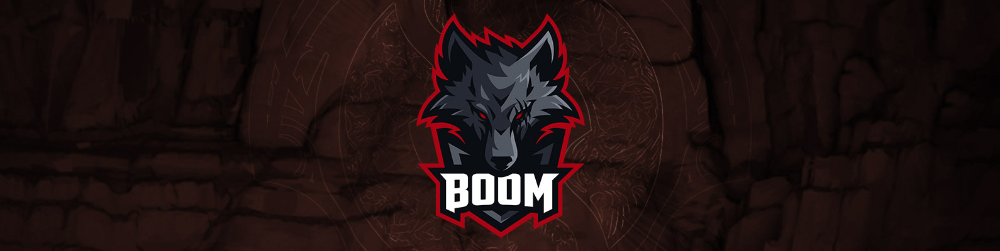</p>
<h2 style="margin: 0.25em 0;">BOOM Esports</h2>
<table>
  <tbody><tr>
    <td>JaCkky</td>
    <td>Yopaj</td>
    <td>Fbz</td>
    <td>TIMS</td>
    <td>skem</td>
    <td>&nbsp;</td>
    <td><i style="font-size: smaller;">Coach</i>&nbsp;&nbsp;&nbsp;Mushi</td></tr>
   </tbody>
</table>
<hr style="margin: 0.5em 0;">

**How did this roster happen?** Painfully. I could write an essay on Fnatic's adventures this year, but it's more efficient to give the bullet point version:

* Fnatic yoinks Thai rising star, Masaros, from Motivate.Trust at the end of 2020. Trust ends up winning a tournament while everybody knows that Masaros is about to leave. Kinda awkward.
* Masaros leaves after Fnatic's disappointing Singapore Major finish and they bring in ChYuan (a mid player) to play offlane.
* Fnatic bumbles their way through S2 to make this new roster work. It's not pretty.
* Moon is ~~kicked~~ fired from Fnatic ~~for underperforming~~ in a hostile corporate takeover. Deth (an offlaner) is brought in to play offlane and ChYuan assumes mid duties.

**How was their DPC year?** 1482 points

* **SEA DPC Tour 1** - 1st 🥇
* **SEA DPC Tour 1 Regional Final** - 1st 🥇
* **SEA DPC Tour 2** - 2nd 🥈
* **ESL Stockholm Major** - 9-12th
* **SEA DPC Tour 3** - 1st 🥇
* **PGL Arlington Major** - 7-8th

***SEA DPC S1** - 1st, **ONE Esports Singapore Major** - 9-12th, **SEA DPC S2** - 4th, **WePlay Kyiv AniMajor** - Did not qualify*

You got the gist of it. The Fnatic organization is a TI mainstay and has attended every single International since TI3. That streak got dangerously close to ending in the SEA regional qual grand finals, but they managed to reverse sweep TNC.

**What would success look like?** iceiceice bumps Deth up a tier or two, or six, in his [SEA offlaner power rankings.](https://afkgaming.com/dota2/news/7038-iceiceice-ranks-sea-dota-2-players-by-role)

**What to spam in Twitch chat when BOOM are winning?** `CEO MOON MADE A GREAT BUSINESS DECISION`

<p style="margin: 0.5em 0;">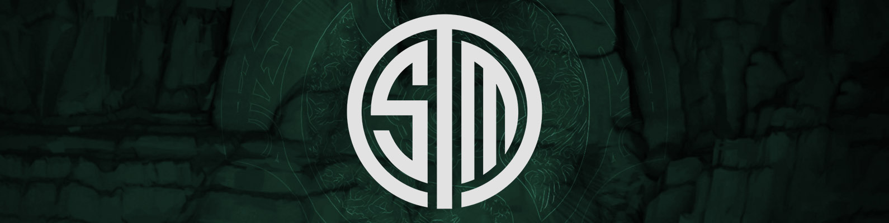</p>
<h2 style="margin: 0.25em 0;">TSM</h2>
<table>
  <tbody><tr>
    <td>Timado</td>
    <td>Bryle</td>
    <td>SabeRLight-</td>
    <td>MoonMeander</td>
    <td>DuBu</td>
    <td>&nbsp;</td>
    <td><i style="font-size: smaller;">Coach</i>&nbsp;&nbsp;&nbsp;MISERY</td></tr>
   </tbody>
</table>
<hr style="margin: 0.5em 0;">

**How did this roster happen?** Honestly, I recommend reading [MoonMeander's heartfelt recap of the team's journey.](https://www.twitlonger.com/show/n_1srpctq)

**How was their DPC year?** 1380 points

* **NA DPC Tour 1** - 1st 🥇
* **NA DPC Tour 1 Regional Final** - 2nd 🥈
* **NA DPC Tour 2** - 2nd 🥈
* **ESL Stockholm Major** - 2nd 🥈
* **NA DPC Tour 3** - 4th
* **PGL Arlington Major** - Did not qualify

North America is Schrödinger's region. If you don't observe it, the cat could very well be alive. But then you tune in to a few matches and think, "No wonder everyone's moving to Valorant." Shit wrong Valve esport.

 While coming just barely short of qualifying to both majors, Undying plowed through the NA regional qualifier without dropping a single game. Does that actually mean anything? Your guess is as good as mine.

**What would success look like?** Acquiring enough practice and experience to maybe, just *maybe*...
<br><br><br><br>
Take a game off Arkosh next year.

**What to spam in Twitch chat when TSM are winning?** `SHINZO SASAGEYO CruW`

<hr style="margin-bottom: 1.2em;">
<p style="margin: 0.5em 0;">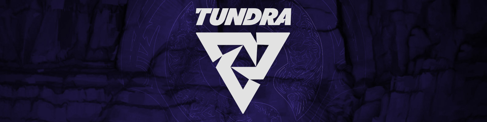</p>
<h2 style="margin: 0.25em 0;">Tundra Esports</h2>
<table>
  <tbody><tr>
    <td>skiter</td>
    <td>Nine</td>
    <td>33</td>
    <td>Saksa</td>
    <td>Sneyking</td>
    <td>&nbsp;</td>
    <td><i style="font-size: smaller;">Coach</i>&nbsp;&nbsp;&nbsp;Aui_2000</td></tr>
   </tbody>
</table>
<hr style="margin: 0.5em 0;">

**How did this roster happen?** In a parallel universe, you _know_ how this roster happened. You know, because they showed up to TI10 . Instead, they lost in a 5 game series against OG in the WEU quals. But by golly they persevered.

**How was their DPC year?** 1212 points

* **WEU DPC Tour 1** - 3rd 🥉
* **WEU DPC Tour 1 Regional Final** - 4th
* **WEU DPC Tour 2** - 4th
* **ESL Stockholm Major** - 3rd 🥉
* **WEU DPC Tour 3** - 1st 🥇
* **PGL Arlington Major** - 15-16th

Pretty good!

**What would success look like?** Should be obvious.

**What to spam in Twitch chat when Tundra are winning?** `THREE FUCKING FLUKES IN A ROW MAN SwiftRage`

<hr style="margin-bottom: 1.2em;">
<p style="margin: 0.5em 0;">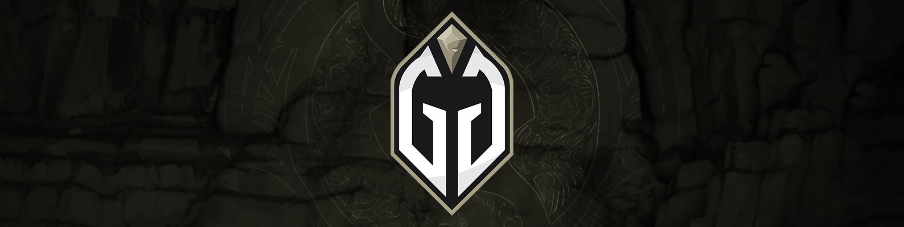</p>
<h2 style="margin: 0.25em 0;">Gaimin Gladiators</h2>
<table>
  <tbody><tr>
    <td>dyrachYO</td>
    <td>BOOM</td>
    <td>Ace</td>
    <td>tOfu</td>
    <td>Seleri</td>
    <td>&nbsp;</td>
    <td><i style="font-size: smaller;">Coach</i>&nbsp;&nbsp;&nbsp;ImmortalFaith</td></tr>
   </tbody>
</table>
<hr style="margin: 0.5em 0;">

**How did this roster happen?** BOOM and Seleri were veterans of tier 1.5-ish WEU team Vikin.gg for quite a while. Ace and tOfu were on another tier 1.5-ish WEU team Hellbear Smashers and faced off against Vikin.gg pretty regularly in officials. dyrachYO came out of nowhere. Dude was an EEU player, but was eager to leave the region and joined these guys and formed "Team Tickles" starting this season.

**How was their DPC year?** 1130 points

* **WEU DPC Tour 1** - 2nd 🥈
* **WEU DPC Tour 1 Regional Final** - 1st 🥇
* **WEU DPC Tour 2** - 2nd 🥈
* **ESL Stockholm Major** - 4th
* **WEU DPC Tour 3** - 6th
* **PGL Arlington Major** - Did not qualify

Keen eyed viewers may take a look at this list and say, "HEY! How does a new stack immediately join Division 1? Shouldn't they have to play through open qualifiers to join Division 2 and then place 1st or 2nd in Division 2 before being promoted to Division 1 in the subsequent tour?" To which I say: pppbbbbbbtttttt.

It's not my job to know RULES, man. That's Liquipedia's job. Except when Valve says that it's _not_ Liquipedia's job. This'll make more sense once you scroll down to Fnatic.

**What would success look like?** Should be obvious.

**What to spam in Twitch chat when GG are winning?** `VEGAN POWER`

<hr style="margin-bottom: 1.2em;">
<p style="margin: 0.5em 0;">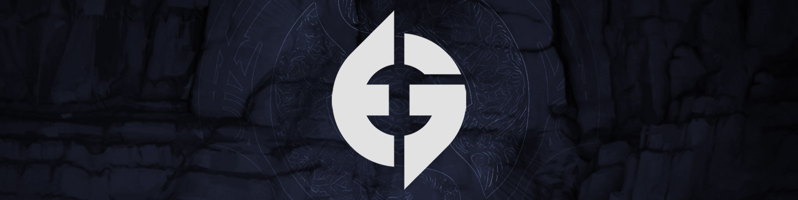</p>
<h2 style="margin: 0.25em 0;">Evil Geniuses</h2>
<table>
  <tbody><tr>
    <td>Arteezy</td>
    <td>Abed</td> 
    <td>Nightfall</td>
    <td>Cr1t-</td>
    <td>Fly</td>
    <td>&nbsp;</td>
    <td><i style="font-size: smaller;">Coach</i>&nbsp;&nbsp;&nbsp;BuLba</td></tr>
   </tbody>
</table>
<hr style="margin: 0.5em 0;">

**How did this roster happen?** If you haven't watched Dota since TI10, you may look at this roster and think, "Oh they kicked iceiceice and got VP's carry to play offlane? That's weird." It is weird. But you know what's even weirder? Bringing Jerax out of retirement, having him take Fly's spot as a 5 position, and doing so mediocre he re-retires . That's right, ole' two time TI winning 4 position Jer-Bear 

**How was their DPC year?** 1052 points

* **NA DPC Tour 1** - 3rd 🥉
* **NA DPC Tour 1 Regional Final** - 2nd 🥈
* **NA DPC Tour 2** - 1st 🥇
* **ESL Stockholm Major** - 13th
* **NA DPC Tour 3** - 1st 🥇
* **PGL Arlington Major** - 9-12th

[You may recall that EG were once notorious for always getting third place at events.](https://howdoiplay.com../img/ti11teams/3teezy.png) Times have changed, though. That was a completely different roster, different meta, different era.

They've since moved up a digit.

Now for a normal person, 2nd place at two majors is pretty incredible. But Dota players, and fans, are not normal people. And in true Ricky Bobby fashion, if you ain't first, you're last. *What a joke of a year. Abed Storm for five games? 1 position NP in grand finals? smh can we finally kick LULba please?*

**What would success look like?** How funny would it be if, after eight years of competing in professional Dota, Arteezy's first Valve LAN event win was TI10.

**What to spam in Twitch chat when EG are winning?** `My streamer FeelsStrongMan`

<hr style="margin-bottom: 1.2em;">
<p style="margin: 0.5em 0;">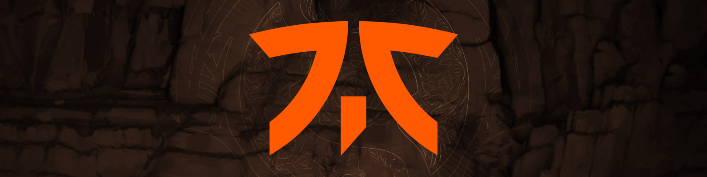</p>
<h2 style="margin: 0.25em 0;">Fnatic</h2>
<table>
  <tbody><tr>
    <td>Raven</td>
    <td>Armel</td>
    <td>Jabz</td>
    <td>DJ</td>
    <td>Jaunuel</td>
    <td>&nbsp;</td>
    <td><i style="font-size: smaller;">Coach</i>&nbsp;&nbsp;&nbsp;SunBhie</td></tr>
   </tbody>
</table>
<hr style="margin: 0.5em 0;">

**How did this roster happen?** Fnatic had been struggling to fulfill their offlane and mid roles for quite a while. 

**How was their DPC year?** 1020 points

* **SEA DPC Tour 1** - 2nd 🥈
* **SEA DPC Tour 1 Regional Final** - 4th
* **SEA DPC Tour 2** - 1st 🥇
* **ESL Stockholm Major** - 7-8th
* **SEA DPC Tour 3** - 3rd 🥉
* **PGL Arlington Major** - 9-12th

You got the gist of it. The Fnatic organization is a TI mainstay and has attended every single International since TI3. That streak got dangerously close to ending in the SEA regional qual grand finals, but they managed to reverse sweep TNC.

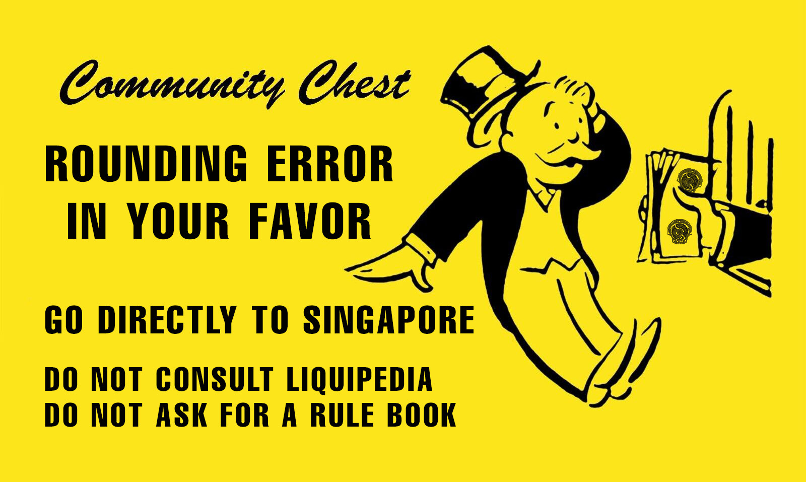

https://www.reddit.com/r/DotA2/comments/wpd5z2/fnatic_qualify_to_ti_over_outsiders_ruling_from/

**What would success look like?** iceiceice bumps Deth up a tier or two, or six, in his [SEA offlaner power rankings.](https://afkgaming.com/dota2/news/7038-iceiceice-ranks-sea-dota-2-players-by-role)

**What to spam in Twitch chat when Fnatic are winning?** `CEO MOON MADE A GREAT BUSINESS DECISION`

----

# The Regional Qualifiers

----

<p style="margin: 0.5em 0;">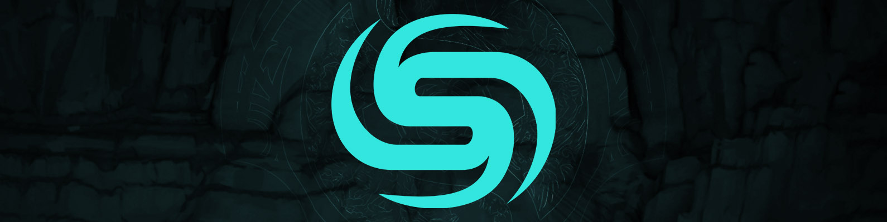</p>
<h2 style="margin: 0.25em 0;">Soniqs - <i>North America</i></h2>
<table>
  <tbody><tr>
    <td>YawaR</td>
    <td>Quinn</td>
    <td>LESLÃO</td>
    <td>MSS</td>
    <td>Fata</td>
    </tr>
   </tbody>
</table>
<hr style="margin: 0.5em 0;">

**How did this roster happen?** Yawar, Quinn, and MSS have been together since 2019. It was as Forward Gaming, who got turned into TI9 Newbee, who got turned into Quincy Crew, who got turned into Chaos EC, who again turned into Quincy Crew and have remained so since early 2020. Along the way, they imported the Brazilian Lelis and brought LoA/SVG out of semi-retirement.

**How was their DPC year?** 582 points

* **NA DPC Tour 1** - 1st 🥇
* **NA DPC Tour 1 Regional Final** - 3rd 🥉
* **NA DPC Tour 2** - 3rd 🥉
* **ESL Stockholm Major** - Did not qualify
* **NA DPC Tour 3** - 2nd 🥈
* **PGL Arlington Major** - 17th

For most of 2020, practically everyone had written off North America as a region beyond saving and it was basically just EG's sandbox to stomp on kids.

In 2021, we learned that North America *is* indeed mostly beyond saving, but there are in fact two bullies at the playground with Quincy Crew too.

Quincy Crew not only gave EG a run for their money in both NA DPC seasons, but was also looking to be worthy competition at international LANs. Their Singapore Major result has an asterisk because QC had to use a stand-in of Poloson due to MSS contracting COVID.

**What would success look like?** Getting a sponsor.

Actually, wait, scratch that. *Quincy Crew* becoming an esports powerhouse brand would be the real success story. *QC FTX* when?

**What to spam in Twitch chat when Soniqs are winning?** `EZ 4 [insert player name here]AO`

<hr style="margin-bottom: 1.2em;">
<p style="margin: 0.5em 0;">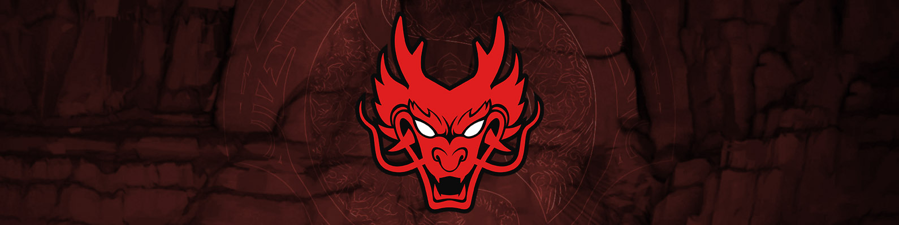</p>
<h2 style="margin: 0.25em 0;">Hokori - <i>South America</i></h2>
<table>
  <tbody><tr>
    <td>Lumière</td>
    <td>4nalog</td>
    <td>Vitaly</td>
    <td>Thiolicor</td>
    <td>Gardick</td>
    </tr>
   </tbody>
</table>
<hr style="margin: 0.5em 0;">

**How did this roster happen?** Whoa, now. *Two* South American teams at TI? Hay talento, hay apoyo. This full Peruvian squad was put together pretty much right before the DPC started. Previously, MoOz had been beastcoast's coach/stand-in for most of 2020, but returned to full time play on TP. Also, yes, that is the Fear you're thinking of who's coaching.

**How was their DPC year?** 97 points

* **SA DPC Tour 1** - 6th
* **SA DPC Tour 1 Regional Final** - Did not qualify
* **SA DPC Tour 2** - 3rd 🥉
* **ESL Stockholm Major** - Did not qualify
* **SA DPC Tour 3** - 8th
* **PGL Arlington Major** - Did not qualify

After May 16, 2021, Thunder Predator's TI invite fate was no longer in their own hands. They had quite a few points with their surprise top 6 finish at the Singapore Major, but it wasn't enough to guarantee no other team could leapfrog them in Kyiv. Enter the Evil Genuises who punched TP's ticket by assassinating NoPing, TNC, and Nigma uno a uno at the AniMajor.

**What would success look like?** The Peruvian teams not having to commit country-on-country elimination in the bracket.

**What to spam in Twitch chat when Hokori are winning?** `TE QUIERO MUCHO ARTURITO FrankerZ`

<hr style="margin-bottom: 1.2em;">
<p style="margin: 0.5em 0;">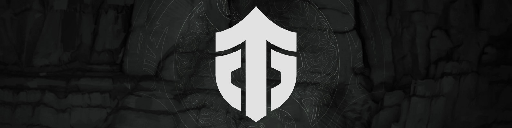</p>
<h2 style="margin: 0.25em 0;">Entity - <i>Western Europe</i></h2>
<table>
  <tbody><tr>
    <td>Pure</td>
    <td>Stormstormer</td>
    <td>Tobi</td>
    <td>Kataomi`</td>
    <td>Fishman</td>
    <td>&nbsp;</td>
    <td><i style="font-size: smaller;">Coach</i>&nbsp;&nbsp;&nbsp;MeTTpuM</td></tr>
   </tbody>
</table>
<hr style="margin: 0.5em 0;">

**How did this roster happen?** As intimidating as this roster looks, it hasn't been all sunflowers and rainbows for the two time reigning TI champs. After TI9, ana peaced out for another season and Jerax just straight up retired. Even Ceb intended to step down from active play and OG signed MidOne, Saksa, and Sumail to fill the empty shoes.

Then COVID happened and Sumail vanished from competitive Dota for nearly an entire year. But see, I told you he'd be back in the third act. 

**How was their DPC year?** 615 points

* **WEU DPC Tour 1 - _Division 2_** - 1st 🥇
* **WEU DPC Tour 1 Regional Final** - Did not qualify
* **WEU DPC Tour 2** - 6th
* **ESL Stockholm Major** - Did not qualify
* **WEU DPC Tour 3** - 4th
* **PGL Arlington Major** - 5-6th*

Dude, it was so exciting. Notail called Alliance a bunch of cheaters during the coaching scandal and never formally apologized. Ceb DM'd Secret's social media manager and cursed him out in French for being mean. The brand appears to be slowly pivoting from esports teams to NFT manufacturers. It's been a ride.

Oh the Dota? The Dota wasn't that great. After a sluggish season 1, MidOne got the boot and ana came back for season 2 under the tag *humblegod.* He proceeded to get so humbled he didn't even finish the season, probably said, "Yeah, I don't need this shit," and retired for realsies this time. OG then had to call up Madara to temporarily be their fifth in the three-way-hell-in-a-cell tiebreaker just to not get bumped down to lower division.

We in the business simply refer to this as OG getting into "TI form."

**What would success look like?** Fun fact: Every player in this team is popping their TI cherry this year. Wild!

**What to spam in Twitch chat when Entity are winning?** `THREE FUCKING FLUKES IN A ROW MAN SwiftRage`

<hr style="margin-bottom: 1.2em;">
<p style="margin: 0.5em 0;">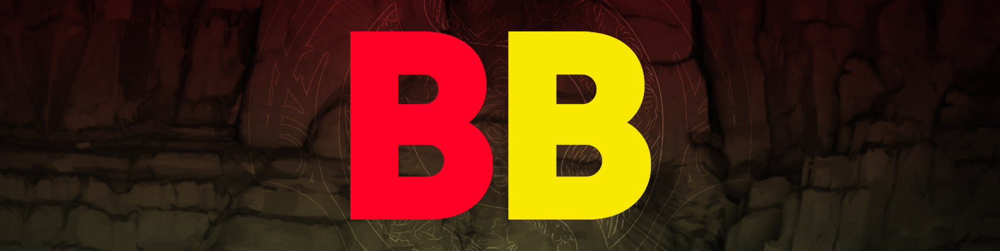</p>
<h2 style="margin: 0.25em 0;">BetBoom Team - <i>Eastern Europe</i></h2>
<style type="text/css">table {margin: 0.25em 0; overflow: hidden} tr td {display: inline-block;padding:0 1em 0 0;font-style: italic;border: 0px solid}</style>
<table>
  <tbody><tr>
    <td>Daxak</td>
    <td>Larl</td> 
    <td>Noticed</td>
    <td>RodjER</td>
    <td>SoNNeikO</td>
    <td>&nbsp;</td>
    <td><i style="font-size: smaller;">Coach</i>&nbsp;&nbsp;&nbsp;Mag</td></tr>
   </tbody>
</table>
<hr style="margin: 0.5em 0;">

**How did this roster happen?** This ain't your dad's VP. No, actually, this is your little brother's VP. This is a group of young players who had been wanting to form a team together for quite a while and were eventually assembled under the *VP.Prodigy* tag in April 2020. They had some stellar performances at a few online tournaments and were soon promoted to the main VP in November 2020.

**How was their DPC year?** 629 points

* **EEU DPC Tour 1 - _Division 2_** - 2nd 🥈
* **EEU DPC Tour 1 Regional Final** - Did not qualify
* **EEU DPC Tour 2 Playoff Tournament** - 1st 🥇
* **ESL Stockholm Major** - 7-8th
* **WEU DPC Tour 3** - 4th
* **PGL Arlington Major** - Did not qualify

By their own admission, their DPC leagues were FREEEEE. They literally only dropped three out of the thirty-one total games they played during both seasons. Put 'em on LAN though? Weelllll, then they don't look so hot. I liken it to how I never had to study at all during high school. Physics? Simple. World History? Cram the night before.

Then I roll up to university and get punched in the mouth by Organic Chemistry. Still have nightmares of S<sub>N</sub>2 reaction mechanisms.

In VP's defense, this is a young team (literally, their oldest player is DM at 21) with minimal LAN experience to begin with. Additionally, they were also operating with no coach until now for TI.

**What would success look like?** The EEU/CIS region hasn't even had a team place top 4 at TI since TI3 Na`Vi, so anything near there would be impressive. No one is really doubting if this squad is good, but what we don't know is if they can handle pressure. This roster hasn't ever even played in front of a crowd before.

<p style="font-size: 0.85em;">Which means that TI10 should feel natural.</p>

**What to spam in Twitch chat when BB are winning?** `I ALWAYS BELIEVED IN GPK STORM COPIUM`

<hr style="margin-bottom: 1.2em;">
<p style="margin: 0.5em 0;">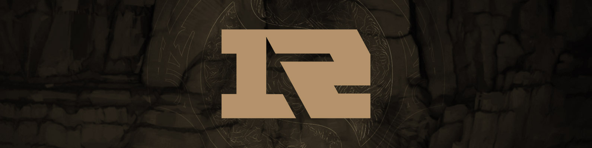</p>
<h2 style="margin: 0.25em 0;">Royal Never Give Up - <i>China</i></h2>
<table>
  <tbody><tr>
    <td>Ghost</td>
    <td>Somnus</td> 
    <td>Chalice</td>
    <td>kaka</td>
    <td>xNova</td>
    <td>&nbsp;</td>
    <td><i style="font-size: smaller;">Coach</i>&nbsp;&nbsp;&nbsp;Super</td></tr>
   </tbody>
</table>
<hr style="margin: 0.5em 0;">

**How did this roster happen?** Unlike most of the other Chinese teams at TI10, this roster was *not* frantically cobbled together in late 2020. Instead, it was a slow, methodical process that has had these five players together since September 2019.

**How was their DPC year?** 738 points

* **CN DPC Tour 1** - 3rd 🥉
* **CN DPC Tour 1 Regional Final** - 2nd 🥈
* **CN DPC Tour 2** - 4th
* **CN DPC Tour 2 Regional Final** - 4th
* **CN DPC Tour 3** - 1st 🥇
* **PGL Arlington Major** - 9-12th*

This team's story is probably best told through greentext.

```
>walks into the dpc
>decides to reverse sweep singapore grand finals
>gets enough points for TI
>refuses to elaborate further
>leaves
```

It's like pottery.

Their coach did have to stand-in for Oli at the AniMajor, but I prefer my interpretation.

**What would success look like?** Kaka avenges Newbee's TI7 silver medal and somewhere miles away Brother Sccc smiles.

**What to spam in Twitch chat when RNG are winning?** `?` That's all. Just `?`

You had to be there.

<hr style="margin-bottom: 1.2em;">
<p style="margin: 0.5em 0;">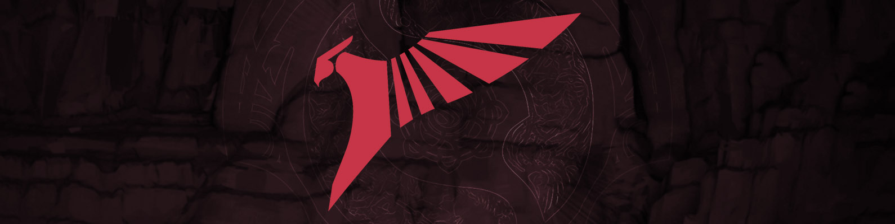</p>
<h2 style="margin: 0.25em 0;">Talon Esports - <i>Southeast Asia</i></h2>
<table>
  <tbody><tr>
    <td>23savage</td>
    <td>Mikoto</td> 
    <td>kpii</td>
    <td>Q</td>
    <td>Hyde</td> 
    <td>&nbsp;</td>
    <td><i style="font-size: smaller;">Coach</i>&nbsp;&nbsp;&nbsp;ALWAYSWANNAFLY</td></tr>
   </tbody>
</table>
<hr style="margin: 0.5em 0;">

**How did this roster happen?** Yes, this is *that* T1. The Faker T1. The... tyler1 T1. The T1 brand that's a juggernaut in Korea. Originally announced in late 2019 with Forev at the center, T1 went through multiple iterations before finally putting together this impressively multinational SEA team right before the DPC started. Their last addition was 23savage who replaced JaCkky right before the Singapore Major.

**How was their DPC year?** 300 points

* **SEA DPC Tour 1 - _Division 2_** - 5th
* **SEA DPC Tour 1 Regional Final** - Did not qualify
* **SEA DPC Tour 2 - _Division 2_** - 2nd 🥈
* **ESL Stockholm Major** - Did not qualify
* **SEA DPC Tour 3** - 2nd 🥈
* **PGL Arlington Major** - 13-14th*

SEA had an interesting conundrum this year. Since their leagues were so intra-regionally competitive, no single team was able to farm both seasons for enough DPC points to break the top 12 rank threshold. As a result, there was a very real possibility that only one SEA team would attend TI10.

But then halfway through the SEA DPC S2 it seems T1 decided, "You know it'd be pretty cool to go to TI directly," and then proceeded to smash their way through the rest of the league and the AniMajor.

**What would success look like?** Placing higher than the T1 in Worlds 2021.

**What to spam in Twitch chat when Talon are winning?** `MikeHogu MASTER KUKU TURUAN MO PA NG IBANG KANTA SI WHITEMON`

<hr style="margin-bottom: 1.2em;">
<p style="margin: 0.5em 0;"></p>
<h2 style="margin: 0.25em 0;">TEST TEAM - <i>Last Chance Qualifier #1</i></h2>
<table>
  <tbody><tr>
    <td>poyoyo (Erica)</td>
    <td>Ori</td> 
    <td>old eLeVeN</td>
    <td>Pyw</td>
    <td>Dy</td>
    <td>&nbsp;</td>
    <td><i style="font-size: smaller;">Coach</i>&nbsp;&nbsp;&nbsp;Fenrir</td></tr>
   </tbody>
</table>
<hr style="margin: 0.5em 0;">

**How did this roster happen?** It's probably easier to explain how the old roster un-happened. Ori has been on Vici since the dawn of time, but what about the rest of these names? You may remember Eurus (Paparazi灬) and Yang as being Vici boys for a while, but they were dropped in 2020 for 23savage and old eLeVeN. 23savage got kinda screwed by VG and COVID, didn't play a single game with the team, and poyoyo joined the fray in his place.

You may also remember Fade. Fade ““““retired”””” from Dota after TI9, enjoyed a day at the beach, and then un-retired two weeks later to join Team Aster. Even by Chinese retirement standards, that's pretty quick.

<p class="faded-text" style="
    -webkit-background-clip: text;
    background-image: 
      linear-gradient(
        currentColor 0%, 
        transparent
      );
    -webkit-text-fill-color: rgba(255,255,255,0.01);}}">
I'm not gonna make a Fade pun here, but he's not at TI10.
</p>

**How was their DPC year?** 950 points

* ***CN DPC S1** - 3rd, **ONE Esports Singapore Major** - 7-8th, **CN DPC S2** - 3rd, **WePlay Kyiv AniMajor** - 4th*

I could literally copy-paste what I wrote about Vici's TI8 squad [three years ago](https://howdoiplay.com../2018/07/18/ti8-team-guide.html) and you would not be able to tell the difference.

<blockquote style="font-size: large;">Just some real solid Dotes. You know, a real focus on the fundamentals. The guys are gonna give it their all. Show some real hustle out there. <br><br>And not win.</blockquote>

What is with Vici and signing teams that are always *good* but never TI championship material.

**What would success look like?** ...being TI championship material. Alley-oop.

**What to spam in Twitch chat when Vici is winning?** `NECC GOD`

<hr style="margin-bottom: 1.2em;">
<p style="margin: 0.5em 0;">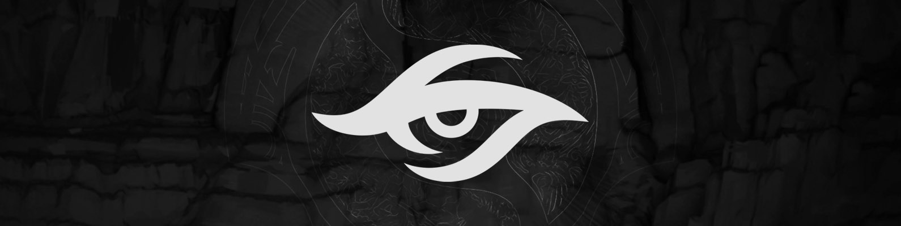</p>
<h2 style="margin: 0.25em 0;">Team Secret - <i>Last Chance Qualifier #2</i></h2>
<table>
  <tbody><tr>
    <td>MATUMBAMAN</td> 
    <td>Nisha</td>
    <td>zai</td>
    <td>YapzOr</td>
    <td>Puppey</td>
    <td>&nbsp;</td>
    <td><i style="font-size: smaller;">Coach</i>&nbsp;&nbsp;&nbsp;Heen</td></tr>
   </tbody>
</table>
<hr style="margin: 0.5em 0;">

**How did this roster happen?** Most of this team should look familiar to you aside from Matumbaman instead of MidOne. Funny enough, Matu was actually planning on taking a break from Dota after a disappointing TI9 on Chaos. But when the Estonian president calls, you answer.

**How was their DPC year?** 950 points

* ***WEU DPC S1** - 1st, **ONE Esports Singapore Major** - 4th, **WEU DPC S2** - 4th, **WePlay Kyiv AniMajor** - 16th*

In the world of 2020 online COVID Dota, Secret were kings. If there was a tournament, they e-attended it, obliterated everyone in it, and gave some surprisingly personable winners' interviews afterwards. They were so insanely dominant, in fact, many English/Western-biased viewers extrapolated that European Dota as a whole had simply eclipsed all other regions in terms of game knowledge and mechanics. There wasn't just going to be a skill gap, but rather a skill canyon once international competition with the DPC majors returned.

That ended up not happening and despite being given four slots at each major (many viewers argued there should be *five*), only two European teams qualified for TI through points. Lucky for Secret, they scooped up enough of those points in the first half of the season so they could finally be kinda bad before TI for once.

**What would success look like?**

<blockquote class="twitter-tweet tw-align-center" data-dnt="true"><p lang="en" dir="ltr">My only purpose in 2020 is to make sure the Finnish president knows who Lasse Urpalainen is.</p>&mdash; Heen (@Heen1337) <a href="https://twitter.com/Heen1337/status/1191536445485277184?ref_src=twsrc%5Etfw">November 5, 2019</a></blockquote> <script async src="https://platform.twitter.com/widgets.js" charset="utf-8"></script>

Since Kuroky isn't here to knock Secret out of TI for the fourth goddamn year in a row, it could very well happen.

**What to spam in Twitch chat when Secret is winning?** `test123`

----

# Who else

Most of your faves were probably in the last chance qualifiers

## North America

#### SVG

* Imagine going from player to caster in one year

#### Fear

* Was actually at TI10 as a coach for Thunder Predator, but now a caster

#### EternaLEnVy
<blockquote class="twitter-tweet" data-dnt="true"><p lang="en" dir="ltr">After watching Yatoro play/pick I’ve concluded I’m no longer good enough to compete at the level I want to. I’ve decided to chill for now and not play for the sake of playing and work on myself as being on a team comes with other obligations. GL to <a href="https://twitter.com/MooDota2?ref_src=twsrc%5Etfw">@MooDota2</a></p>&mdash; EternaLEnVy (@EternaLEnVy1991) <a href="https://twitter.com/EternaLEnVy1991/status/1453577086594166786?ref_src=twsrc%5Etfw">October 28, 2021</a></blockquote> <script async src="https://platform.twitter.com/widgets.js" charset="utf-8"></script>

No one knows what it means, but it's provocative. It gets the people going.

## South America

#### hFn, 4dr, tavo, Kingrd, Duster
* This star studded Brazilian lineup had middling results in SA Div 1 DPC Tour 3 and got eliminated early on in TI regional quals.

## Western Europe

#### Miracle-, SumaiL, MinD_ContRoL, GH, KuroKy
* Ah, you mean *Team Nigma*? Yes, that's their name. Well, actually, it's *Nigma Galaxy* now. After TI9, Kuro took the path of Secret/OG and decided to create his own organization. There were a few exciting victories for Nigma in 2020, but 2021 was mostly rocky. They attended the Singapore Major with a stand-in, bombed out, benched w33 for iLTW in season 2, got 5-6th at the AniMajor after being eliminated by EG, and landed 13th place in the DPC rankings. *One slot away* from being directly invited to TI through points. In the WEU regional qualifier, they got 3rd after narrowly losing to longtime rivals OG and bowed out of TI contention. <br><br>Their fans have not been coping with the loss particularly well. Rather than graciously accept defeat, some vocal Nigma diehards have been channeling their frustrations by: belittling the competitive integrity of other regions, condemning the DPC structure, trying to convince everyone this TI will suck because their favorite players aren't there, and eagerly licking their chops to sub-in when news broke that some Chinese teams in Bucharest have COVID. Some real *BERNIE CAN STILL WIN* vibes out in the Nigma camp.

#### Team Liquid in general
* After Kuro splintered off to form Nigma, Liquid signed TI9's Alliance of miCKe, qojqva, Boxi, Taiga, and iNSaNiA. The team did well enough to show up to both majors, but they only "showed up" and not much more than that. Ultimately, they got 4th in the WEU regional qualifier after losing to Nigma.

#### Hmmm... if Nigma got 3rd and Liquid got 4th, who got 2nd?
* A team by the name of *Tundra Esports* with Skiter, Nine, 33, Sneyking, and Fata. Tundra never got to attend any majors, but they got nail-bitingly close to beating OG in the WEU TI10 qualifiers. Incidentally, this is the first International that Fata has missed since he started competing at *TI3.*

#### Team Bald

* Literally the only reason I'm including this is to preempt the sea of reddit comments that would inevitably say, *"YOU FORGOT TEAM BALD OMEGALUL gorgcBald gorgcBald gorgcBald"*

#### AdmiralBulldog

* This one too. I'm one step ahead of you scrubs.

## Eastern Europe (CIS)

#### Old VP (RAMZES666, No[o]ne, 9pasha, RodjER, Solo)
* After TI9, the team imploded and everyone went their separate ways. I could get into the aftermath, but this stupid guide has gotten way too goddamn long  already so go do the research yourself. Amusingly, Na\`Vi is currently the most recent team on every one of those players' Liquipedia team history.

#### Dendi
* God bless this man. He absolutely refuses to give up on playing the game that he loves and I respect him for it. After formally leaving the Na\`Vi organization in 2019, Dondo formed his own team, *B8,* in early 2020. They had two underwhelming runs in the EEU/CIS S1/S2 lower division with a mishmash of players. But don't worry, he's still ever the ball of light blazing out across a dark sea of toxicity. Tune into the Russian TI10 broadcast if you wanna see his antics with 4 out of 5 players from TI1 Na`Vi.

## China

#### Sccc
* Highly successful streamer in China. Completely MIA from the competitive scene this year.

#### EHOME
* [Has one of the funniest Liquipedia pages I've ever seen.](https://howdoiplay.com../img/ti11teams/ehomeinactive.jpg) Lookin' more like a Retirement EHOME, amirite?

#### BurNIng
* Owns Team Aster. Kinda disliked in China now for some [dickish behavior.](https://www.reddit.com/r/DotA2/comments/nwmjoz/only_38_chinese_audience_support_aster/h1cxazo/?context=10000)

## Southeast Asia

#### iceiceice
* Lol

#### Team SMG (MidOne, Moon, kpii, ah fu, Roddgeee)
* Dropped out of TI10 SEA quals pretty early in the mix. Poor kpii even flew out to their bootcamp and they got eliminated while he was mandatory quarantining.

<hr style="margin-bottom: 1.0em;">

# That's it.

There's no way you read this entire thing, but hopefully whatever bits you glanced over helped you gain a deeper appreciation for the art form that is professional Dota 2 esports and the exhibition that is The International. Say hi if you see me in the Arena Naţională! Oh... 

Shucks. I mean I guess you could always [buy my voice line with your ticket refund money.](https://www.dota2.com/store/itemdetails/22128)

----

My sincerest thanks to the many volunteers who <a href="https://liquipedia.net/dota2/Dota_Pro_Circuit/2021/Rankings">keep Liquipedia up to date.</a> Without resources like this, the lore behind all these players and teams would be lost to time.

If you enjoyed this article and want to keep up with me, check my [Twitter](https://twitter.com/tsunami643), or [Twitch](https://twitch.tv/tsunami643), or [Instagram](https://instagram.com/tsunami643), or my [dead YouTube.](https://youtube.com/tsunami643)

[**Discussion for this article on /r/dota2.**](https://www.reddit.com/r/DotA2/comments/q2l6hv/the_international_2021_a_practical_guide_to_all/?)