---
layout: "post"
title: "The International 2024: A Practical Guide to All 16 Teams"
date: "2023-10-05 11:45"
summary:    The bare minimum information you need to know before talking to a Dota player this October.
feature-img: "img/ti13teams/ti13header.jpg"
flags: true
---

### Or more accurately, "The *Road* to the International 2024: A Practical Guide"

The what?

The *Road*, my friends. The *Road*. Most people skip these introductions, so let's go quick.

#### What <i>was</i> SUNSfan warning us about?

* **Was it beloved grassroots organization Beyond the Summit being shuttered?** BTS did not receive any DPC tour coverage rights this year which, along with an overall downturn in esports, may have been the death knell for this long standing Dota institution.
* **Was it ESL not getting any DPC tours?** ESL also wasn't given any league coverage this year, so they decided to just make their own non-DPC circuit. The *ESL Pro Tour*, or EPT for short, consisted of two *DreamLeague* events and culminated in the *Riyadh Masters 2023* LAN event with a whopping $15MM prize pool.
* **Was it the DPC getting canned?** After this year, the DPC in its current form will cease to exist. Valve seems optimistic. The community does not.
* **Was it the Battle Pass getting kneecapped?** You may notice that the prize pool for this TI is [astronomically lower](https://dota2.prizetrac.kr/international2023) than previous years. Valve has made the conscious decision to not juice TI's purse with a cosmetic-laden Battle Pass with the implication that more content will come after TI fervor ends when more players are excited to actually play Dota, not just watch it.
* **Was it the TI format changing?** In an effort to make group stage games higher stakes, Valve has now split the 20 TI teams into 4 different groups. If you make it past groups, you'll be placed in a playoff bracket the following weekend. These two legs are all part of *The Road* to the International. The final, *final* weekend, with the top 8 teams, will be considered the 'main' International.

DPC BEING GONE
 
PROS - MORE LAN EVENTS
 
MORE MONEY
 
CONS - DIV 2 in shambles
 
MARKETING SUCKS

These forewords are typically more for my benefit so I can document all the significant happenings from the year.

Here's a quick legend on how to read the tables: **Bold events are LANs (players are competing in-person, not online),** an asterisk* means there was a stand-in for a player or coach, and the results themselves are meant to be read from left to right in terms of chronology. For example, ESL One Kuala Lumpur, then BetBoom Dacha Dubai, then DreamLeague S22, and so on. If you're on mobile... turn your phone sideways.

---

# The Invites

---

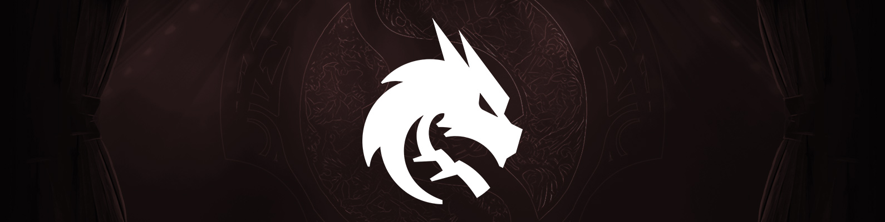

<h2 style="margin: 0.25em 0;">Team Spirit</h2>
<table class="roster">
  <tbody><tr>
    <td>Yatoro</td>
    <td>Larl</td>
    <td>Collapse</td>
    <td>Mira</td>
    <td>Miposhka</td>
    <td>&nbsp;</td>
    <td><i style="font-size: smaller;">Coach</i>&nbsp;&nbsp;&nbsp;Silent</td></tr>
   </tbody>
</table>

**How did this roster happen?** Usually after you win TI, you keep the gang together for another year. [Not always](https://youtu.be/hn39ySAFY_E?t=38), but usually.

Even beyond that, the core four are currently the [third most prolific quartet in the history of the game](../img/ti13teams/spirit_4tuple.jpg) *(credit: [datdota](https://datdota.com/players/squads?tier=1&tier=2&valve-event=does-not-matter&patch=7.37&patch=7.36&patch=7.35&patch=7.34&patch=7.33&patch=7.32&patch=7.31&patch=7.30&patch=7.29&patch=7.28&patch=7.27&patch=7.26&patch=7.25&patch=7.24&patch=7.23&patch=7.22&patch=7.21&patch=7.20&patch=7.19&patch=7.18&patch=7.17&patch=7.16&patch=7.15&patch=7.14&patch=7.13&patch=7.12&patch=7.11&patch=7.10&patch=7.09&patch=7.08&patch=7.07&patch=7.06&patch=7.05&patch=7.04&patch=7.03&patch=7.02&patch=7.01&patch=7.00&patch=6.88&patch=6.87&patch=6.86&patch=6.85&patch=6.84&patch=6.83&patch=6.82&patch=6.81&patch=6.80&patch=6.79&patch=6.78&patch=6.77&patch=6.76&patch=6.75&patch=6.74&after=01%2F01%2F2010&before=02%2F09%2F2024&duration=0%3B200&duration-value-from=0&duration-value-to=200))* after TI7 Liquid and TI3 Alliance.

**How was their season?**

  

  <table class="resultsTable" style="max-width: 400px; margin: 0 0.5em;">
  <thead><tr><th class="event">EPT Events</th><th class="result">Result</th></tr></thead>
  <tbody>
  <tr><td><b>ESL One Kuala Lumpur</b></td><td>-</td></tr>
  <tr><td>DreamLeague S22</td><td>4th</td></tr>
  <tr><td><b>ESL One Birmingham</b></td><td><b>9-10th</b></td></tr>
  <tr><td>DreamLeague S23</td><td>-</td></tr>
  <tr><td><b>Riyadh Masters 2024</b></td><td class="top8"><b>7-8th</b></td></tr>
  <tr><td>&nbsp;</td><td>&nbsp;</td></tr>
  </tbody></table>
  

  

  <table class="resultsTable" style="max-width: 400px; margin: 0 0.5em;">
  <thead><tr><th class="event">Other Events</th><th class="result">Result</th></tr></thead>
  <tbody>
  <tr><td><b>BetBoom Dacha Dubai</b></td><td class="top6"><b>5-6th</b></td></tr>
  <tr><td>Elite League S1</td><td>13-14th</td></tr>
  <tr><td><b>PGL Wallachia S1</b></td><td class="first"><b>1st 🥇</b></td></tr>
  <tr><td>&nbsp;</td><td>&nbsp;</td></tr>
  <tr><td><b>Clavision: Snow Ruyi</b></td><td class="second"><b>2nd 🥈</b></td></tr>
  <tr><td>FISSURE Universe 3</td><td>2nd 🥈</td></tr>
  </tbody></table>
  

 

After conquering Seattle last year, Spirit decided to take a little vacation and skip the first big tournament of the new season (ESL KL) in December. Since then, it's been all over the place. During Wallachia, Mira did confess that the team had been struggling with motivation this year, but the effort they put forth for that event paid off with a pretty exciting five game series against Xtreme.

As the season comes to a close, they do seem to be Mode: Grind as they are the only directly invited TI team to compete in *two* tournaments post-Riyadh with Snow Ruyi and Fissure Universe.

**What would success look like?** The range of results for Spirit is truly unmatched. One moment they're winning the biggest prize pools in Dota history, the next they're getting 4th place in DLS23 online qualifiers after losing to Na\`Vi (no offense to Na\`Vi). When they're on, they're <i>on</i>. And, well, they have won two out of the three TIs they've shown up to...

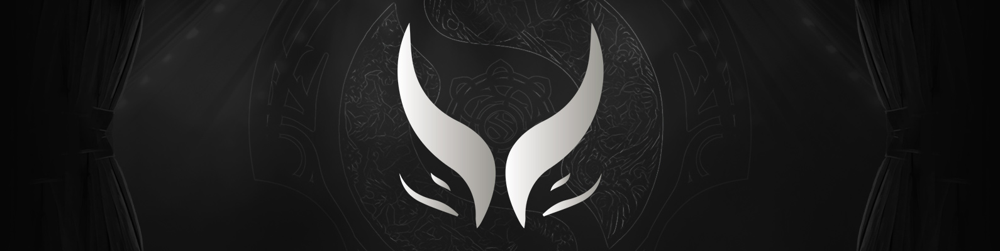

<h2 style="margin: 0.25em 0;">Xtreme Gaming</h2>
<table class="roster">
  <tbody><tr>
    <td>Ame</td>
    <td>Xm</td>
    <td>Xxs</td>
    <td>XinQ</td>
    <td>Dy</td>
    <td>&nbsp;</td>
    <td><i style="font-size: smaller;">Coach</i>&nbsp;&nbsp;&nbsp;Maps</td></tr>
   </tbody>
</table>

**How did this roster happen?** Dy had been chilling on Xtreme for about 3 years, but the rest of the team came out of nowhere. After being absent from the competitive scene since TI2022 in Singapore, professional Genshin Impact cosplayer Ame made his triumphant return to Dota in 2024. Meanwhile, Xtreme and Azure Ray share the same owner, so Xm, Xxs, and XinQ were transferred over from Azure.

**How was their season?**

  

  <table class="resultsTable" style="max-width: 400px; margin: 0 0.5em;">
  <thead><tr><th class="event">EPT Events</th><th class="result">Result</th></tr></thead>
  <tbody>
  <tr><td><b>ESL One Kuala Lumpur</b></td><td class="first"><b>1st 🥇???</b></td></tr>
  <tr><td>DreamLeague S22</td><td>3rd 🥉</td></tr>
  <tr><td><b>ESL One Birmingham</b></td><td class="top8"><b>7-8th</b></td></tr>
  <tr><td>DreamLeague S23</td><td>4th</td></tr>
  <tr><td><b>Riyadh Masters 2024</b></td><td class="top8"><b>7-8th</b></td></tr>
  </tbody></table>
  

  

  <table class="resultsTable" style="max-width: 400px; margin: 0 0.5em;">
  <thead><tr><th class="event">Other Events</th><th class="result">Result</th></tr></thead>
  <tbody>
  <tr><td><b>BetBoom Dacha Dubai</b></td><td class="top8"><b>7-8th</b></td></tr>
  <tr><td>Elite League S1</td><td>1st 🥇</td></tr>
  <tr><td><b>PGL Wallachia S1</b></td><td class="second"><b>2nd 🥈</b></td></tr>
  <tr><td>&nbsp;</td><td>&nbsp;</td></tr>
  <tr><td><b>Clavision: Snow Ruyi</b></td><td class="first"><b>1st 🥇</b></td></tr>
  </tbody></table>
  

 

The transferring of the three X amigos happened *after* they won ESL KL as Azure Ray, so I'm counting that as an Xtreme win. After that, the team took up the mantle of "best Chinese team" fairly quickly. Ame seemingly hadn't missed a beat during his sabbatical and Xtreme ended the season on a high note with a win on home turf at the Snow Ruyi LAN.

Perhaps promised consort <a href="https://www.reddit.com/r/DotA2/comments/1dyfjqr/yatoro_on_why_he_changed_his_nickname/">Raddan</a> had to give one back to his beloved [Ame the Kind](https://www.reddit.com/r/DotA2/comments/1aimrjf/yatoro_after_watching_10_minutes_of_ames_game_on/) after Wallachia.

**What would success look like?** Unfortunately, "best Chinese team" has been synonymous with "best non-European team" for the past six TIs. That's not necessarily a bad place to be. In fact, China as a region has never had a peak placement lower than 4th place at TI in the history of the event. With fewer teams from China making it to TI each year, maintaining that streak gets more and more challenging.

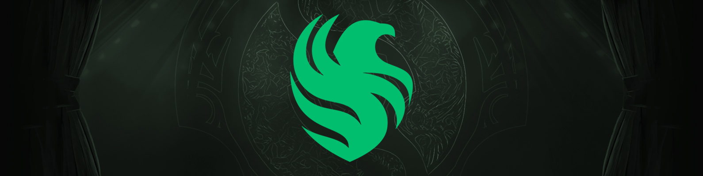

<h2 style="margin: 0.25em 0;">Team Falcons</h2>
<table class="roster">
  <tbody><tr>
    <td>skiter</td>
    <td>Malr1ne</td>
    <td>ATF</td>
    <td>Cr1t-</td>
    <td>Sneyking</td>
    <td>&nbsp;</td>
    <td><i style="font-size: smaller;">Coach</i>&nbsp;&nbsp;&nbsp;Aui_2000</td></tr>
   </tbody>
</table>

**How did this roster happen?** Falcons is one of several organizations to suddenly pop up in Dota this year. So who'd they get? Well, ATF has been consistently in the conversation of top 5 Dota players in the world for the past three years, but was absent from last Riyadh and TI following contract disputes with Quest. You really need to know what you're doing if you're gonna pass on those two events, but boy did the gamble pay off.

With him, came Malrine; another graduate from the illustrious school of Creepwave with Ammar. He had minimal tier 1 pro experience, but that has not at all been reflected in his play. Kid's a beast.

Tundra imploded after TI12, bringing an opportunity for Skiter and Sneyking to join. Both of them also had experience playing with Malrine when [he briefly stood in for Tundra last year.](https://www.youtube.com/watch?v=NYTtg3Nr3r8&t=140s)

Last piece of the puzzle is Crit. After *seven years* of playing in North America, Crit finally abandoned ship(ify) and immediately found himself on a championship roster.

**How was their season?**

  

  <table class="resultsTable" style="max-width: 400px; margin: 0 0.5em;">
  <thead><tr><th class="event">EPT Events</th><th class="result">Result</th></tr></thead>
  <tbody>
  <tr><td><b>ESL One Kuala Lumpur</b></td><td class="top6"><b>5-6th</b></td></tr>
  <tr><td>DreamLeague S22</td><td>1st 🥇</td></tr>
  <tr><td><b>ESL One Birmingham</b></td><td class="first"><b>1st 🥇</b></td></tr>
  <tr><td>DreamLeague S23</td><td>1st 🥇</td></tr>
  <tr><td><b>Riyadh Masters 2024</b></td><td class="third"><b>3rd 🥉</b></td></tr>
  </tbody></table>
  

  

  <table class="resultsTable" style="max-width: 400px; margin: 0 0.5em;">
  <thead><tr><th class="event">Other Events</th><th class="result">Result</th></tr></thead>
  <tbody>
  <tr><td><b>BetBoom Dacha Dubai</b></td><td class="first"><b>1st 🥇</b></td></tr>
  <tr><td>Elite League S1</td><td>2nd 🥈</td></tr>
  <tr><td><b>PGL Wallachia S1</b></td><td class="third"><b>3rd 🥉*</b></td></tr>
  <tr><td>&nbsp;</td><td>&nbsp;</td></tr>
  <tr><td>FISSURE Universe 3</td><td>1st 🥇</td></tr>
  </tbody></table>
  

 

The EPT circuit created a dedicated MENA region this year and Falcons, being a Saudi org, promptly stomped their way to the top. The competition in those qualifiers was basically limited to Quest and Nigma, so the community was left wondering, "Yeah, okay, but how good would this team be if they had to play WEU quals?"

Probably pretty good, it turns out. While their debut at ESL KL was nothing special, Aui joined the team as coach shortly thereafter and it's been a podium filled run ever since. Their lowest LAN placement was 3rd, and one of those was because Nine (Tundra reunion!) had to stand-in for Malrine.

**What would success look like?** As exhibited by their performance this season, Falcons getting anything lower than 4th at this TI would probably be considered an upset. Are you ready to live in a universe where Sneyking... Dignitas.Sneyking... NAR`Vi.Sneyking... *Fighting Pepegas.Sneyking*... might be a two-time TI winner?

Well start getting ready.

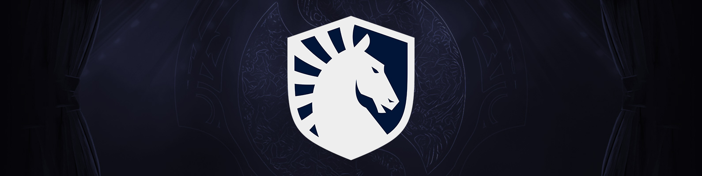

<h2 style="margin: 0.25em 0;">Team Liquid</h2>
<table class="roster">
  <tbody><tr>
    <td>miCKe</td>
    <td>Nisha</td>
    <td>33</td>
    <td>Boxi</td>
    <td>Insania</td>
    <td>&nbsp;</td>
    <td><i style="font-size: smaller;">Coach</i>&nbsp;&nbsp;&nbsp;Blitz</td>
    <td><i style="font-size: smaller;">Coach</i>&nbsp;&nbsp;&nbsp;kpii</td>
    <td><i style="font-size: smaller;">Analyst</i>&nbsp;&nbsp;&nbsp;Jabbz</td></tr>
   </tbody>
</table>

**How did this roster happen?** Liquid keeps having players retire on them after TIs end, but for once Team Secret didn't have anyone worth redeeming as a replacement for Zai. So who do you get if the job requirement is for a brainy offlaner willing to take the captain role? 33 fit the bill.

TI7 grand finalist kpii recently popped in to also coach Liquid when Blitz couldn't make it to Elite League S2. He earned his keep.

**How was their season?**

  

  <table class="resultsTable" style="max-width: 400px; margin: 0 0.5em;">
  <thead><tr><th class="event">EPT Events</th><th class="result">Result</th></tr></thead>
  <tbody>
  <tr><td><b>ESL One Kuala Lumpur</b></td><td class="third"><b>3rd 🥉*</b></td></tr>
  <tr><td>DreamLeague S22</td><td>13-14th</td></tr>
  <tr><td><b>ESL One Birmingham</b></td><td class="top6"><b>5-6th</b></td></tr>
  <tr><td>DreamLeague S23</td><td>9-10th</td></tr>
  <tr><td><b>Riyadh Masters 2024</b></td><td class="second"><b>2nd 🥈</b></td></tr>
  </tbody></table>
  

  

  <table class="resultsTable" style="max-width: 400px; margin: 0 0.5em;">
  <thead><tr><th class="event">Other Events</th><th class="result">Result</th></tr></thead>
  <tbody>
  <tr><td><b>BetBoom Dacha Dubai</b></td><td class="second"><b>2nd 🥈</b></td></tr>
  <tr><td>Elite League S1</td><td>4th</td></tr>
  <tr><td><b>PGL Wallachia S1</b></td><td class="top6"><b>5-6th</b></td></tr>
  <tr><td>&nbsp;</td><td>&nbsp;</td></tr>
  <tr><td><b>Elite League S2</b></td><td class="first"><b>1st 🥇*</b></td></tr>
  </tbody></table>
  

 

When TI invites were announced in May, there was a sentiment permeating online that Liquid had been huffing glue all year and them getting a direct invite to TI was absurd. Outside of online DreamLeagues, it was a pretty flimsy stance, but Liquid seemed to have took it personally and really turned up the heat afterwards for their last two events.

Here's a fun exercise for anyone who hasn't been keeping up with Dota since last year: Based on your memory of the 2023 season, take a wild guess at who beat these guys in grand finals of Riyadh. Yup. Yuuuuuup.

I think Liquid is probably the only team in the history of Dota who could win a lower bracket final against a team like Falcons so dominantly and yet have the entire community immediately think, "Oh great, now they're definitely gonna lose grand finals 3-0 to Gaimin." But by golly, it happened.

**What would success look like?** Okay, yes, *technically* they won Elite League S2. *Technically*, it was a LAN. Liquipedia classified it as a [tier 2 LAN](https://liquipedia.net/dota2/Elite_League/2) based on the level of competition, but still a LAN.

But do *you* count it as the LAN win they've been clawing towards for years? Do *they* count it?

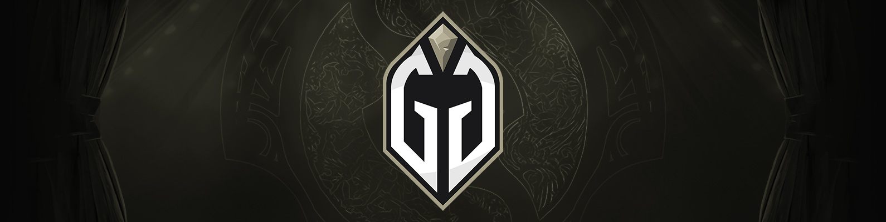

<h2 style="margin: 0.25em 0;">Gaimin Gladiators</h2>
<table class="roster">
  <tbody><tr>
    <td>dyrachyo</td>
    <td>Quinn</td>
    <td>Ace</td>
    <td>tOfu</td>
    <td>Seleri</td>
    <td>&nbsp;</td>
    <td><i style="font-size: smaller;">Coach</i>&nbsp;&nbsp;&nbsp;Cy-</td></tr>
   </tbody>
</table>

**How did this roster happen?** Nothing changed from last year!

**How was their season?**

  

  <table class="resultsTable" style="max-width: 400px; margin: 0 0.5em;">
  <thead><tr><th class="event">EPT Events</th><th class="result">Result</th></tr></thead>
  <tbody>
  <tr><td><b>ESL One Kuala Lumpur</b></td><td class="second"><b>2nd 🥈</b></td></tr>
  <tr><td>DreamLeague S22</td><td>5th</td></tr>
  <tr><td><b>ESL One Birmingham</b></td><td><b>11-12th</b></td></tr>
  <tr><td>DreamLeague S23</td><td>2nd 🥈</td></tr>
  <tr><td><b>Riyadh Masters 2024</b></td><td class="first"><b>1st 🥇</b></td></tr>
  </tbody></table>
  

  

  <table class="resultsTable" style="max-width: 400px; margin: 0 0.5em;">
  <thead><tr><th class="event">Other Events</th><th class="result">Result</th></tr></thead>
  <tbody>
  <tr><td><b>BetBoom Dacha Dubai</b></td><td class="top6"><b>5-6th</b></td></tr>
  <tr><td>Elite League S1</td><td>5-6th</td></tr>
  <tr><td><b>PGL Wallachia S1</b></td><td class="top8"><b>7-8th</b></td></tr>
  <tr><td>&nbsp;</td><td>&nbsp;</td></tr>
  <tr><td>FISSURE Universe 3</td><td>7-8th</td></tr>
  </tbody></table>
  

 

Their results changed from last year!

But not in the good way. They at least closed out the previous calendar year strong with a grand final appearance at KL (losing to Azure Ray), but the rest of the season was a far cry from the heights they achieved in 2023. That is, up until Riyadh.

So yes, fewer trophies, but their 1st place finish at Riyadh netted them higher earnings than winning all three majors (Lima+Berlin+Bali) and 2nd place at TI last year *combined*. That's just good financial planning.

**What would success look like?** Famously, winning the last big event before TI meant you probably *won't* win TI. That trend was bucked last year with Spirit winning in both Riyadh and Seattle. So I guess the story now is: Spirit won both. Can Gaimin?

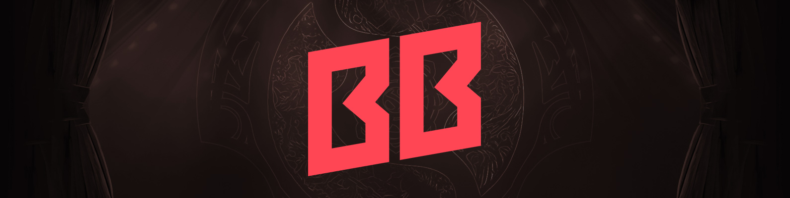

<h2 style="margin: 0.25em 0;">BB Team</h2>
<table class="roster">
  <tbody><tr>
    <td>Nightfall</td>
    <td>gpk</td> 
    <td>MieRo`</td>
    <td>Save-</td>
    <td>TORONTOTOKYO</td>
    <td>&nbsp;</td>
    <td><i style="font-size: smaller;">Coach</i>&nbsp;&nbsp;&nbsp;boolk</td></tr>
   </tbody>
</table>

**How did this roster happen?** After their TI12 run, Pure was still the offlaner on this team until after KL when they traded him out for Miero.

**How was their season?**

  

  <table class="resultsTable" style="max-width: 400px; margin: 0 0.5em;">
  <thead><tr><th class="event">EPT Events</th><th class="result">Result</th></tr></thead>
  <tbody>
  <tr><td><b>ESL One Kuala Lumpur</b></td><td class="fourth"><b>4th</b></td></tr>
  <tr><td>DreamLeague S22</td><td>2nd 🥈</td></tr>
  <tr><td><b>ESL One Birmingham</b></td><td class="second"><b>2nd 🥈</b></td></tr>
  <tr><td>DreamLeague S23</td><td>3rd 🥉</td></tr>
  <tr><td><b>Riyadh Masters 2024</b></td><td class="top6"><b>5-6th</b></td></tr>
  </tbody></table>
  

  

  <table class="resultsTable" style="max-width: 400px; margin: 0 0.5em;">
  <thead><tr><th class="event">Other Events</th><th class="result">Result</th></tr></thead>
  <tbody>
  <tr><td><b>BetBoom Dacha Dubai</b></td><td class="third"><b>3rd 🥉</b></td></tr>
  <tr><td>Elite League S1</td><td>11-12th</td></tr>
  <tr><td><b>PGL Wallachia S1</b></td><td><b>9-11th*</b></td></tr>
  <tr><td>&nbsp;</td><td>&nbsp;</td></tr>
  <tr><td>FISSURE Universe 3</td><td>4th</td></tr>
  </tbody></table>
  

 

The kids these days use the term "aura" a lot. Aura, [as defined by Wikipedia, the free encyclopedia at en.wikipedia.org is:](https://en.wikipedia.org/wiki/List_of_Generation_Z_slang#:~:text=Aura,%2C%20Twitter%2C%20and%20YouTube%20Shorts.)
> A quantifiable unit referring to how cool (positive integer) or uncool (negative integer) an individual is.
>> "Oh, you failed to rizz that level 10 gyatt? -1000000 aura loss lil bro."

>> "How much aura did I lose when I got Fanum taxed in Ohio?"

Now why did I make you read those cursed sentences? Basically, BB have aura ong 💯 when going through bracket. But when it comes to the final four-ish? Big yikes. They're completely cooked. It's giving delulu.

Skibidi.

A term that's decidedly more relevant amongst Dota's aging audience is "clutch" and if one possesses the clutch gene and/or clutch factor. Time and time again this year, BB Team were shown to not have it. Trouble for them was there was no clear diagnosis. It wasn't like individual players were underperforming in high pressure situations or specific teams consistently beating them. BB as a whole just looked more and more disconnected the higher the stakes got.

**What would success look like?** Aegismaxxing.

----

# The Regional Qualifiers

----

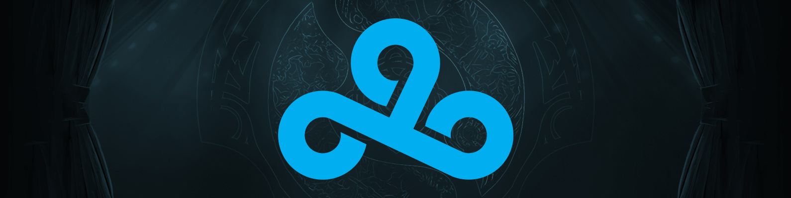

<h2 style="margin: 0.25em 0;">Cloud9 - <i>Western Europe #1</i></h2>
<table class="roster">
  <tbody><tr>
    <td>watson</td>
    <td>No[o]ne-</td>
    <td>DM</td>
    <td>Kataomi`</td>
    <td>Fishman</td>
    <td>&nbsp;</td>
    <td><i style="font-size: smaller;">Coach</i>&nbsp;&nbsp;&nbsp;Astini</td></tr>
   </tbody>
</table>

**How did this roster happen?** Well that's a logo we haven't seen around these parts in quite a while. And before you ask, no, EternaLEnVy hasn't finished his *Investor Z* filler arc and returned to the Dota scene quite yet. Instead, this roster was playing as Entity for most of the year.

Watson, Kataomi, and Fishman were all on the TI12 Entity. Gabbi was replaced by DM and Stormstormer was replaced by reibl, who was then also replaced by Noone after they failed to qualify for ESL KL.

Lastly, Astini joined as coach after Elite League S1. The players have publicly given a lot of credit to Astini after he started working with them. The man's results are nothing to scoff at, he was also coaching nouns last year when they got their surprise top 8 finish.

**How was their season?**

  

  <table class="resultsTable" style="max-width: 400px; margin: 0 0.5em;">
  <thead><tr><th class="event">EPT Events</th><th class="result">Result</th></tr></thead>
  <tbody>
  <tr><td><b>ESL One Kuala Lumpur</b></td><td>-</td></tr>
  <tr><td>DreamLeague S22</td><td>-</td></tr>
  <tr><td><b>ESL One Birmingham</b></td><td>-</td></tr>
  <tr><td>DreamLeague S23</td><td>-</td></tr>
  <tr><td><b>Riyadh Masters 2024</b></td><td><b>9-12th</b></td></tr>
  </tbody></table>
  

  

  <table class="resultsTable" style="max-width: 400px; margin: 0 0.5em;">
  <thead><tr><th class="event">Other Events</th><th class="result">Result</th></tr></thead>
  <tbody>
  <tr><td><b>BetBoom Dacha Dubai</b></td><td>-</td></tr>
  <tr><td>Elite League S1</td><td>11-12th</td></tr>
  <tr><td><b>PGL Wallachia S1</b></td><td>-</td></tr>
  <tr><td>&nbsp;</td><td>&nbsp;</td></tr>
  <tr><td>FISSURE Universe 3</td><td>5-6th</td></tr>
  </tbody></table>
  

 

Nothing too exceptional, but being the first team out of WEU qualifiers will always be a feat. This year, some notable teams left in the wake included: Nigma, Secret, OG, Quest, and the illustrious Team Bald.

**What would success look like?** The last time Cloud9 came back to the Dota scene, [a global pandemic began two months later.](https://cloud9.gg/cloud9-comes-off-cooldown-and-rejoins-competitive-dota-2/)

The team's performance is irrelevant to me. If I don't have to jam a swab halfway up my nose come November 2024, you did it Cloud9, it's a win.

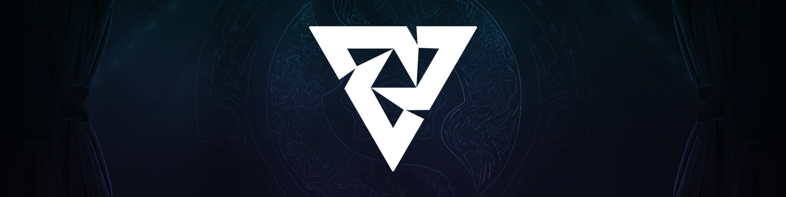

<h2 style="margin: 0.25em 0;">Tundra Esports - <i>Western Europe #2</i></h2>
<table class="roster">
  <tbody><tr>
    <td>Pure~</td>
    <td>Topson</td>
    <td>RAMZES666</td>
    <td>Saksa</td>
    <td>Whitemon</td>
    <td>&nbsp;</td>
    <td><i style="font-size: smaller;">Coach</i>&nbsp;&nbsp;&nbsp;MoonMeander</td></tr>
   </tbody>
</table>

**How did this roster happen?** KL was a completely different roster, it was old TSM. Then Mindcontrol, 9class, and pure join. But then so does moonmeander and zai, kinda. And lemme tell you, ole' Ivan Ivanov did not like that one bit no siree. Then tobi came in. Then tobi came out and ramzses came in

**How was their season?**

  

  <table class="resultsTable" style="max-width: 400px; margin: 0 0.5em;">
  <thead><tr><th class="event">EPT Events</th><th class="result">Result</th></tr></thead>
  <tbody>
  <tr><td><b>ESL One Kuala Lumpur</b></td><td class="top8"><b>7-8th*</b></td></tr>
  <tr><td>DreamLeague S22</td><td>9-10th</td></tr>
  <tr><td><b>ESL One Birmingham</b></td><td class="third"><b>3rd 🥉</b></td></tr>
  <tr><td>DreamLeague S23</td><td>5-6th</td></tr>
  <tr><td><b>Riyadh Masters 2024</b></td><td class="fourth"><b>4th</b></td></tr>
  </tbody></table>
  

  

  <table class="resultsTable" style="max-width: 400px; margin: 0 0.5em;">
  <thead><tr><th class="event">Other Events</th><th class="result">Result</th></tr></thead>
  <tbody>
  <tr><td><b>BetBoom Dacha Dubai</b></td><td>-</td></tr>
  <tr><td>Elite League S1</td><td>7-8th</td></tr>
  <tr><td><b>PGL Wallachia S1</b></td><td><b>-*</b></td></tr>
  <tr><td>&nbsp;</td><td>&nbsp;</td></tr>
  <tr><td>FISSURE Universe 3</td><td>3rd 🥉</td></tr>
  </tbody></table>
  

 

QUALIFIED TO WALLACHIA BUT COULDN'T GET VISAS, REPLACED BY MOUZ

**What would success look like?** I don't mean to alarm you, but we may be witnessing the potential of ***3*** time TI winners Topson and Aui as coach!

Sure, Topson already played a few matches with the Tundra boys during September's DreamLeague S21 and it was... fine? They only got 5-6th out of a 12 team tournament.

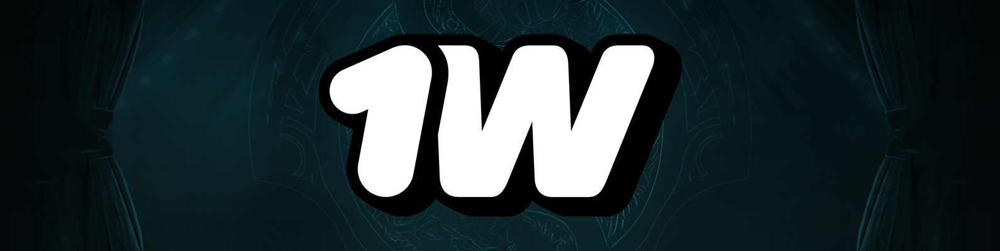

<h2 style="margin: 0.25em 0;">1w - <i>Eastern Europe</i></h2>
<table class="roster">
  <tbody><tr>
    <td>Munkushi~</td>
    <td>CHIRA_JUNIOR</td>
    <td>Cloud</td>
    <td>swedenstrong</td>
    <td>RESPECT</td>
    <td>&nbsp;</td>
    <td><i style="font-size: smaller;">Coach</i>&nbsp;&nbsp;&nbsp;Ahilles</td></tr>
   </tbody>
</table>

**How did this roster happen?** Typically when an EEU stack of majority newcomers is slapped together, they'll have at least one veteran player guiding them. Not in this case. Swedenstrong is probably the most well known having been on the 2022 Na`Vi roster that competed in the Arlington Major, but the rest of the players have mostly only tier 2 teams on their resumes.

**How was their season?**

  

  <table class="resultsTable" style="max-width: 400px; margin: 0 0.5em;">
  <thead><tr><th class="event">EPT Events</th><th class="result">Result</th></tr></thead>
  <tbody>
  <tr><td><b>ESL One Kuala Lumpur</b></td><td>-</td></tr>
  <tr><td>DreamLeague S22</td><td>15-16th</td></tr>
  <tr><td><b>ESL One Birmingham</b></td><td><b>-*</b></td></tr>
  <tr><td>DreamLeague S23</td><td>-</td></tr>
  <tr><td><b>Riyadh Masters 2024</b></td><td>-</td></tr>
  </tbody></table>
  

  

  <table class="resultsTable" style="max-width: 400px; margin: 0 0.5em;">
  <thead><tr><th class="event">Other Events</th><th class="result">Result</th></tr></thead>
  <tbody>
  <tr><td><b>BetBoom Dacha Dubai</b></td><td>-</td></tr>
  <tr><td>Elite League S1</td><td>-</td></tr>
  <tr><td><b>PGL Wallachia S1</b></td><td>-</td></tr>
  <tr><td>&nbsp;</td><td>&nbsp;</td></tr>
  <tr><td><b>Elite League S2</b></td><td class="second"><b>2nd 🥈</b></td></tr>
  </tbody></table>
  

 

They actually did qualify for Birmingham, but unsurprisingly, a bunch of young Russian players didn't 

**What would success look like?** Whenever a stack of untested players make their debut at TI, "Who's gonna look good enough to get poached by a top tier team" is the question on most people's minds. But lately, EEU teams have really made a point to stick together even after TI ends. Whether that's for the best, it depends. Sometimes you're a BB Team, sometimes you're a VP.

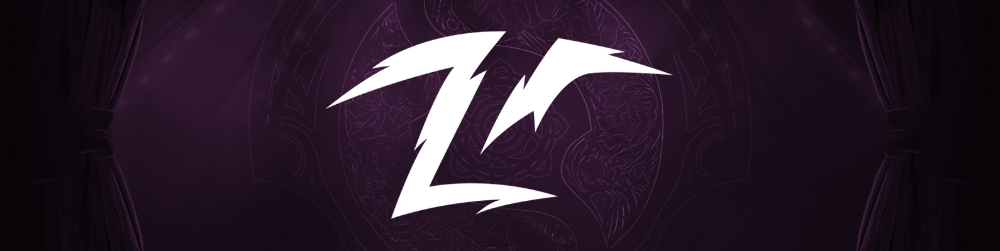

<h2 style="margin: 0.25em 0;">Team Zero - <i>China #1</i></h2>
<table class="roster">
  <tbody><tr>
    <td>Erika (poyoyo)</td>
    <td>7e</td>
    <td>Beyond</td>
    <td>ponlo</td>
    <td>zzq</td>
    <td>&nbsp;</td>
    <td><i style="font-size: smaller;">Coach</i>&nbsp;&nbsp;&nbsp;bLink</td></tr>
   </tbody>
</table>

**How did this roster happen?** 7e, Beyond, and zzq have been kickin' it on Zero since May 2023. They attempted to qualify for last TI with cty and former Wings TI winner iceice, but got 3rd. That roster stuck around for a little bit of this year, but Erika and ponlo were brought in starting with Elite League S1 quals. As of Snow Ruyi, another Wings alumni, bLink, officially joined the team as a coach.

**How was their season?**

  

  <table class="resultsTable" style="max-width: 400px; margin: 0 0.5em;">
  <thead><tr><th class="event">EPT Events</th><th class="result">Result</th></tr></thead>
  <tbody>
  <tr><td><b>ESL One Kuala Lumpur</b></td><td>-</td></tr>
  <tr><td>DreamLeague S22</td><td>-</td></tr>
  <tr><td><b>ESL One Birmingham</b></td><td>-</td></tr>
  <tr><td>DreamLeague S23</td><td>-</td></tr>
  <tr><td><b>Riyadh Masters 2024</b></td><td>-</td></tr>
  </tbody></table>
  

  

  <table class="resultsTable" style="max-width: 400px; margin: 0 0.5em;">
  <thead><tr><th class="event">Other Events</th><th class="result">Result</th></tr></thead>
  <tbody>
  <tr><td><b>BetBoom Dacha Dubai</b></td><td>-</td></tr>
  <tr><td>Elite League S1</td><td>-</td></tr>
  <tr><td><b>PGL Wallachia S1</b></td><td>-</td></tr>
  <tr><td>&nbsp;</td><td>&nbsp;</td></tr>
  <tr><td><b>Clavision: Snow Ruyi</b></td><td><b>9-10th</b></td></tr>
  </tbody></table>
  

 

The calendar looks pretty empty for them and that's because it was. Scrolling through their results... they got 2nd in the Elite League S1 and DLS23 CN quals? That's something. Oh! Wait! They won *Cringe Station Kobolds Rave 2.* So yeah. Cringe Station. That's a TO name.

Jokes aside, the fact that they were the *first* team to qualify out of China's TI regionals was crazy. Remember, Xtreme was China's only directly invited TI team, so there were still plenty of sharks left in the qualifier. But Zero rightfully earned the first slot by beating both G2 x iG and Azure Ray.

**What would success look like?** Witnessing the glorious ponlo redemption arc after his troubled stints on Quincy Crew, Alliance, and ~~twitter~~ x dot com.

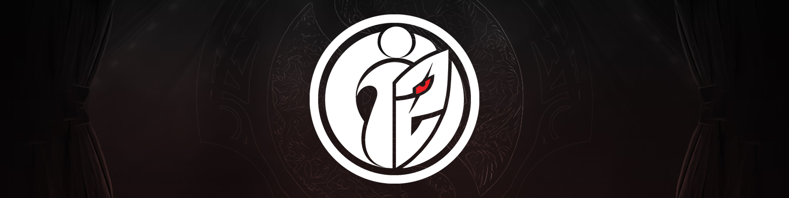

<h2 style="margin: 0.25em 0;">G2 x iG - <i>China #2</i></h2>
<table class="roster">
  <tbody><tr>
    <td>Monet</td>
    <td>NothingToSay</td>
    <td>JT-</td>
    <td>BoBoKa</td>
    <td>xNova</td>
    <td>&nbsp;</td>
    <td><i style="font-size: smaller;">Coach</i>&nbsp;&nbsp;&nbsp;super</td>
    <td><i style="font-size: smaller;">Coach</i>&nbsp;&nbsp;&nbsp;@dogf1ghts</td>
    <td><i style="font-size: smaller;">Manager</i>&nbsp;&nbsp;&nbsp;KBBQ</td></tr>
   </tbody>
</table>

**How did this roster happen?** When a storied esports organization like G2 wants to make a splash in a new game, they want to do it big. Doing it big usually involves creating a superteam. Unfortunately, many of the players whom you *would* get for a superteam were “““retired””” during the post-TI shuffle.

Here's how I like to imagine their initial meeting went:

<code>Gentlemen, we want to get into Dota. Western Europe seems like a real doozy, though, but it looks like there's a power vacuum in China. I say we form a strategic partnership with iG and put a superteam together in the region.</code>

<code>NothingToSay is off LGD after four years on the roster? Perfect, get him on the team. Speaking of LGD, who's the only other Malaysian they ever had? xNova? Why'd he return to SEA, what a disaster, let's bring him back to China.</code>

<code>Who's next. Uhhh, who's the best Chinese offlaner of all time? Probably Faith_bian? He's retired? Damn. That's fine, JT- was an iG boy for ages, let's bring him back.</code>

<code>How about best Chinese carry? Ame, right? He's retired too? Oh. No worries, Monet was very consistent on Aster, let's reach out. We need someone to balance JT-'s craziness anyway.</code>

<code>Last one. Best Chinese 4. Gotta be fy. He's... you're joking. <i>It's fine,</i> it's fine. Who was that one 4 we used to have? <a href="https://www.youtube.com/watch?v=KhQio49YG-Q">The one with the funny name.</a> Yeah, whatever. 4 position Monkey King is still viable, right?</code>

<code>Real shame all those super famous and top tier players retired, but I guess they're done playing Dota forever.</code>

<code><b><i>One month passes</i></b></code>

<code>ARE YOU FUCKING KIDDING ME.</code>

You'll notice I also wrote their manager on this roster list despite usually not doing that. Why? Take a shot every time someone mentions Jack "KBBQ" Chen on the EN broadcast when G2 x iG are playing. You'll be puking in the toilet before the draft even starts.

**How was their season?**

  

  <table class="resultsTable" style="max-width: 400px; margin: 0 0.5em;">
  <thead><tr><th class="event">EPT Events</th><th class="result">Result</th></tr></thead>
  <tbody>
  <tr><td><b>ESL One Kuala Lumpur</b></td><td class="top6"><b>5-6th</b></td></tr>
  <tr><td>DreamLeague S22</td><td>15-16th</td></tr>
  <tr><td><b>ESL One Birmingham</b></td><td class="top6"><b>5-6th</b></td></tr>
  <tr><td>DreamLeague S23</td><td>-</td></tr>
  <tr><td><b>Riyadh Masters 2024</b></td><td><b>19-20th</b></td></tr>
  <tr><td>&nbsp;</td><td>&nbsp;</td></tr>
  </tbody></table>
  

  

  <table class="resultsTable" style="max-width: 400px; margin: 0 0.5em;">
  <thead><tr><th class="event">Other Events</th><th class="result">Result</th></tr></thead>
  <tbody>
  <tr><td><b>BetBoom Dacha Dubai</b></td><td>-</td></tr>
  <tr><td>Elite League S1</td><td>7-8th</td></tr>
  <tr><td><b>PGL Wallachia S1</b></td><td class="fourth"><b>4th</b></td></tr>
  <tr><td>&nbsp;</td><td>&nbsp;</td></tr>
  <tr><td><b>Clavision: Snow Ruyi</b></td><td class="top6"><b>5-6th</b></td></tr>
  <tr><td>FISSURE Universe 3</td><td>7-8th</td></tr>
  </tbody></table>
  

 

Despite not putting together a full superteam, G2 x iG still had the typical Chinese superteam results. Which is to say: meh. Wallachia was a nice moment of clarity, but the rest of the year was nothing special.

**What would success look like?** After winning a thrilling five game grand final...

Legendary manager Jack Chen hois-- NO, STOP. I'M DOING IT AGAIN.

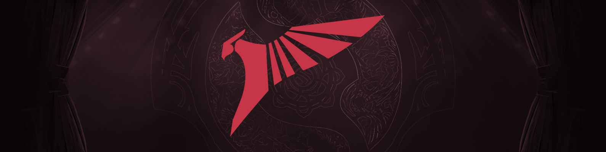

<h2 style="margin: 0.25em 0;">Talon Esports - <i>Southeast Asia #1</i></h2>
<table class="roster">
  <tbody><tr>
    <td>Akashi</td>
    <td>Mikoto</td>
    <td>Ws</td>
    <td>Jhocam</td>
    <td>ponyo</td>
    <td>&nbsp;</td>
    <td><i style="font-size: smaller;">Coach</i>&nbsp;&nbsp;&nbsp;pieliedie</td></tr>
   </tbody>
</table>

**How did this roster happen?** Mikoto wanted to take a break after last TI, so the rest of talon went on to become Aurora. Mikoto's break didn't last long and he was actually on Bleed for most of the year with jackky, masaros, dj, and poloson. Sounds like the kinda team that could do pretty good, right? Yep, just like all Bleed rosters. And like all Bleed rosters, they ended up sucking. Meanwhile, Talon signed the other 4 players from various middling SEA teams along with ChYuaN to play mid. Mikoto came back to Talon in june

**How was their season?**

  

  <table class="resultsTable" style="max-width: 400px; margin: 0 0.5em;">
  <thead><tr><th class="event">EPT Events</th><th class="result">Result</th></tr></thead>
  <tbody>
  <tr><td><b>ESL One Kuala Lumpur</b></td><td>-</td></tr>
  <tr><td>DreamLeague S22</td><td>-</td></tr>
  <tr><td><b>ESL One Birmingham</b></td><td><b>9-10th</b></td></tr>
  <tr><td>DreamLeague S23</td><td>-</td></tr>
  <tr><td><b>Riyadh Masters 2024</b></td><td>-</td></tr>
  </tbody></table>
  

  

  <table class="resultsTable" style="max-width: 400px; margin: 0 0.5em;">
  <thead><tr><th class="event">Other Events</th><th class="result">Result</th></tr></thead>
  <tbody>
  <tr><td><b>BetBoom Dacha Dubai</b></td><td>-</td></tr>
  <tr><td>Elite League S1</td><td>17-19th</td></tr>
  <tr><td><b>PGL Wallachia S1</b></td><td>-</td></tr>
  <tr><td>&nbsp;</td><td>&nbsp;</td></tr>
  <tr><td><b>Clavision: Snow Ruyi</b></td><td class="top8"><b>7-8th</b></td></tr>
  </tbody></table>
  

 

This year, EEU has been a rock paper scissors between three teams: 9Pandas, BetBoom, and Team Spirit. Each of them took a turn topping their regional league, but Pandas had the highest DPC LAN finish at the Berlin Major despite Rodjer standing in for Solo.

**What would success look like?** Pretty much every year that Solo and Ramzes were teammates at TI, they were considered favorites. I would know. I put them into my Compendium predictions to win it literally every time. Then that old VP would proceed to consistently drop the ball at TI7. And TI8. And TI9.

For some, the real success would be beating Gaimin specifically, but I think the Ramzes x Quinn rivalry horse was stomped to death in an elevator Refn-style one too many times this year.

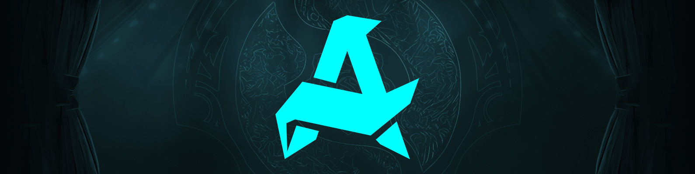

<h2 style="margin: 0.25em 0;">Aurora - <i>Southeast Asia #2</i></h2>
<table class="roster">
  <tbody><tr>
    <td>23</td>
    <td>lorenof</td>
    <td>Jabz</td>
    <td>Q</td>
    <td>Oli</td>
    <td>&nbsp;</td>
    <td><i style="font-size: smaller;">Coach</i>&nbsp;&nbsp;&nbsp;SunBhie</td></tr>
   </tbody>
</table>

**How did this roster happen?** Like I said, old Talon wanted to keep competing, but they didn't have a mid. Armel was originally the mid, but then he went and had a baby. Unknown newcomer lorenof came in starting at DLS22

**How was their season?**

  

  <table class="resultsTable" style="max-width: 400px; margin: 0 0.5em;">
  <thead><tr><th class="event">EPT Events</th><th class="result">Result</th></tr></thead>
  <tbody>
  <tr><td><b>ESL One Kuala Lumpur</b></td><td>-</td></tr>
  <tr><td>DreamLeague S22</td><td>8th</td></tr>
  <tr><td><b>ESL One Birmingham</b></td><td>-</td></tr>
  <tr><td>DreamLeague S23</td><td>7-8th</td></tr>
  <tr><td><b>Riyadh Masters 2024</b></td><td><b>9th-12th</b></td></tr>
  </tbody></table>
  

  

  <table class="resultsTable" style="max-width: 400px; margin: 0 0.5em;">
  <thead><tr><th class="event">Other Events</th><th class="result">Result</th></tr></thead>
  <tbody>
  <tr><td><b>BetBoom Dacha Dubai</b></td><td><b>9-12th</b></td></tr>
  <tr><td>Elite League S1</td><td>9-10th</td></tr>
  <tr><td><b>PGL Wallachia S1</b></td><td class="top8"><b>7-8th</b></td></tr>
  <tr><td>&nbsp;</td><td>&nbsp;</td></tr>
  <tr><td>&nbsp;</td><td>&nbsp;</td></tr>
  </tbody></table>
  

 

They did attempt to qualify for FISSURE Universe 3, but were eliminated in play-ins after getting 2-0'd by 1w and nouns.

**What would success look like?** Every year I bemoan the state of SEA Dota and every year that feeling is mostly affirmed at TI. Although, last year, I actually had some real hope for these guys on Talon after they got 3rd at both the Lima Major (lost to Liquid twice in bracket) and Riyadh Masters 2023 (lost to Liquid twice in bracket). Unfortunately, they ended up getting 9-12th at that TI (lost to Liquid once in bracket).

So, hey, maybe if they don't have to play Liquid theeeen...

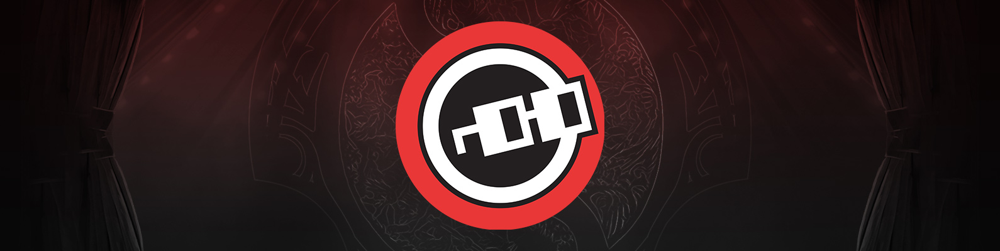

<h2 style="margin: 0.25em 0;">nouns - <i>North America</i></h2>
<table class="roster">
  <tbody><tr>
    <td>Yuma</td>
    <td>Copy</td>
    <td>Gunnar</td>
    <td>Lelis</td>
    <td>Fly</td>
    <td>&nbsp;</td>
    <td><i style="font-size: smaller;">Coach</i>&nbsp;&nbsp;&nbsp;MiLAN</td></tr>
   </tbody>
</table>

**How did this roster happen?** Speaking of bemoaning regions of Dota, check out the <i>ONE</i> team representing North America at this TI. That's right. Every other region has at least two or more teams showing up in Copenhagen. But North America? THERE'S A REASON OUR COUNTRY CODE IS +1 BAYBEEE.

But I digress. How did this roster happen? After getting top 8 at TI last year, gunnar moved to offlane and stormstormer was brought in for mid. Shopify fell apart after TI and fly came in to replace yamsun. Yuma replaced K1 after he went to HEROIC. After an underwhelming Dacha Dubai result stormstormer was replaced with another german, copy. Milan joined later.

**How was their season?**

  

  <table class="resultsTable" style="max-width: 400px; margin: 0 0.5em;">
  <thead><tr><th class="event">EPT Events</th><th class="result">Result</th></tr></thead>
  <tbody>
  <tr><td><b>ESL One Kuala Lumpur</b></td><td>-</td></tr>
  <tr><td>DreamLeague S22</td><td>-</td></tr>
  <tr><td><b>ESL One Birmingham</b></td><td>-</td></tr>
  <tr><td>DreamLeague S23</td><td>-</td></tr>
  <tr><td><b>Riyadh Masters 2024</b></td><td><b>17-18th</b></td></tr>
  <tr><td>&nbsp;</td><td>&nbsp;</td></tr>
  </tbody></table>
  

  

  <table class="resultsTable" style="max-width: 400px; margin: 0 0.5em;">
  <thead><tr><th class="event">Other Events</th><th class="result">Result</th></tr></thead>
  <tbody>
  <tr><td><b>BetBoom Dacha Dubai</b></td><td><b>9-12th</b></td></tr>
  <tr><td>Elite League S1</td><td>20-22nd</td></tr>
  <tr><td><b>PGL Wallachia S1</b></td><td><b>12-14th</b></td></tr>
  <tr><td>&nbsp;</td><td>&nbsp;</td></tr>
  <tr><td><b>Elite League S2</b></td><td class="top6"><b>5-6th</b></td></tr>
  <tr><td>FISSURE Universe 3</td><td>5-6th</td></tr>
  </tbody></table>
  

 

Usually for these regional qualifier teams, we just have to infer how they'd theoretically perform against international opponents. Thankfully for nouns, we have the data. ESL graciously granted North America three slots to DLS19 and nouns got bodied. Then TSM graciously granted nouns their slot to the Bali Major and they got bodied again.

To be fair, these were pre-K1 versions of nouns. After dominating NA TI quals, it's been good times, right? Let me check some sources real quick. Ah yes, it appears they just finished playing in an online event *Pinnacle Cup: Malta Vibes #4* and got 9-12th after getting 2-0'd by a Turkish player whose handle is "Jeezy."

Hmm.

And yes, this does mean that there is no Arteezy at this TI. His attendance streak from TI4 has finally been broken. Had he qualified, he'd have the most TI attendances of any player after Fly and Puppey.

**What would success look like?** Honestly, them getting top 8 last year *was* a success in my book. Their LAN results last year were equally as middling, so I could see it happening again.

Not gonna lie, though, it would be really cool to see the most veteran player at the event lift the Aegis. And I'm not just talking about TI appearances, Fly is also the oldest player competing at this TI at 31 and also the player with the most ticketed games of pro Dota ever. Insane longevity.

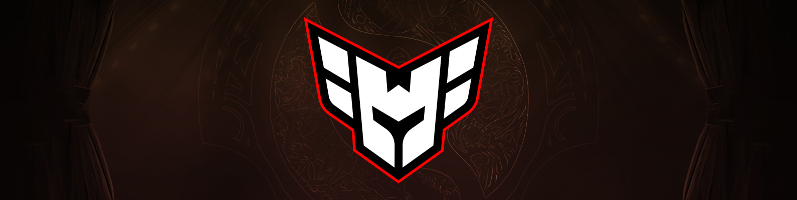

<h2 style="margin: 0.25em 0;">HEROIC - <i>South America #1</i></h2>
<table class="roster">
  <tbody><tr>
    <td>K1</td>
    <td>4nalog</td>
    <td>Davai Lama</td>
    <td>Scofield</td>
    <td>KJ</td>
    <td>&nbsp;</td>
    <td><i style="font-size: smaller;">Coach</i>&nbsp;&nbsp;&nbsp;kaffs</td>
    <td><i style="font-size: smaller;">Coach</i>&nbsp;&nbsp;&nbsp;Mangusu</td></tr>
   </tbody>
</table>

**How did this roster happen?** K1 came from nouns, scofield came from beastcoast, analog and KJ came from keyd stars, davai lama exported himself to a third region after not finding success in europe

**How was their season?**

  

  <table class="resultsTable" style="max-width: 400px; margin: 0 0.5em;">
  <thead><tr><th class="event">EPT Events</th><th class="result">Result</th></tr></thead>
  <tbody>
  <tr><td><b>ESL One Kuala Lumpur</b></td><td>-</td></tr>
  <tr><td>DreamLeague S22</td><td>13-14th</td></tr>
  <tr><td><b>ESL One Birmingham</b></td><td class="top8"><b>7-8th</b></td></tr>
  <tr><td>DreamLeague S23</td><td>7-8th</td></tr>
  <tr><td><b>Riyadh Masters 2024</b></td><td><b>13-14th</b></td></tr>
  </tbody></table>
  

  

  <table class="resultsTable" style="max-width: 400px; margin: 0 0.5em;">
  <thead><tr><th class="event">Other Events</th><th class="result">Result</th></tr></thead>
  <tbody>
  <tr><td><b>BetBoom Dacha Dubai</b></td><td>-</td></tr>
  <tr><td>Elite League S1</td><td>15-16th</td></tr>
  <tr><td><b>PGL Wallachia S1</b></td><td><b>15-16th</b></td></tr>
  <tr><td>&nbsp;</td><td>&nbsp;</td></tr>
  <tr><td><b>Elite League S2</b></td><td><b>9-11th</b></td></tr>
  </tbody></table>
  

 

When you saw the **Lima** Major you just knew things had to be hype for South America. Peru is the strongest it's ever been and they finally had a LAN on home soil. Alas, EG was only able to scrape a top 6 finish. Amusingly, they got eliminated by ex-Evil Geniuses Arteezy and the gang.

They maintained their momentum into a 4th place finish at the Berlin Major. That's the most significant placement a South American team has gotten at a Valve Major since paiN Gaming's 3rd place finish at ESL One Birmingham 2018. Though, Birmingham's [tournament format](https://liquipedia.net/dota2/ESL_One/Birmingham/2018) was on crack, so let's just gloss over it and go with Berlin being the new South American bar to beat.

Let's also gloss over the last third of the season because... oof.

**What would success look like?** I've never seen a team where you can so clearly interpret how well they're going to do on any given day just by looking at their faces. I'm serious. Watch the VoDs on their elimination days. You'd think they were being forced to walk out on stage to play Dota at gunpoint.

For what it's worth, it *is* a Seattle TI. So there's probably a lot of EG jerseys being dug out of closets and dusted off with wives asking, "Why do you still have this? And who is Universe?" Will these vintage EG fans be rooting for this team? Probably not, but don't tell the players that. Big smiles, EG boys. Big Chris Smiles.

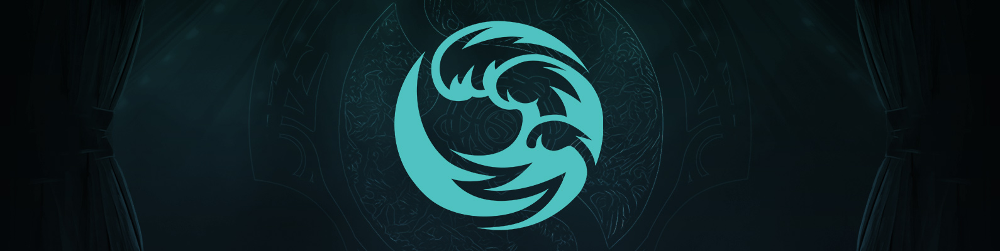

<h2 style="margin: 0.25em 0;">beastcoast - <i>South America #2</i></h2>
<table class="roster">
  <tbody><tr>
    <td>payk</td>
    <td>Lumpy</td>
    <td>Vitaly</td>
    <td>Elmisho</td>
    <td>MoOz</td>
    <td>&nbsp;</td>
    <td><i style="font-size: smaller;">Coach</i>&nbsp;&nbsp;&nbsp;Mariano</td></tr>
   </tbody>
</table>

**How did this roster happen?** Gardick was on the original team, but was replaced by elmisho. It's mainly 4 new kids and papa mooz.

**How was their season?**

  

  <table class="resultsTable" style="max-width: 400px; margin: 0 0.5em;">
  <thead><tr><th class="event">EPT Events</th><th class="result">Result</th></tr></thead>
  <tbody>
  <tr><td><b>ESL One Kuala Lumpur</b></td><td>-</td></tr>
  <tr><td>DreamLeague S22</td><td>-</td></tr>
  <tr><td><b>ESL One Birmingham</b></td><td>-</td></tr>
  <tr><td>DreamLeague S23</td><td>-</td></tr>
  <tr><td><b>Riyadh Masters 2024</b></td><td><b>13-14th</b></td></tr>
  </tbody></table>
  

  

  <table class="resultsTable" style="max-width: 400px; margin: 0 0.5em;">
  <thead><tr><th class="event">Other Events</th><th class="result">Result</th></tr></thead>
  <tbody>
  <tr><td><b>BetBoom Dacha Dubai</b></td><td>-</td></tr>
  <tr><td>Elite League S1</td><td>-</td></tr>
  <tr><td><b>PGL Wallachia S1</b></td><td>-</td></tr>
  <tr><td>&nbsp;</td><td>&nbsp;</td></tr>
  <tr><td><b>Elite League S2</b></td><td class="top8"><b>7-8th</b></td></tr>
  </tbody></table>
  

 

It's been a quiet season for the boys in aquamarine. For every superteam, there must be a... civilianteam? Let's just say the EG roster shuffle results were not very kind to them and having to change K1 at the end of the season probably didn't help. Their TI invitation chances were in jeopardy near the end of the season, but Shopify Rebellion did them a solid and lost in first round of Bali's lower bracket to get beastcoast 300 points with top 8.

**What would success look like?** A Climate Pledge arena filled to the brim with Crest plushies.

----

# Time to shill, I earned it

Too bad the core demographic for these articles are usually people who don't have Dota 2 installed anymore, BUT JUST IN CASE YOU DO, consider buying my voiceline!

  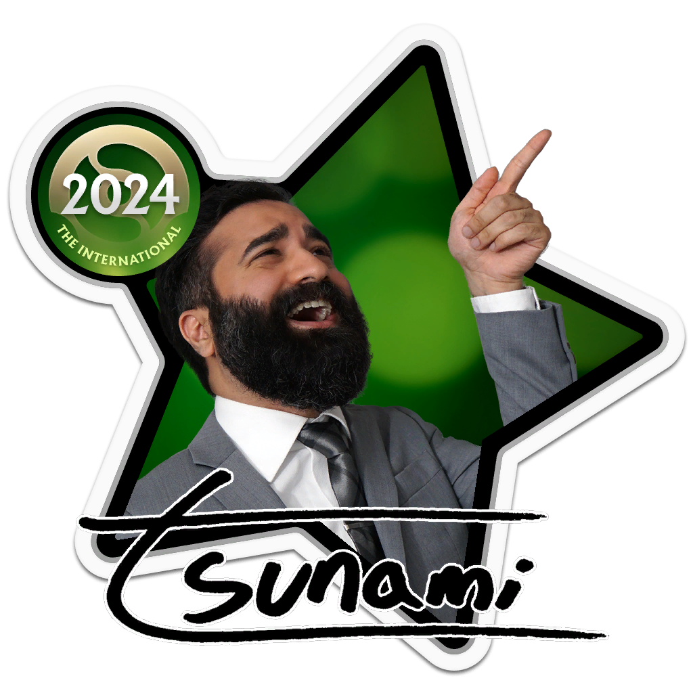

  
<a href="#" title="Glitter Tier Line" id="play" onclick="bkb.play();return false;">tsunami - Imagine if you had BKB.<audio id="bkb" class="audio" src="https://chatwheel.howdoiplay.com/assets/audio/other/bkb.mp3" type="audio/mpeg"></audio></a>

  
<a href="#" title="Gold Tier Line" id="play" onclick="chat.play();return false;">tsunami - Chat is this real?<audio id="chat" class="audio" src="https://chatwheel.howdoiplay.com/assets/audio/other/chat.mp3" type="audio/mpeg"></audio></a>

If you're more into physical goods, you can also check out my [**howdoiplay merch store**](https://shop.howdoiplay.com/). Season 2 drop coming eventually.

Thank you, thank you, thank you to all the [Liquipedia volunteers.](https://liquipedia.net/dota2/Dota_Pro_Circuit/2023/Rankings) Dota just had our 'ten year anniversary' and so much of our esport's history is kept intact thanks to Liquipedia.

If you want to keep up with me, I'm around on [Twitch](https://twitch.tv/tsunami643), [Instagram](https://instagram.com/tsunami643), and... [X.](https://twitter.com/tsunami643)

    <a href="https://www.reddit.com/r/DotA2/comments/175j2hx/the_international_2023_a_practical_guide_to_all/" target="_blank" class="button large">Discussion for this article on /r/dota2</a>

